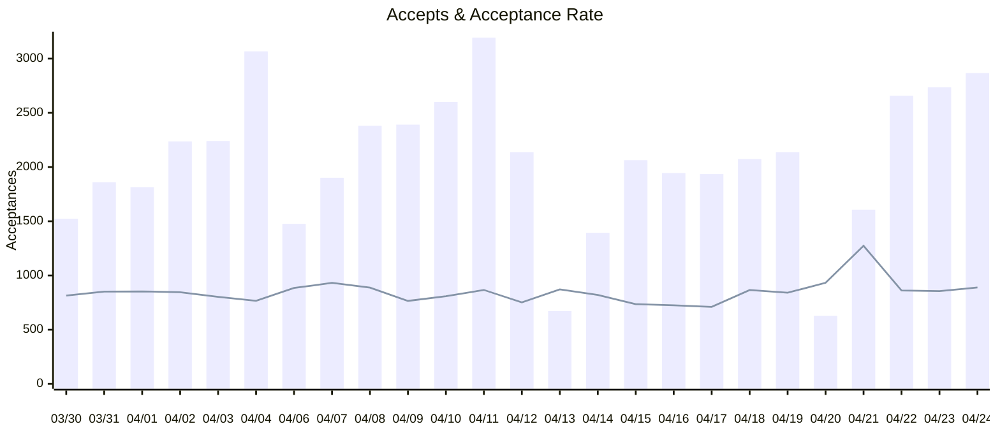
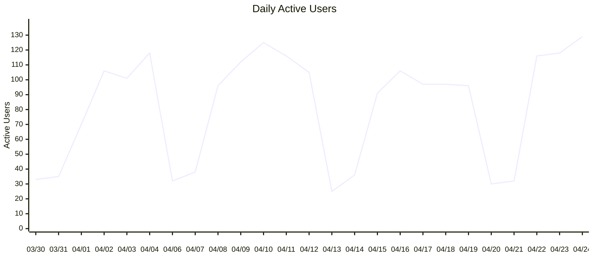
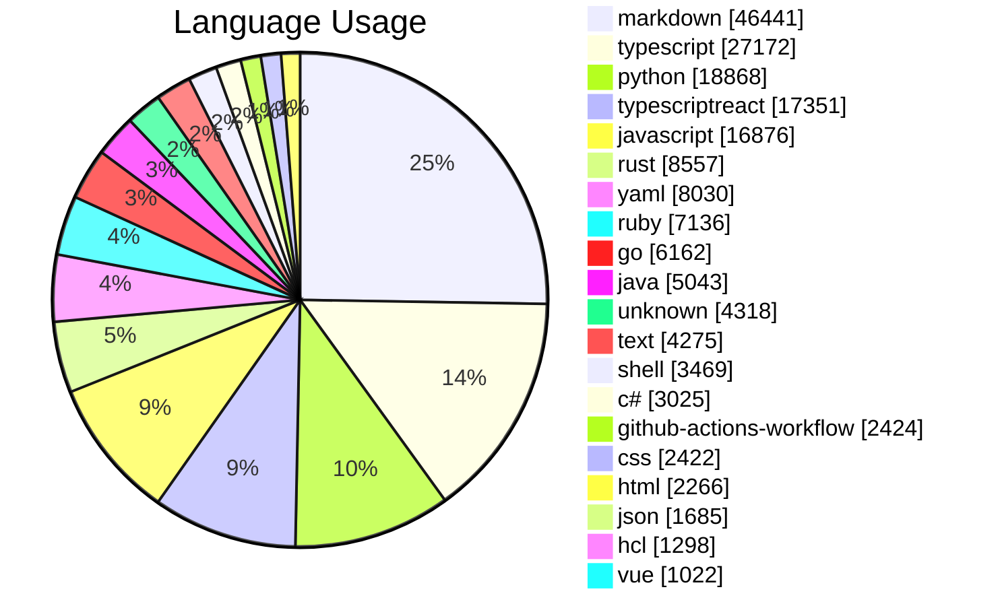
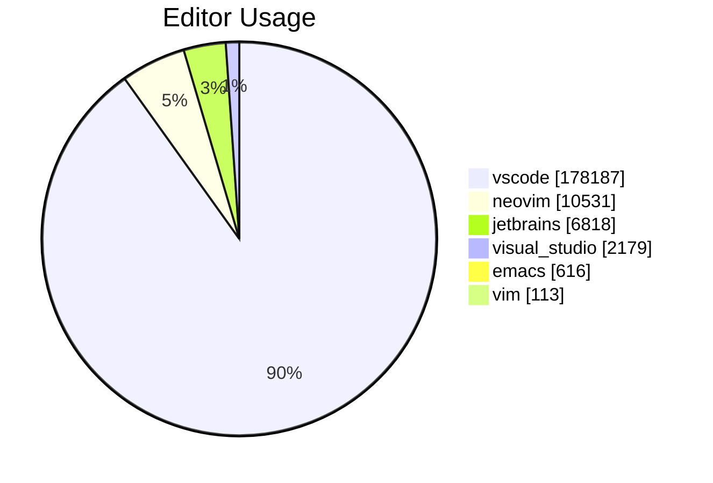
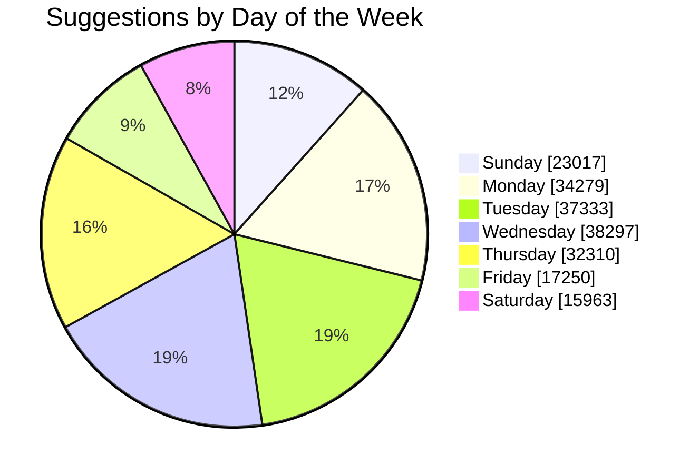

# Copilot Usage Action

Get Copilot usage data as:
* Md Job Summary
* CSV
* XML
* JSON

Powered by the [REST API endpoints for GitHub Copilot usage metrics](https://docs.github.com/en/rest/copilot/copilot-usage).

## Usage
Create a workflow (eg: `.github/workflows/copilot-usage.yml`). See [Creating a Workflow file](https://help.github.com/en/articles/configuring-a-workflow#creating-a-workflow-file).

### PAT(Personal Access Token)

You will need to [create a PAT(Personal Access Token)](https://github.com/settings/tokens/new?scopes=admin:org) that has the `copilot`, `manage_billing:copilot`, `admin:org`, `admin:enterprise`, or `manage_billing:enterprise` scope to use this endpoint.

Add this PAT as a secret so we can use it as input `github-token`, see [Creating encrypted secrets for a repository](https://docs.github.com/en/enterprise-cloud@latest/actions/security-guides/encrypted-secrets#creating-encrypted-secrets-for-a-repository). 

#### Basic Example

The default behavior is to get the usage for the repository owner which is likely the organization.

> [!IMPORTANT]  
> You need to set the secret `TOKEN` in your repository settings.

```yml
name: Copilot Usage
on:
  schedule:
    - cron: '0 0 * * *'
  workflow_dispatch:

jobs:
  run:
    name: Run Action
    runs-on: ubuntu-latest
    steps:
      - uses: austenstone/copilot-usage@v3.0
        with:
          github-token: ${{ secrets.TOKEN }}
```
## Example get team usage

```yml
      - uses: austenstone/copilot-usage@v3.0
        with:
          github-token: ${{ secrets.TOKEN }}
          organization: 'org-slug'
          team: 'team-slug'
```

## Example get enterprise usage

```yml
      - uses: austenstone/copilot-usage@v3.0
        with:
          github-token: ${{ secrets.TOKEN }}
          enterprise: 'enterprise-slug'
```

#### Example sending email PDF report

> [!IMPORTANT]  
> You must set secrets for `EMAIL` and `PASSWORD` to send the email. You must use an [App Password](https://support.google.com/accounts/answer/185833?visit_id=638496193361004722-1436339969&p=InvalidSecondFactor&rd=1#app-passwords) for Gmail.

```yml
name: Email Copilot Report
on:
  workflow_dispatch:
  schedule:
    - cron: '0 0 * * *'

jobs:
  run:
    runs-on: ubuntu-latest
    steps:
      - uses: austenstone/copilot-usage@v3.0
        with:
          github-token: ${{ secrets.TOKEN }}
      - uses: austenstone/job-summary@v2.0
        id: pdf
        with:
          name: copilot-usage
      - uses: dawidd6/action-send-mail@v3.0
        with:
          server_address: smtp.gmail.com
          server_port: 465
          username: ${{ secrets.EMAIL }}
          password: ${{ secrets.PASSWORD }}
          from: ${{ secrets.EMAIL }}
          to: ${{ secrets.EMAIL }} # Recipient email
          subject: "Copilot Usage Report (${{ steps.usage.outputs.since }} - ${{ steps.usage.outputs.until }})"
          html_body: |
            <!DOCTYPE html>
            <html>
            
            <body>
              <h1>Copilot Usage Report</h1>
              <p>Attached is the Copilot Usage Report for ${{ steps.usage.outputs.since }} - ${{ steps.usage.outputs.until }}!</p>
              <p>
                <a href="https://github.com/${{ github.repository }}/actions/runs/${{ github.run_id }}#:~:text=Copilot%20Usage%20summary">View the full report on
                  GitHub.com</a>
              </p>

              ${{ steps.pdf.outputs.job-summary-html }}
              
            </body>
            
            </html>
          attachments: ${{ steps.pdf.outputs.pdf-file }}
```

> [!TIP]
> Try using other messaging systems such as [slack](https://github.com/marketplace/actions/slack-send), [teams](https://github.com/marketplace/actions/microsoft-teams-notification), [discord](https://github.com/marketplace/actions/discord-message-notify), etc.


## ➡️ Inputs

We look first for `enterprise` input, then `team`, and finally `organization`. If none are provided, we default to the repository owner which is likely the organization.

Various inputs are defined in [`action.yml`](action.yml):

| Name | Description | Default |
| --- | --- | --- |
| github-token | The GitHub token used to create an authenticated client | ${{ github.token }} |
| enterprise | The GitHub enterprise slug | |
| organization | The organization slug | ${{ github.repository_owner }} |
| team | The team slug | |
| days | The number of days to show usage metrics for | |
| since | Show usage metrics since this date. This is a timestamp, in `YYYY-MM-DD` format. Maximum value is 28 days ago | |
| until | Show usage metrics until this date. This is a timestamp, in `YYYY-MM-DD` format. Maximum value is 28 days ago | |
| job-summary | Whether to generate a report | true |
| csv | Whether to generate a CSV as a workflow artifact | false |
| csv-options | The options for the CSV report | |
| xml | Whether to generate an XML as a workflow artifact | false |
| xml-options | The options for the XML report | |

## ⬅️ Outputs
| Name | Description |
| --- | - |
| result | The copilot usage as a JSON string |
| since | The date since which the usage metrics are shown |
| until | The date until which the usage metrics are shown |

### Endpoints

The endpoints used by this action...

* GET /enterprises/{enterprise}/copilot/usage
* GET /orgs/{org}/team/{team}/copilot/usage
* GET /orgs/{org}/copilot/usage
* GET /orgs/{org}/copilot/billing
* GET /orgs/{org}/copilot/billing/seats

## Example Job Summary

<h1>Copilot Usage<br>3/30/2024 - 4/24/2024</h1>
<h3>Suggestions: 198,449</h3>
<h3>Acceptances: 51,532</h3>
<h3>Acceptance Rate: 25.97%</h3>
<h3>Lines of Code Accepted: 87,151</h3>




<h1>Language Usage</h1>


<table><tr><th>Language</th><th>Suggestions</th><th>Acceptances</th><th>Acceptance Rate</th><th>Lines Suggested</th><th>Lines Accepted</th><th>Active Users</th></tr><tr><td>typescript</td><td>27172</td><td>8276</td><td>30.46%</td><td>45407</td><td>13864</td><td>327</td></tr><tr><td>markdown</td><td>46441</td><td>7272</td><td>15.66%</td><td>66610</td><td>8292</td><td>377</td></tr><tr><td>python</td><td>18868</td><td>6800</td><td>36.04%</td><td>29912</td><td>10480</td><td>354</td></tr><tr><td>javascript</td><td>16876</td><td>5618</td><td>33.29%</td><td>33054</td><td>11717</td><td>453</td></tr><tr><td>typescriptreact</td><td>17351</td><td>4583</td><td>26.41%</td><td>28274</td><td>6721</td><td>299</td></tr><tr><td>yaml</td><td>8030</td><td>2476</td><td>30.83%</td><td>14990</td><td>4342</td><td>287</td></tr><tr><td>ruby</td><td>7136</td><td>2140</td><td>29.99%</td><td>11828</td><td>2670</td><td>199</td></tr><tr><td>java</td><td>5043</td><td>2045</td><td>40.55%</td><td>17829</td><td>6515</td><td>220</td></tr><tr><td>rust</td><td>8557</td><td>1982</td><td>23.16%</td><td>40011</td><td>4067</td><td>73</td></tr><tr><td>go</td><td>6162</td><td>1800</td><td>29.21%</td><td>10694</td><td>2585</td><td>109</td></tr><tr><td>c#</td><td>3025</td><td>1192</td><td>39.40%</td><td>7537</td><td>2726</td><td>146</td></tr><tr><td>shell</td><td>3469</td><td>1021</td><td>29.43%</td><td>5401</td><td>1393</td><td>132</td></tr><tr><td>github-actions-workflow</td><td>2424</td><td>793</td><td>32.71%</td><td>4637</td><td>1498</td><td>61</td></tr><tr><td>html</td><td>2266</td><td>717</td><td>31.64%</td><td>8377</td><td>1553</td><td>124</td></tr><tr><td>unknown</td><td>4318</td><td>628</td><td>14.54%</td><td>7298</td><td>831</td><td>103</td></tr><tr><td>css</td><td>2422</td><td>555</td><td>22.91%</td><td>5062</td><td>1031</td><td>97</td></tr><tr><td>text</td><td>4275</td><td>388</td><td>9.08%</td><td>23864</td><td>533</td><td>78</td></tr><tr><td>json</td><td>1685</td><td>345</td><td>20.47%</td><td>3446</td><td>711</td><td>137</td></tr><tr><td>hcl</td><td>1298</td><td>340</td><td>26.19%</td><td>4501</td><td>1098</td><td>55</td></tr><tr><td>fsharp</td><td>872</td><td>315</td><td>36.12%</td><td>2096</td><td>736</td><td>36</td></tr><tr><td>dockerfile</td><td>667</td><td>244</td><td>36.58%</td><td>793</td><td>250</td><td>49</td></tr><tr><td>sql</td><td>522</td><td>216</td><td>41.38%</td><td>918</td><td>433</td><td>69</td></tr><tr><td>vue</td><td>1022</td><td>190</td><td>18.59%</td><td>2375</td><td>276</td><td>16</td></tr><tr><td>emacs-lisp</td><td>564</td><td>153</td><td>27.13%</td><td>1143</td><td>300</td><td>18</td></tr><tr><td>powershell</td><td>595</td><td>138</td><td>23.19%</td><td>795</td><td>156</td><td>31</td></tr><tr><td>scss</td><td>817</td><td>128</td><td>15.67%</td><td>1464</td><td>144</td><td>39</td></tr><tr><td>ql</td><td>807</td><td>117</td><td>14.50%</td><td>1720</td><td>157</td><td>24</td></tr><tr><td>kotlin</td><td>177</td><td>77</td><td>43.50%</td><td>708</td><td>356</td><td>13</td></tr><tr><td>json with comments</td><td>738</td><td>70</td><td>9.49%</td><td>1235</td><td>80</td><td>63</td></tr><tr><td>r</td><td>388</td><td>70</td><td>18.04%</td><td>690</td><td>72</td><td>16</td></tr><tr><td>blazor</td><td>311</td><td>62</td><td>19.94%</td><td>943</td><td>115</td><td>18</td></tr><tr><td>xml</td><td>151</td><td>59</td><td>39.07%</td><td>507</td><td>245</td><td>39</td></tr><tr><td>jade</td><td>151</td><td>57</td><td>37.75%</td><td>255</td><td>104</td><td>5</td></tr><tr><td>postcss</td><td>138</td><td>46</td><td>33.33%</td><td>296</td><td>64</td><td>7</td></tr><tr><td>lua</td><td>348</td><td>45</td><td>12.93%</td><td>1523</td><td>66</td><td>7</td></tr><tr><td>javascriptreact</td><td>64</td><td>43</td><td>67.19%</td><td>197</td><td>73</td><td>7</td></tr><tr><td>toml</td><td>267</td><td>41</td><td>15.36%</td><td>857</td><td>54</td><td>23</td></tr><tr><td>astro</td><td>125</td><td>38</td><td>30.40%</td><td>391</td><td>122</td><td>8</td></tr><tr><td>razor</td><td>95</td><td>30</td><td>31.58%</td><td>218</td><td>37</td><td>16</td></tr><tr><td>html+erb</td><td>192</td><td>28</td><td>14.58%</td><td>295</td><td>34</td><td>19</td></tr><tr><td>mdx</td><td>250</td><td>24</td><td>9.60%</td><td>297</td><td>24</td><td>10</td></tr><tr><td>terraform-vars</td><td>64</td><td>24</td><td>37.50%</td><td>79</td><td>24</td><td>6</td></tr><tr><td>html.erb</td><td>107</td><td>24</td><td>22.43%</td><td>244</td><td>51</td><td>8</td></tr><tr><td>vs-markdown</td><td>149</td><td>24</td><td>16.11%</td><td>149</td><td>24</td><td>7</td></tr><tr><td>ini</td><td>146</td><td>20</td><td>13.70%</td><td>190</td><td>20</td><td>12</td></tr><tr><td>dotenv</td><td>106</td><td>20</td><td>18.87%</td><td>120</td><td>17</td><td>13</td></tr><tr><td>php</td><td>102</td><td>18</td><td>17.65%</td><td>301</td><td>24</td><td>17</td></tr><tr><td>c++</td><td>70</td><td>18</td><td>25.71%</td><td>136</td><td>34</td><td>15</td></tr><tr><td>bicep</td><td>63</td><td>17</td><td>26.98%</td><td>120</td><td>39</td><td>10</td></tr><tr><td>postgres</td><td>117</td><td>17</td><td>14.53%</td><td>247</td><td>6</td><td>14</td></tr><tr><td>dart</td><td>72</td><td>17</td><td>23.61%</td><td>143</td><td>19</td><td>7</td></tr><tr><td>groovy</td><td>71</td><td>15</td><td>21.13%</td><td>125</td><td>20</td><td>15</td></tr><tr><td>ignore list</td><td>124</td><td>15</td><td>12.10%</td><td>141</td><td>15</td><td>24</td></tr><tr><td>sas</td><td>71</td><td>14</td><td>19.72%</td><td>116</td><td>17</td><td>2</td></tr><tr><td>dockercompose</td><td>33</td><td>10</td><td>30.30%</td><td>74</td><td>39</td><td>9</td></tr><tr><td>django-txt</td><td>20</td><td>10</td><td>50.00%</td><td>24</td><td>10</td><td>2</td></tr><tr><td>puppet</td><td>44</td><td>9</td><td>20.45%</td><td>111</td><td>26</td><td>7</td></tr><tr><td>rjsx</td><td>30</td><td>9</td><td>30.00%</td><td>107</td><td>62</td><td>2</td></tr><tr><td>git-commit</td><td>288</td><td>8</td><td>2.78%</td><td>355</td><td>8</td><td>19</td></tr><tr><td>prisma</td><td>17</td><td>8</td><td>47.06%</td><td>33</td><td>24</td><td>10</td></tr><tr><td>tex</td><td>55</td><td>6</td><td>10.91%</td><td>73</td><td>6</td><td>9</td></tr><tr><td>kusto</td><td>47</td><td>6</td><td>12.77%</td><td>76</td><td>10</td><td>7</td></tr><tr><td>liquid</td><td>106</td><td>6</td><td>5.66%</td><td>379</td><td>16</td><td>2</td></tr><tr><td>scminput</td><td>59</td><td>5</td><td>8.47%</td><td>152</td><td>5</td><td>10</td></tr><tr><td>graphql</td><td>21</td><td>5</td><td>23.81%</td><td>81</td><td>27</td><td>3</td></tr><tr><td>julia</td><td>20</td><td>4</td><td>20.00%</td><td>24</td><td>7</td><td>3</td></tr><tr><td>aspnetcorerazor</td><td>8</td><td>4</td><td>50.00%</td><td>30</td><td>12</td><td>4</td></tr><tr><td>helm</td><td>18</td><td>3</td><td>16.67%</td><td>20</td><td>3</td><td>6</td></tr><tr><td>cobol</td><td>7</td><td>3</td><td>42.86%</td><td>8</td><td>3</td><td>2</td></tr><tr><td>makefile</td><td>14</td><td>3</td><td>21.43%</td><td>17</td><td>3</td><td>7</td></tr><tr><td>vb</td><td>4</td><td>3</td><td>75.00%</td><td>8</td><td>4</td><td>4</td></tr><tr><td>objective-c</td><td>5</td><td>3</td><td>60.00%</td><td>31</td><td>15</td><td>2</td></tr><tr><td>pug</td><td>8</td><td>3</td><td>37.50%</td><td>9</td><td>3</td><td>4</td></tr><tr><td>scala</td><td>6</td><td>3</td><td>50.00%</td><td>23</td><td>2</td><td>2</td></tr><tr><td>gotemplate</td><td>8</td><td>2</td><td>25.00%</td><td>16</td><td>3</td><td>2</td></tr><tr><td>vim</td><td>11</td><td>2</td><td>18.18%</td><td>27</td><td>2</td><td>2</td></tr><tr><td>perl</td><td>48</td><td>2</td><td>4.17%</td><td>60</td><td>2</td><td>7</td></tr><tr><td>nunjucks</td><td>14</td><td>1</td><td>7.14%</td><td>16</td><td>1</td><td>7</td></tr><tr><td>properties</td><td>28</td><td>1</td><td>3.57%</td><td>43</td><td>1</td><td>8</td></tr><tr><td>mermaid</td><td>6</td><td>1</td><td>16.67%</td><td>7</td><td>1</td><td>2</td></tr><tr><td>pip-requirements</td><td>26</td><td>1</td><td>3.85%</td><td>28</td><td>1</td><td>5</td></tr><tr><td>nix</td><td>12</td><td>1</td><td>8.33%</td><td>28</td><td>1</td><td>2</td></tr><tr><td>rmd</td><td>38</td><td>1</td><td>2.63%</td><td>44</td><td>1</td><td>2</td></tr><tr><td>django-html</td><td>3</td><td>1</td><td>33.33%</td><td>11</td><td>9</td><td>2</td></tr><tr><td>eruby</td><td>1</td><td>1</td><td>100.00%</td><td>4</td><td>4</td><td>2</td></tr><tr><td>postgresql</td><td>6</td><td>1</td><td>16.67%</td><td>9</td><td>1</td><td>3</td></tr><tr><td>clojure</td><td>9</td><td>0</td><td>0.00%</td><td>11</td><td>0</td><td>2</td></tr><tr><td>objective-cpp</td><td>12</td><td>0</td><td>0.00%</td><td>12</td><td>0</td><td>2</td></tr><tr><td>code++.ini</td><td>3</td><td>0</td><td>0.00%</td><td>7</td><td>0</td><td>1</td></tr><tr><td>protocol buffer</td><td>1</td><td>0</td><td>0.00%</td><td>1</td><td>0</td><td>1</td></tr><tr><td>zsh</td><td>4</td><td>0</td><td>0.00%</td><td>18</td><td>0</td><td>3</td></tr><tr><td>ssh_config</td><td>1</td><td>0</td><td>0.00%</td><td>1</td><td>0</td><td>1</td></tr><tr><td>swift</td><td>2</td><td>0</td><td>0.00%</td><td>3</td><td>0</td><td>1</td></tr><tr><td>gemfile</td><td>7</td><td>0</td><td>0.00%</td><td>8</td><td>0</td><td>2</td></tr><tr><td>msbuild</td><td>1</td><td>0</td><td>0.00%</td><td>3</td><td>0</td><td>1</td></tr><tr><td>conf</td><td>3</td><td>0</td><td>0.00%</td><td>10</td><td>0</td><td>1</td></tr><tr><td>sshconfig</td><td>9</td><td>0</td><td>0.00%</td><td>33</td><td>0</td><td>3</td></tr><tr><td>plm</td><td>4</td><td>0</td><td>0.00%</td><td>5</td><td>0</td><td>1</td></tr><tr><td>restructuredtext</td><td>1</td><td>0</td><td>0.00%</td><td>1</td><td>0</td><td>1</td></tr><tr><td>csv</td><td>2</td><td>0</td><td>0.00%</td><td>3</td><td>0</td><td>2</td></tr><tr><td>bat</td><td>2</td><td>0</td><td>0.00%</td><td>2</td><td>0</td><td>2</td></tr><tr><td>vgo</td><td>9</td><td>0</td><td>0.00%</td><td>14</td><td>0</td><td>1</td></tr><tr><td>hcl.terraform</td><td>1</td><td>0</td><td>0.00%</td><td>3</td><td>0</td><td>1</td></tr><tr><td>coffeescript</td><td>5</td><td>0</td><td>0.00%</td><td>6</td><td>0</td><td>3</td></tr><tr><td>http request</td><td>1</td><td>0</td><td>0.00%</td><td>1</td><td>0</td><td>1</td></tr><tr><td>requirements</td><td>4</td><td>0</td><td>0.00%</td><td>4</td><td>0</td><td>1</td></tr><tr><td>emd</td><td>7</td><td>0</td><td>0.00%</td><td>7</td><td>0</td><td>2</td></tr><tr><td>c</td><td>2</td><td>0</td><td>0.00%</td><td>2</td><td>0</td><td>1</td></tr><tr><td>sqlite</td><td>2</td><td>0</td><td>0.00%</td><td>2</td><td>0</td><td>1</td></tr></table>
<h1>Editor Usage</h1>


<table><tr><th>Editor</th><th>Suggestions</th><th>Acceptances</th><th>Acceptance Rate</th><th>Lines Suggested</th><th>Lines Accepted</th><th>Active Users</th></tr><tr><td>vscode</td><td>178187</td><td>46043</td><td>25.84%</td><td>321088</td><td>76507</td><td>3911</td></tr><tr><td>neovim</td><td>10531</td><td>2509</td><td>23.82%</td><td>50495</td><td>4938</td><td>133</td></tr><tr><td>jetbrains</td><td>6818</td><td>1959</td><td>28.73%</td><td>14794</td><td>3583</td><td>315</td></tr><tr><td>visual_studio</td><td>2179</td><td>824</td><td>37.82%</td><td>4577</td><td>1673</td><td>105</td></tr><tr><td>emacs</td><td>616</td><td>167</td><td>27.11%</td><td>1332</td><td>389</td><td>24</td></tr><tr><td>vim</td><td>113</td><td>29</td><td>25.66%</td><td>358</td><td>57</td><td>19</td></tr></table>
<h1>Daily Usage</h1>
<h3>The most active day was 4/24/2024 with 129 active users.</h3>
<h3>The day with the highest acceptance rate was 4/21/2024 with an acceptance rate of 39.75%.</h3>


<table><tr><th>Day</th><th>Suggestions</th><th>Acceptances</th><th>Acceptance Rate</th><th>Lines Suggested</th><th>Lines Accepted</th><th>Active Users</th><th>Chat Acceptances</th><th>Chat Turns</th><th>Active Chat Users</th></tr><tr><td>3/30/2024</td><td>5993</td><td>1523</td><td>25.41%</td><td>15527</td><td>2709</td><td>33</td><td>0</td><td>0</td><td>0</td></tr><tr><td>3/31/2024</td><td>6995</td><td>1859</td><td>26.58%</td><td>17328</td><td>3044</td><td>35</td><td>0</td><td>0</td><td>0</td></tr><tr><td>4/1/2024</td><td>6819</td><td>1815</td><td>26.62%</td><td>29475</td><td>3169</td><td>70</td><td>0</td><td>0</td><td>0</td></tr><tr><td>4/2/2024</td><td>8476</td><td>2237</td><td>26.39%</td><td>14464</td><td>3768</td><td>106</td><td>0</td><td>0</td><td>0</td></tr><tr><td>4/3/2024</td><td>8943</td><td>2240</td><td>25.05%</td><td>19976</td><td>4386</td><td>101</td><td>0</td><td>0</td><td>0</td></tr><tr><td>4/4/2024</td><td>12821</td><td>3067</td><td>23.92%</td><td>27008</td><td>5982</td><td>118</td><td>0</td><td>0</td><td>0</td></tr><tr><td>4/6/2024</td><td>5345</td><td>1476</td><td>27.61%</td><td>10927</td><td>2433</td><td>32</td><td>0</td><td>0</td><td>0</td></tr><tr><td>4/7/2024</td><td>6539</td><td>1901</td><td>29.07%</td><td>13533</td><td>3611</td><td>38</td><td>0</td><td>0</td><td>0</td></tr><tr><td>4/8/2024</td><td>8587</td><td>2380</td><td>27.72%</td><td>16254</td><td>4618</td><td>96</td><td>0</td><td>0</td><td>0</td></tr><tr><td>4/9/2024</td><td>10008</td><td>2391</td><td>23.89%</td><td>18542</td><td>4514</td><td>112</td><td>0</td><td>0</td><td>0</td></tr><tr><td>4/10/2024</td><td>10301</td><td>2600</td><td>25.24%</td><td>18825</td><td>4752</td><td>125</td><td>0</td><td>0</td><td>0</td></tr><tr><td>4/11/2024</td><td>11811</td><td>3194</td><td>27.04%</td><td>20636</td><td>5512</td><td>116</td><td>0</td><td>0</td><td>0</td></tr><tr><td>4/12/2024</td><td>9105</td><td>2137</td><td>23.47%</td><td>14478</td><td>3554</td><td>105</td><td>0</td><td>0</td><td>0</td></tr><tr><td>4/13/2024</td><td>2470</td><td>672</td><td>27.21%</td><td>3756</td><td>880</td><td>25</td><td>0</td><td>0</td><td>0</td></tr><tr><td>4/14/2024</td><td>5440</td><td>1393</td><td>25.61%</td><td>8604</td><td>1975</td><td>36</td><td>0</td><td>0</td><td>0</td></tr><tr><td>4/15/2024</td><td>8985</td><td>2063</td><td>22.96%</td><td>13923</td><td>3224</td><td>91</td><td>0</td><td>0</td><td>0</td></tr><tr><td>4/16/2024</td><td>8603</td><td>1945</td><td>22.61%</td><td>16403</td><td>3608</td><td>106</td><td>0</td><td>0</td><td>0</td></tr><tr><td>4/17/2024</td><td>8723</td><td>1935</td><td>22.18%</td><td>16341</td><td>3380</td><td>97</td><td>0</td><td>0</td><td>0</td></tr><tr><td>4/18/2024</td><td>7678</td><td>2074</td><td>27.01%</td><td>13713</td><td>2885</td><td>97</td><td>0</td><td>0</td><td>0</td></tr><tr><td>4/19/2024</td><td>8145</td><td>2137</td><td>26.24%</td><td>15544</td><td>3442</td><td>96</td><td>0</td><td>0</td><td>0</td></tr><tr><td>4/20/2024</td><td>2155</td><td>627</td><td>29.10%</td><td>4082</td><td>992</td><td>30</td><td>0</td><td>0</td><td>0</td></tr><tr><td>4/21/2024</td><td>4043</td><td>1607</td><td>39.75%</td><td>7207</td><td>2211</td><td>32</td><td>0</td><td>0</td><td>0</td></tr><tr><td>4/22/2024</td><td>9888</td><td>2658</td><td>26.88%</td><td>18575</td><td>4119</td><td>116</td><td>0</td><td>0</td><td>0</td></tr><tr><td>4/23/2024</td><td>10246</td><td>2735</td><td>26.69%</td><td>17450</td><td>4120</td><td>118</td><td>316</td><td>1631</td><td>107</td></tr><tr><td>4/24/2024</td><td>10330</td><td>2866</td><td>27.74%</td><td>20090</td><td>4263</td><td>129</td><td>349</td><td>2193</td><td>116</td></tr></table>
<a href="https://github.com/organizations/{org}/settings/copilot/seat_management">Manage Access for {org}</a>

## Further help
To get more help on the Actions see [documentation](https://docs.github.com/en/actions).

[](https://www.bestpractices.dev/projects/8903)