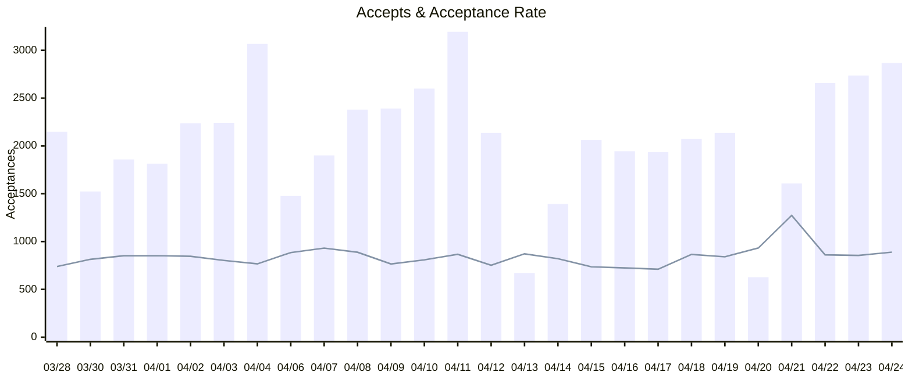
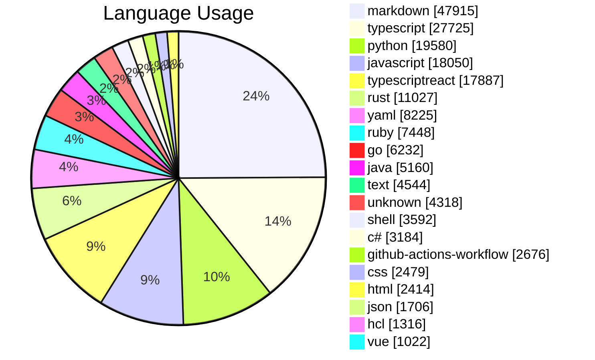
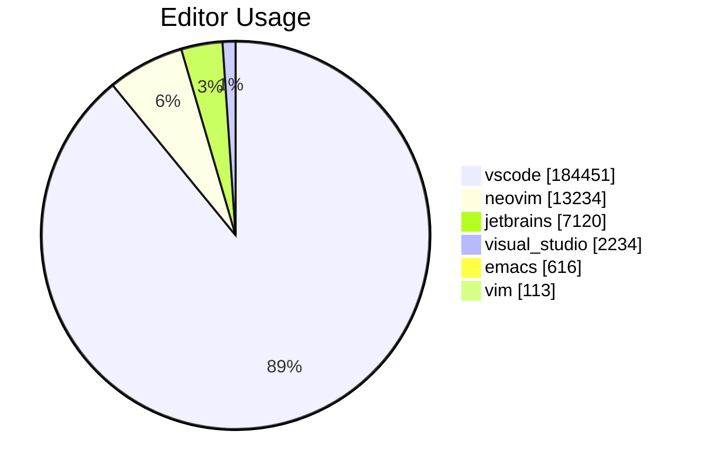

# Copilot Usage Action

Get Copilot usage data as:
* Md Job Summary
* CSV
* XML
* JSON

Powered by the [REST API endpoints for GitHub Copilot usage metrics](https://docs.github.com/en/rest/copilot/copilot-usage).

## Usage
Create a workflow (eg: `.github/workflows/copilot-usage.yml`). See [Creating a Workflow file](https://help.github.com/en/articles/configuring-a-workflow#creating-a-workflow-file).


### PAT(Personal Access Token)

You will need to [create a PAT(Personal Access Token)](https://github.com/settings/tokens/new?scopes=admin:org) that has the `copilot`, `manage_billing:copilot`, `admin:org`, `admin:enterprise`, or `manage_billing:enterprise` scope to use this endpoint.

Add this PAT as a secret so we can use it as input `github-token`, see [Creating encrypted secrets for a repository](https://docs.github.com/en/enterprise-cloud@latest/actions/security-guides/encrypted-secrets#creating-encrypted-secrets-for-a-repository). 

#### Example

> [!IMPORTANT]  
> You need to set the secret `TOKEN` in your repository settings.

```yml
name: Copilot Usage
on:
  schedule:
    - cron: '0 0 * * *'
  workflow_dispatch:

jobs:
  run:
    name: Run Action
    runs-on: ubuntu-latest
    steps:
      - uses: austenstone/copilot-usage@main
        with:
          github-token: ${{ secrets.TOKEN }}
```

#### Example sending email PDF report

> [!IMPORTANT]  
> You must set secrets for `EMAIL` and `PASSWORD` to send the email. You must use an [App Password](https://support.google.com/accounts/answer/185833?visit_id=638496193361004722-1436339969&p=InvalidSecondFactor&rd=1#app-passwords) for Gmail.

```yml
name: Email Copilot Report
on:
  workflow_dispatch:
  schedule:
    - cron: '0 0 * * *'

jobs:
  run:
    runs-on: ubuntu-latest
    steps:
      - uses: austenstone/copilot-usage@main
        with:
          organization: ${{ github.repository_owner }}
          github-token: ${{ secrets.TOKEN }}
      - uses: austenstone/job-summary-to-pdf@main
        id: pdf
        with:
          name: copilot-usage
      - uses: dawidd6/action-send-mail@v3
        with:
          server_address: smtp.gmail.com
          server_port: 465
          username: ${{ secrets.EMAIL }}
          password: ${{ secrets.PASSWORD }}
          from: ${{ secrets.EMAIL }}
          to: ${{ secrets.EMAIL }} # Recipient email
          subject: "Copilot Usage Report"
          body: "Attached is the Copilot Usage Report!"
          attachments: ${{ steps.pdf.outputs.pdf-file }}
```

> [!TIP]
> Try using other messaging systems such as [slack](https://github.com/marketplace/actions/slack-send), [teams](https://github.com/marketplace/actions/microsoft-teams-notification), [discord](https://github.com/marketplace/actions/discord-message-notify), etc.


## ➡️ Inputs
Various inputs are defined in [`action.yml`](action.yml):

| Name | Description | Default |
| --- | --- | --- |
| github-token | The GitHub token used to create an authenticated client | ${{ github.token }} |
| enterprise | The GitHub enterprise slug | |
| organization | The organization slug | ${{ github.repository_owner }} |
| team | The team slug | |
| days | The number of days to show usage metrics for | |
| since | Show usage metrics since this date. This is a timestamp in ISO 8601 format (YYYY-MM-DDTHH:MM:SSZ). Maximum value is 28 days ago | |
| until | Show usage metrics until this date. This is a timestamp in ISO 8601 format (YYYY-MM-DDTHH:MM:SSZ). Maximum value is 28 days ago | |
| job-summary | Whether to generate a report | true |
| csv | Whether to generate a CSV as a workflow artifact | false |
| csv-options | The options for the CSV report | |
| xml | Whether to generate an XML as a workflow artifact | false |
| xml-options | The options for the XML report | |

## ⬅️ Outputs
| Name | Description |
| --- | - |
| result | The copilot usage as a JSON string |
| since | The date since which the usage metrics are shown |
| until | The date until which the usage metrics are shown |

## Example Job Summary

<h1>Copilot Usage Results for 2024-03-28 to 2024-04-24</h1>
<h1>Suggestions: 207,774</h1>
<h1>Acceptances: 53,681</h1>
<h1>Acceptance Rate: 25.84%</h1>
<h1>Lines of Code Accepted: 91,248</h1>




<h1>Language Usage</h1>


<table><tr><th>Language</th><th>Suggestions</th><th>Acceptances</th><th>Acceptance Rate</th><th>Lines Suggested</th><th>Lines Accepted</th><th>Active Users</th></tr><tr><td>typescript</td><td>27725</td><td>8445</td><td>30.46%</td><td>46435</td><td>14213</td><td>338</td></tr><tr><td>markdown</td><td>47915</td><td>7411</td><td>15.47%</td><td>68741</td><td>8437</td><td>400</td></tr><tr><td>python</td><td>19580</td><td>7048</td><td>36.00%</td><td>31067</td><td>10911</td><td>372</td></tr><tr><td>javascript</td><td>18050</td><td>5972</td><td>33.09%</td><td>35415</td><td>12544</td><td>477</td></tr><tr><td>typescriptreact</td><td>17887</td><td>4697</td><td>26.26%</td><td>29180</td><td>6911</td><td>311</td></tr><tr><td>yaml</td><td>8225</td><td>2533</td><td>30.80%</td><td>15668</td><td>4558</td><td>297</td></tr><tr><td>rust</td><td>11027</td><td>2454</td><td>22.25%</td><td>53265</td><td>4889</td><td>77</td></tr><tr><td>ruby</td><td>7448</td><td>2225</td><td>29.87%</td><td>12398</td><td>2791</td><td>213</td></tr><tr><td>java</td><td>5160</td><td>2104</td><td>40.78%</td><td>18216</td><td>6722</td><td>226</td></tr><tr><td>go</td><td>6232</td><td>1825</td><td>29.28%</td><td>10868</td><td>2629</td><td>113</td></tr><tr><td>c#</td><td>3184</td><td>1246</td><td>39.13%</td><td>7829</td><td>2837</td><td>158</td></tr><tr><td>shell</td><td>3592</td><td>1050</td><td>29.23%</td><td>5593</td><td>1438</td><td>139</td></tr><tr><td>github-actions-workflow</td><td>2676</td><td>855</td><td>31.95%</td><td>5136</td><td>1622</td><td>67</td></tr><tr><td>html</td><td>2414</td><td>754</td><td>31.23%</td><td>8619</td><td>1597</td><td>136</td></tr><tr><td>unknown</td><td>4318</td><td>628</td><td>14.54%</td><td>7298</td><td>831</td><td>103</td></tr><tr><td>css</td><td>2479</td><td>561</td><td>22.63%</td><td>5157</td><td>1039</td><td>103</td></tr><tr><td>text</td><td>4544</td><td>471</td><td>10.37%</td><td>25867</td><td>724</td><td>85</td></tr><tr><td>json</td><td>1706</td><td>348</td><td>20.40%</td><td>3474</td><td>715</td><td>140</td></tr><tr><td>hcl</td><td>1316</td><td>343</td><td>26.06%</td><td>4570</td><td>1113</td><td>57</td></tr><tr><td>fsharp</td><td>917</td><td>322</td><td>35.11%</td><td>2152</td><td>743</td><td>38</td></tr><tr><td>dockerfile</td><td>706</td><td>278</td><td>39.38%</td><td>834</td><td>284</td><td>53</td></tr><tr><td>sql</td><td>530</td><td>217</td><td>40.94%</td><td>938</td><td>439</td><td>71</td></tr><tr><td>vue</td><td>1022</td><td>190</td><td>18.59%</td><td>2375</td><td>276</td><td>16</td></tr><tr><td>emacs-lisp</td><td>564</td><td>153</td><td>27.13%</td><td>1143</td><td>300</td><td>18</td></tr><tr><td>powershell</td><td>598</td><td>138</td><td>23.08%</td><td>798</td><td>156</td><td>32</td></tr><tr><td>scss</td><td>828</td><td>128</td><td>15.46%</td><td>1509</td><td>144</td><td>40</td></tr><tr><td>ql</td><td>820</td><td>118</td><td>14.39%</td><td>1744</td><td>158</td><td>26</td></tr><tr><td>kotlin</td><td>177</td><td>77</td><td>43.50%</td><td>708</td><td>356</td><td>13</td></tr><tr><td>json with comments</td><td>752</td><td>73</td><td>9.71%</td><td>1253</td><td>84</td><td>66</td></tr><tr><td>r</td><td>388</td><td>70</td><td>18.04%</td><td>690</td><td>72</td><td>16</td></tr><tr><td>postcss</td><td>232</td><td>67</td><td>28.88%</td><td>506</td><td>96</td><td>9</td></tr><tr><td>javascriptreact</td><td>96</td><td>66</td><td>68.75%</td><td>249</td><td>113</td><td>9</td></tr><tr><td>blazor</td><td>312</td><td>62</td><td>19.87%</td><td>944</td><td>115</td><td>19</td></tr><tr><td>xml</td><td>151</td><td>59</td><td>39.07%</td><td>507</td><td>245</td><td>39</td></tr><tr><td>jade</td><td>151</td><td>57</td><td>37.75%</td><td>255</td><td>104</td><td>5</td></tr><tr><td>toml</td><td>313</td><td>49</td><td>15.65%</td><td>993</td><td>63</td><td>25</td></tr><tr><td>lua</td><td>348</td><td>45</td><td>12.93%</td><td>1523</td><td>66</td><td>7</td></tr><tr><td>astro</td><td>125</td><td>38</td><td>30.40%</td><td>391</td><td>122</td><td>8</td></tr><tr><td>mdx</td><td>339</td><td>36</td><td>10.62%</td><td>416</td><td>36</td><td>12</td></tr><tr><td>razor</td><td>95</td><td>30</td><td>31.58%</td><td>218</td><td>37</td><td>16</td></tr><tr><td>html+erb</td><td>206</td><td>29</td><td>14.08%</td><td>315</td><td>35</td><td>21</td></tr><tr><td>terraform-vars</td><td>65</td><td>24</td><td>36.92%</td><td>80</td><td>24</td><td>7</td></tr><tr><td>html.erb</td><td>107</td><td>24</td><td>22.43%</td><td>244</td><td>51</td><td>8</td></tr><tr><td>vs-markdown</td><td>149</td><td>24</td><td>16.11%</td><td>149</td><td>24</td><td>7</td></tr><tr><td>c++</td><td>79</td><td>23</td><td>29.11%</td><td>176</td><td>53</td><td>17</td></tr><tr><td>ini</td><td>152</td><td>23</td><td>15.13%</td><td>196</td><td>23</td><td>14</td></tr><tr><td>dart</td><td>94</td><td>21</td><td>22.34%</td><td>178</td><td>25</td><td>9</td></tr><tr><td>dotenv</td><td>106</td><td>20</td><td>18.87%</td><td>120</td><td>17</td><td>13</td></tr><tr><td>php</td><td>109</td><td>19</td><td>17.43%</td><td>309</td><td>25</td><td>19</td></tr><tr><td>ignore list</td><td>137</td><td>19</td><td>13.87%</td><td>157</td><td>19</td><td>27</td></tr><tr><td>postgres</td><td>168</td><td>18</td><td>10.71%</td><td>382</td><td>7</td><td>16</td></tr><tr><td>bicep</td><td>63</td><td>17</td><td>26.98%</td><td>120</td><td>39</td><td>10</td></tr><tr><td>groovy</td><td>71</td><td>15</td><td>21.13%</td><td>125</td><td>20</td><td>15</td></tr><tr><td>sas</td><td>71</td><td>14</td><td>19.72%</td><td>116</td><td>17</td><td>2</td></tr><tr><td>git-commit</td><td>344</td><td>12</td><td>3.49%</td><td>452</td><td>12</td><td>23</td></tr><tr><td>dockercompose</td><td>33</td><td>10</td><td>30.30%</td><td>74</td><td>39</td><td>9</td></tr><tr><td>django-txt</td><td>20</td><td>10</td><td>50.00%</td><td>24</td><td>10</td><td>2</td></tr><tr><td>puppet</td><td>44</td><td>9</td><td>20.45%</td><td>111</td><td>26</td><td>7</td></tr><tr><td>rjsx</td><td>30</td><td>9</td><td>30.00%</td><td>107</td><td>62</td><td>2</td></tr><tr><td>prisma</td><td>17</td><td>8</td><td>47.06%</td><td>33</td><td>24</td><td>10</td></tr><tr><td>cmake</td><td>8</td><td>7</td><td>87.50%</td><td>11</td><td>9</td><td>2</td></tr><tr><td>kusto</td><td>50</td><td>6</td><td>12.00%</td><td>79</td><td>10</td><td>8</td></tr><tr><td>tex</td><td>55</td><td>6</td><td>10.91%</td><td>73</td><td>6</td><td>9</td></tr><tr><td>liquid</td><td>106</td><td>6</td><td>5.66%</td><td>379</td><td>16</td><td>2</td></tr><tr><td>scminput</td><td>62</td><td>5</td><td>8.06%</td><td>155</td><td>5</td><td>11</td></tr><tr><td>graphql</td><td>21</td><td>5</td><td>23.81%</td><td>81</td><td>27</td><td>3</td></tr><tr><td>c</td><td>31</td><td>4</td><td>12.90%</td><td>38</td><td>4</td><td>3</td></tr><tr><td>eruby</td><td>14</td><td>4</td><td>28.57%</td><td>122</td><td>7</td><td>4</td></tr><tr><td>julia</td><td>20</td><td>4</td><td>20.00%</td><td>24</td><td>7</td><td>3</td></tr><tr><td>aspnetcorerazor</td><td>8</td><td>4</td><td>50.00%</td><td>30</td><td>12</td><td>4</td></tr><tr><td>helm</td><td>18</td><td>3</td><td>16.67%</td><td>20</td><td>3</td><td>6</td></tr><tr><td>cobol</td><td>7</td><td>3</td><td>42.86%</td><td>8</td><td>3</td><td>2</td></tr><tr><td>makefile</td><td>14</td><td>3</td><td>21.43%</td><td>17</td><td>3</td><td>7</td></tr><tr><td>vb</td><td>4</td><td>3</td><td>75.00%</td><td>8</td><td>4</td><td>4</td></tr><tr><td>objective-c</td><td>5</td><td>3</td><td>60.00%</td><td>31</td><td>15</td><td>2</td></tr><tr><td>pug</td><td>8</td><td>3</td><td>37.50%</td><td>9</td><td>3</td><td>4</td></tr><tr><td>scala</td><td>6</td><td>3</td><td>50.00%</td><td>23</td><td>2</td><td>2</td></tr><tr><td>gotemplate</td><td>8</td><td>2</td><td>25.00%</td><td>16</td><td>3</td><td>2</td></tr><tr><td>vim</td><td>11</td><td>2</td><td>18.18%</td><td>27</td><td>2</td><td>2</td></tr><tr><td>perl</td><td>48</td><td>2</td><td>4.17%</td><td>60</td><td>2</td><td>7</td></tr><tr><td>nunjucks</td><td>24</td><td>1</td><td>4.17%</td><td>56</td><td>1</td><td>8</td></tr><tr><td>tsv</td><td>2</td><td>1</td><td>50.00%</td><td>2</td><td>1</td><td>2</td></tr><tr><td>gradle</td><td>9</td><td>1</td><td>11.11%</td><td>21</td><td>1</td><td>2</td></tr><tr><td>properties</td><td>28</td><td>1</td><td>3.57%</td><td>43</td><td>1</td><td>8</td></tr><tr><td>mermaid</td><td>6</td><td>1</td><td>16.67%</td><td>7</td><td>1</td><td>2</td></tr><tr><td>pip-requirements</td><td>26</td><td>1</td><td>3.85%</td><td>28</td><td>1</td><td>5</td></tr><tr><td>nix</td><td>12</td><td>1</td><td>8.33%</td><td>28</td><td>1</td><td>2</td></tr><tr><td>rmd</td><td>38</td><td>1</td><td>2.63%</td><td>44</td><td>1</td><td>2</td></tr><tr><td>django-html</td><td>3</td><td>1</td><td>33.33%</td><td>11</td><td>9</td><td>2</td></tr><tr><td>postgresql</td><td>6</td><td>1</td><td>16.67%</td><td>9</td><td>1</td><td>3</td></tr><tr><td>gemfile</td><td>8</td><td>0</td><td>0.00%</td><td>10</td><td>0</td><td>3</td></tr><tr><td>java-properties</td><td>5</td><td>0</td><td>0.00%</td><td>5</td><td>0</td><td>1</td></tr><tr><td>csv</td><td>3</td><td>0</td><td>0.00%</td><td>5</td><td>0</td><td>3</td></tr><tr><td>dtd</td><td>6</td><td>0</td><td>0.00%</td><td>30</td><td>0</td><td>1</td></tr><tr><td>clojure</td><td>9</td><td>0</td><td>0.00%</td><td>11</td><td>0</td><td>2</td></tr><tr><td>objective-cpp</td><td>12</td><td>0</td><td>0.00%</td><td>12</td><td>0</td><td>2</td></tr><tr><td>code++.ini</td><td>3</td><td>0</td><td>0.00%</td><td>7</td><td>0</td><td>1</td></tr><tr><td>protocol buffer</td><td>1</td><td>0</td><td>0.00%</td><td>1</td><td>0</td><td>1</td></tr><tr><td>zsh</td><td>4</td><td>0</td><td>0.00%</td><td>18</td><td>0</td><td>3</td></tr><tr><td>ssh_config</td><td>1</td><td>0</td><td>0.00%</td><td>1</td><td>0</td><td>1</td></tr><tr><td>swift</td><td>2</td><td>0</td><td>0.00%</td><td>3</td><td>0</td><td>1</td></tr><tr><td>msbuild</td><td>1</td><td>0</td><td>0.00%</td><td>3</td><td>0</td><td>1</td></tr><tr><td>conf</td><td>3</td><td>0</td><td>0.00%</td><td>10</td><td>0</td><td>1</td></tr><tr><td>sshconfig</td><td>9</td><td>0</td><td>0.00%</td><td>33</td><td>0</td><td>3</td></tr><tr><td>plm</td><td>4</td><td>0</td><td>0.00%</td><td>5</td><td>0</td><td>1</td></tr><tr><td>restructuredtext</td><td>1</td><td>0</td><td>0.00%</td><td>1</td><td>0</td><td>1</td></tr><tr><td>bat</td><td>2</td><td>0</td><td>0.00%</td><td>2</td><td>0</td><td>2</td></tr><tr><td>vgo</td><td>9</td><td>0</td><td>0.00%</td><td>14</td><td>0</td><td>1</td></tr><tr><td>hcl.terraform</td><td>1</td><td>0</td><td>0.00%</td><td>3</td><td>0</td><td>1</td></tr><tr><td>coffeescript</td><td>5</td><td>0</td><td>0.00%</td><td>6</td><td>0</td><td>3</td></tr><tr><td>http request</td><td>1</td><td>0</td><td>0.00%</td><td>1</td><td>0</td><td>1</td></tr><tr><td>requirements</td><td>4</td><td>0</td><td>0.00%</td><td>4</td><td>0</td><td>1</td></tr><tr><td>emd</td><td>7</td><td>0</td><td>0.00%</td><td>7</td><td>0</td><td>2</td></tr><tr><td>sqlite</td><td>2</td><td>0</td><td>0.00%</td><td>2</td><td>0</td><td>1</td></tr></table>
<h1>Editor Usage</h1>


<table><tr><th>Editor</th><th>Suggestions</th><th>Acceptances</th><th>Acceptance Rate</th><th>Lines Suggested</th><th>Lines Accepted</th><th>Active Users</th></tr><tr><td>vscode</td><td>184451</td><td>47563</td><td>25.79%</td><td>332656</td><td>79485</td><td>4118</td></tr><tr><td>visual_studio</td><td>2234</td><td>845</td><td>37.82%</td><td>4640</td><td>1699</td><td>108</td></tr><tr><td>jetbrains</td><td>7120</td><td>2006</td><td>28.17%</td><td>15281</td><td>3659</td><td>333</td></tr><tr><td>neovim</td><td>13234</td><td>3069</td><td>23.19%</td><td>65797</td><td>5954</td><td>147</td></tr><tr><td>vim</td><td>113</td><td>29</td><td>25.66%</td><td>358</td><td>57</td><td>19</td></tr><tr><td>emacs</td><td>616</td><td>167</td><td>27.11%</td><td>1332</td><td>389</td><td>24</td></tr></table>
<h1>Daily Usage</h1>
<table><tr><th>Day</th><th>Suggestions</th><th>Acceptances</th><th>Acceptance Rate</th><th>Lines Suggested</th><th>Lines Accepted</th><th>Active Users</th><th>Chat Acceptances</th><th>Chat Turns</th><th>Active Chat Users</th></tr><tr><td>2024&#8209;03&#8209;28</td><td>9325</td><td>2149</td><td>23.05%</td><td>27422</td><td>4097</td><td>106</td><td>0</td><td>0</td><td>0</td></tr><tr><td>2024&#8209;03&#8209;30</td><td>5993</td><td>1523</td><td>25.41%</td><td>15527</td><td>2709</td><td>33</td><td>0</td><td>0</td><td>0</td></tr><tr><td>2024&#8209;03&#8209;31</td><td>6995</td><td>1859</td><td>26.58%</td><td>17328</td><td>3044</td><td>35</td><td>0</td><td>0</td><td>0</td></tr><tr><td>2024&#8209;04&#8209;01</td><td>6819</td><td>1815</td><td>26.62%</td><td>29475</td><td>3169</td><td>70</td><td>0</td><td>0</td><td>0</td></tr><tr><td>2024&#8209;04&#8209;02</td><td>8476</td><td>2237</td><td>26.39%</td><td>14464</td><td>3768</td><td>106</td><td>0</td><td>0</td><td>0</td></tr><tr><td>2024&#8209;04&#8209;03</td><td>8943</td><td>2240</td><td>25.05%</td><td>19976</td><td>4386</td><td>101</td><td>0</td><td>0</td><td>0</td></tr><tr><td>2024&#8209;04&#8209;04</td><td>12821</td><td>3067</td><td>23.92%</td><td>27008</td><td>5982</td><td>118</td><td>0</td><td>0</td><td>0</td></tr><tr><td>2024&#8209;04&#8209;06</td><td>5345</td><td>1476</td><td>27.61%</td><td>10927</td><td>2433</td><td>32</td><td>0</td><td>0</td><td>0</td></tr><tr><td>2024&#8209;04&#8209;07</td><td>6539</td><td>1901</td><td>29.07%</td><td>13533</td><td>3611</td><td>38</td><td>0</td><td>0</td><td>0</td></tr><tr><td>2024&#8209;04&#8209;08</td><td>8587</td><td>2380</td><td>27.72%</td><td>16254</td><td>4618</td><td>96</td><td>0</td><td>0</td><td>0</td></tr><tr><td>2024&#8209;04&#8209;09</td><td>10008</td><td>2391</td><td>23.89%</td><td>18542</td><td>4514</td><td>112</td><td>0</td><td>0</td><td>0</td></tr><tr><td>2024&#8209;04&#8209;10</td><td>10301</td><td>2600</td><td>25.24%</td><td>18825</td><td>4752</td><td>125</td><td>0</td><td>0</td><td>0</td></tr><tr><td>2024&#8209;04&#8209;11</td><td>11811</td><td>3194</td><td>27.04%</td><td>20636</td><td>5512</td><td>116</td><td>0</td><td>0</td><td>0</td></tr><tr><td>2024&#8209;04&#8209;12</td><td>9105</td><td>2137</td><td>23.47%</td><td>14478</td><td>3554</td><td>105</td><td>0</td><td>0</td><td>0</td></tr><tr><td>2024&#8209;04&#8209;13</td><td>2470</td><td>672</td><td>27.21%</td><td>3756</td><td>880</td><td>25</td><td>0</td><td>0</td><td>0</td></tr><tr><td>2024&#8209;04&#8209;14</td><td>5440</td><td>1393</td><td>25.61%</td><td>8604</td><td>1975</td><td>36</td><td>0</td><td>0</td><td>0</td></tr><tr><td>2024&#8209;04&#8209;15</td><td>8985</td><td>2063</td><td>22.96%</td><td>13923</td><td>3224</td><td>91</td><td>0</td><td>0</td><td>0</td></tr><tr><td>2024&#8209;04&#8209;16</td><td>8603</td><td>1945</td><td>22.61%</td><td>16403</td><td>3608</td><td>106</td><td>0</td><td>0</td><td>0</td></tr><tr><td>2024&#8209;04&#8209;17</td><td>8723</td><td>1935</td><td>22.18%</td><td>16341</td><td>3380</td><td>97</td><td>0</td><td>0</td><td>0</td></tr><tr><td>2024&#8209;04&#8209;18</td><td>7678</td><td>2074</td><td>27.01%</td><td>13713</td><td>2885</td><td>97</td><td>0</td><td>0</td><td>0</td></tr><tr><td>2024&#8209;04&#8209;19</td><td>8145</td><td>2137</td><td>26.24%</td><td>15544</td><td>3442</td><td>96</td><td>0</td><td>0</td><td>0</td></tr><tr><td>2024&#8209;04&#8209;20</td><td>2155</td><td>627</td><td>29.10%</td><td>4082</td><td>992</td><td>30</td><td>0</td><td>0</td><td>0</td></tr><tr><td>2024&#8209;04&#8209;21</td><td>4043</td><td>1607</td><td>39.75%</td><td>7207</td><td>2211</td><td>32</td><td>0</td><td>0</td><td>0</td></tr><tr><td>2024&#8209;04&#8209;22</td><td>9888</td><td>2658</td><td>26.88%</td><td>18575</td><td>4119</td><td>116</td><td>0</td><td>0</td><td>0</td></tr><tr><td>2024&#8209;04&#8209;23</td><td>10246</td><td>2735</td><td>26.69%</td><td>17450</td><td>4120</td><td>118</td><td>316</td><td>1631</td><td>107</td></tr><tr><td>2024&#8209;04&#8209;24</td><td>10330</td><td>2866</td><td>27.74%</td><td>20090</td><td>4263</td><td>129</td><td>349</td><td>2193</td><td>116</td></tr></table>

## Example CSV
```csv
day,total_suggestions_count,total_acceptances_count,total_lines_suggested,total_lines_accepted,total_active_users,total_chat_acceptances,total_chat_turns,total_active_chat_users,breakdown
2024-03-28,9325,2149,27422,4097,106,0,0,0,"[{""language"":""fsharp"",""editor"":""vscode"",""suggestions_count"":45,""acceptances_count"":7,""lines_suggested"":56,""lines_accepted"":7,""active_users"":2},{""language"":""gemfile"",""editor"":""vscode"",""suggestions_count"":1,""acceptances_count"":0,""lines_suggested"":2,""lines_accepted"":0,""active_users"":1},{""language"":""git-commit"",""editor"":""vscode"",""suggestions_count"":56,""acceptances_count"":4,""lines_suggested"":97,""lines_accepted"":4,""active_users"":4},{""language"":""github-actions-workflow"",""editor"":""vscode"",""suggestions_count"":252,""acceptances_count"":62,""lines_suggested"":499,""lines_accepted"":124,""active_users"":6},{""language"":""java-properties"",""editor"":""vscode"",""suggestions_count"":5,""acceptances_count"":0,""lines_suggested"":5,""lines_accepted"":0,""active_users"":1},{""language"":""javascriptreact"",""editor"":""vscode"",""suggestions_count"":32,""acceptances_count"":23,""lines_suggested"":52,""lines_accepted"":40,""active_users"":2},{""language"":""kusto"",""editor"":""vscode"",""suggestions_count"":3,""acceptances_count"":0,""lines_suggested"":3,""lines_accepted"":0,""active_users"":1},{""language"":""nunjucks"",""editor"":""vscode"",""suggestions_count"":10,""acceptances_count"":0,""lines_suggested"":40,""lines_accepted"":0,""active_users"":1},{""language"":""postgres"",""editor"":""vscode"",""suggestions_count"":51,""acceptances_count"":1,""lines_suggested"":135,""lines_accepted"":1,""active_users"":2},{""language"":""ql"",""editor"":""vscode"",""suggestions_count"":13,""acceptances_count"":1,""lines_suggested"":24,""lines_accepted"":1,""active_users"":2},{""language"":""scminput"",""editor"":""vscode"",""suggestions_count"":3,""acceptances_count"":0,""lines_suggested"":3,""lines_accepted"":0,""active_users"":1},{""language"":""terraform-vars"",""editor"":""vscode"",""suggestions_count"":1,""acceptances_count"":0,""lines_suggested"":1,""lines_accepted"":0,""active_users"":1},{""language"":""tsv"",""editor"":""vscode"",""suggestions_count"":2,""acceptances_count"":1,""lines_suggested"":2,""lines_accepted"":1,""active_users"":2},{""language"":""typescriptreact"",""editor"":""vscode"",""suggestions_count"":401,""acceptances_count"":98,""lines_suggested"":701,""lines_accepted"":163,""active_users"":10},{""language"":""shell"",""editor"":""vscode"",""suggestions_count"":99,""acceptances_count"":29,""lines_suggested"":167,""lines_accepted"":45,""active_users"":6},{""language"":""javascript"",""editor"":""vscode"",""suggestions_count"":1167,""acceptances_count"":354,""lines_suggested"":2354,""lines_accepted"":827,""active_users"":23},{""language"":""ruby"",""editor"":""vscode"",""suggestions_count"":306,""acceptances_count"":80,""lines_suggested"":559,""lines_accepted"":115,""active_users"":12},{""language"":""c++"",""editor"":""vscode"",""suggestions_count"":9,""acceptances_count"":5,""lines_suggested"":40,""lines_accepted"":19,""active_users"":2},{""language"":""python"",""editor"":""vscode"",""suggestions_count"":648,""acceptances_count"":234,""lines_suggested"":1053,""lines_accepted"":415,""active_users"":15},{""language"":""php"",""editor"":""vscode"",""suggestions_count"":7,""acceptances_count"":1,""lines_suggested"":8,""lines_accepted"":1,""active_users"":2},{""language"":""java"",""editor"":""vscode"",""suggestions_count"":117,""acceptances_count"":59,""lines_suggested"":387,""lines_accepted"":207,""active_users"":6},{""language"":""go"",""editor"":""vscode"",""suggestions_count"":70,""acceptances_count"":25,""lines_suggested"":174,""lines_accepted"":44,""active_users"":4},{""language"":""c#"",""editor"":""vscode"",""suggestions_count"":83,""acceptances_count"":23,""lines_suggested"":180,""lines_accepted"":60,""active_users"":6},{""language"":""rust"",""editor"":""vscode"",""suggestions_count"":32,""acceptances_count"":3,""lines_suggested"":116,""lines_accepted"":7,""active_users"":2},{""language"":""powershell"",""editor"":""vscode"",""suggestions_count"":3,""acceptances_count"":0,""lines_suggested"":3,""lines_accepted"":0,""active_users"":1},{""language"":""dart"",""editor"":""vscode"",""suggestions_count"":22,""acceptances_count"":4,""lines_suggested"":35,""lines_accepted"":6,""active_users"":2},{""language"":""typescript"",""editor"":""vscode"",""suggestions_count"":553,""acceptances_count"":169,""lines_suggested"":1028,""lines_accepted"":349,""active_users"":11},{""language"":""css"",""editor"":""vscode"",""suggestions_count"":52,""acceptances_count"":5,""lines_suggested"":71,""lines_accepted"":7,""active_users"":4},{""language"":""markdown"",""editor"":""vscode"",""suggestions_count"":1466,""acceptances_count"":136,""lines_suggested"":2120,""lines_accepted"":141,""active_users"":21},{""language"":""sql"",""editor"":""vscode"",""suggestions_count"":8,""acceptances_count"":1,""lines_suggested"":20,""lines_accepted"":6,""active_users"":2},{""language"":""html"",""editor"":""vscode"",""suggestions_count"":147,""acceptances_count"":37,""lines_suggested"":241,""lines_accepted"":44,""active_users"":11},{""language"":""cmake"",""editor"":""vscode"",""suggestions_count"":8,""acceptances_count"":7,""lines_suggested"":11,""lines_accepted"":9,""active_users"":2},{""language"":""hcl"",""editor"":""vscode"",""suggestions_count"":18,""acceptances_count"":3,""lines_suggested"":69,""lines_accepted"":15,""active_users"":2},{""language"":""csv"",""editor"":""vscode"",""suggestions_count"":1,""acceptances_count"":0,""lines_suggested"":2,""lines_accepted"":0,""active_users"":1},{""language"":""dockerfile"",""editor"":""vscode"",""suggestions_count"":39,""acceptances_count"":34,""lines_suggested"":41,""lines_accepted"":34,""active_users"":4},{""language"":""gradle"",""editor"":""vscode"",""suggestions_count"":9,""acceptances_count"":1,""lines_suggested"":21,""lines_accepted"":1,""active_users"":2},{""language"":""html+erb"",""editor"":""vscode"",""suggestions_count"":14,""acceptances_count"":1,""lines_suggested"":20,""lines_accepted"":1,""active_users"":2},{""language"":""ini"",""editor"":""vscode"",""suggestions_count"":6,""acceptances_count"":3,""lines_suggested"":6,""lines_accepted"":3,""active_users"":2},{""language"":""json"",""editor"":""vscode"",""suggestions_count"":18,""acceptances_count"":3,""lines_suggested"":25,""lines_accepted"":4,""active_users"":2},{""language"":""scss"",""editor"":""vscode"",""suggestions_count"":11,""acceptances_count"":0,""lines_suggested"":45,""lines_accepted"":0,""active_users"":1},{""language"":""text"",""editor"":""vscode"",""suggestions_count"":75,""acceptances_count"":9,""lines_suggested"":129,""lines_accepted"":9,""active_users"":4},{""language"":""yaml"",""editor"":""vscode"",""suggestions_count"":191,""acceptances_count"":57,""lines_suggested"":660,""lines_accepted"":216,""active_users"":9},{""language"":""postcss"",""editor"":""vscode"",""suggestions_count"":94,""acceptances_count"":21,""lines_suggested"":210,""lines_accepted"":32,""active_users"":2},{""language"":""json with comments"",""editor"":""vscode"",""suggestions_count"":14,""acceptances_count"":3,""lines_suggested"":18,""lines_accepted"":4,""active_users"":3},{""language"":""ignore list"",""editor"":""vscode"",""suggestions_count"":13,""acceptances_count"":4,""lines_suggested"":16,""lines_accepted"":4,""active_users"":3},{""language"":""mdx"",""editor"":""vscode"",""suggestions_count"":89,""acceptances_count"":12,""lines_suggested"":119,""lines_accepted"":12,""active_users"":2},{""language"":""c#"",""editor"":""visual_studio"",""suggestions_count"":55,""acceptances_count"":21,""lines_suggested"":63,""lines_accepted"":26,""active_users"":3},{""language"":""blazor"",""editor"":""jetbrains"",""suggestions_count"":1,""acceptances_count"":0,""lines_suggested"":1,""lines_accepted"":0,""active_users"":1},{""language"":""dtd"",""editor"":""jetbrains"",""suggestions_count"":6,""acceptances_count"":0,""lines_suggested"":30,""lines_accepted"":0,""active_users"":1},{""language"":""typescriptreact"",""editor"":""jetbrains"",""suggestions_count"":135,""acceptances_count"":16,""lines_suggested"":205,""lines_accepted"":27,""active_users"":2},{""language"":""shell"",""editor"":""jetbrains"",""suggestions_count"":24,""acceptances_count"":0,""lines_suggested"":25,""lines_accepted"":0,""active_users"":1},{""language"":""javascript"",""editor"":""jetbrains"",""suggestions_count"":7,""acceptances_count"":0,""lines_suggested"":7,""lines_accepted"":0,""active_users"":1},{""language"":""python"",""editor"":""jetbrains"",""suggestions_count"":64,""acceptances_count"":14,""lines_suggested"":102,""lines_accepted"":16,""active_users"":3},{""language"":""c"",""editor"":""jetbrains"",""suggestions_count"":29,""acceptances_count"":4,""lines_suggested"":36,""lines_accepted"":4,""active_users"":2},{""language"":""c#"",""editor"":""jetbrains"",""suggestions_count"":21,""acceptances_count"":10,""lines_suggested"":49,""lines_accepted"":25,""active_users"":3},{""language"":""markdown"",""editor"":""jetbrains"",""suggestions_count"":8,""acceptances_count"":3,""lines_suggested"":11,""lines_accepted"":4,""active_users"":2},{""language"":""json"",""editor"":""jetbrains"",""suggestions_count"":3,""acceptances_count"":0,""lines_suggested"":3,""lines_accepted"":0,""active_users"":1},{""language"":""yaml"",""editor"":""jetbrains"",""suggestions_count"":4,""acceptances_count"":0,""lines_suggested"":18,""lines_accepted"":0,""active_users"":1},{""language"":""eruby"",""editor"":""neovim"",""suggestions_count"":13,""acceptances_count"":3,""lines_suggested"":118,""lines_accepted"":3,""active_users"":2},{""language"":""ruby"",""editor"":""neovim"",""suggestions_count"":6,""acceptances_count"":5,""lines_suggested"":11,""lines_accepted"":6,""active_users"":2},{""language"":""rust"",""editor"":""neovim"",""suggestions_count"":2438,""acceptances_count"":469,""lines_suggested"":13138,""lines_accepted"":815,""active_users"":2},{""language"":""css"",""editor"":""neovim"",""suggestions_count"":5,""acceptances_count"":1,""lines_suggested"":24,""lines_accepted"":1,""active_users"":2},{""language"":""html"",""editor"":""neovim"",""suggestions_count"":1,""acceptances_count"":0,""lines_suggested"":1,""lines_accepted"":0,""active_users"":1},{""language"":""toml"",""editor"":""neovim"",""suggestions_count"":46,""acceptances_count"":8,""lines_suggested"":136,""lines_accepted"":9,""active_users"":2},{""language"":""text"",""editor"":""neovim"",""suggestions_count"":194,""acceptances_count"":74,""lines_suggested"":1874,""lines_accepted"":182,""active_users"":3}]"
2024-03-30,5993,1523,15527,2709,33,0,0,0,"[{""language"":""dockercompose"",""editor"":""vscode"",""suggestions_count"":1,""acceptances_count"":1,""lines_suggested"":3,""lines_accepted"":3,""active_users"":2},{""language"":""git-commit"",""editor"":""vscode"",""suggestions_count"":20,""acceptances_count"":1,""lines_suggested"":25,""lines_accepted"":1,""active_users"":2},{""language"":""nunjucks"",""editor"":""vscode"",""suggestions_count"":3,""acceptances_count"":1,""lines_suggested"":3,""lines_accepted"":1,""active_users"":2},{""language"":""typescriptreact"",""editor"":""vscode"",""suggestions_count"":238,""acceptances_count"":36,""lines_suggested"":378,""lines_accepted"":72,""active_users"":4},{""language"":""shell"",""editor"":""vscode"",""suggestions_count"":9,""acceptances_count"":1,""lines_suggested"":9,""lines_accepted"":1,""active_users"":2},{""language"":""javascript"",""editor"":""vscode"",""suggestions_count"":636,""acceptances_count"":196,""lines_suggested"":993,""lines_accepted"":317,""active_users"":3},{""language"":""ruby"",""editor"":""vscode"",""suggestions_count"":59,""acceptances_count"":8,""lines_suggested"":70,""lines_accepted"":8,""active_users"":2},{""language"":""python"",""editor"":""vscode"",""suggestions_count"":347,""acceptances_count"":119,""lines_suggested"":563,""lines_accepted"":292,""active_users"":7},{""language"":""lua"",""editor"":""vscode"",""suggestions_count"":7,""acceptances_count"":3,""lines_suggested"":23,""lines_accepted"":4,""active_users"":2},{""language"":""groovy"",""editor"":""vscode"",""suggestions_count"":1,""acceptances_count"":0,""lines_suggested"":1,""lines_accepted"":0,""active_users"":1},{""language"":""go"",""editor"":""vscode"",""suggestions_count"":121,""acceptances_count"":16,""lines_suggested"":139,""lines_accepted"":18,""active_users"":3},{""language"":""typescript"",""editor"":""vscode"",""suggestions_count"":862,""acceptances_count"":321,""lines_suggested"":1696,""lines_accepted"":765,""active_users"":6},{""language"":""css"",""editor"":""vscode"",""suggestions_count"":60,""acceptances_count"":6,""lines_suggested"":87,""lines_accepted"":12,""active_users"":3},{""language"":""markdown"",""editor"":""vscode"",""suggestions_count"":1681,""acceptances_count"":392,""lines_suggested"":2939,""lines_accepted"":532,""active_users"":6},{""language"":""tex"",""editor"":""vscode"",""suggestions_count"":5,""acceptances_count"":0,""lines_suggested"":6,""lines_accepted"":0,""active_users"":1},{""language"":""html"",""editor"":""vscode"",""suggestions_count"":118,""acceptances_count"":19,""lines_suggested"":235,""lines_accepted"":29,""active_users"":4},{""language"":""dockerfile"",""editor"":""vscode"",""suggestions_count"":11,""acceptances_count"":3,""lines_suggested"":12,""lines_accepted"":3,""active_users"":2},{""language"":""json"",""editor"":""vscode"",""suggestions_count"":1,""acceptances_count"":0,""lines_suggested"":1,""lines_accepted"":0,""active_users"":1},{""language"":""scss"",""editor"":""vscode"",""suggestions_count"":14,""acceptances_count"":1,""lines_suggested"":23,""lines_accepted"":1,""active_users"":2},{""language"":""text"",""editor"":""vscode"",""suggestions_count"":11,""acceptances_count"":2,""lines_suggested"":12,""lines_accepted"":3,""active_users"":3},{""language"":""yaml"",""editor"":""vscode"",""suggestions_count"":93,""acceptances_count"":10,""lines_suggested"":225,""lines_accepted"":10,""active_users"":4},{""language"":""json with comments"",""editor"":""vscode"",""suggestions_count"":24,""acceptances_count"":2,""lines_suggested"":46,""lines_accepted"":2,""active_users"":2},{""language"":""ignore list"",""editor"":""vscode"",""suggestions_count"":31,""acceptances_count"":0,""lines_suggested"":35,""lines_accepted"":0,""active_users"":1},{""language"":""fsharp"",""editor"":""visual_studio"",""suggestions_count"":129,""acceptances_count"":75,""lines_suggested"":184,""lines_accepted"":99,""active_users"":2},{""language"":""javascript"",""editor"":""jetbrains"",""suggestions_count"":20,""acceptances_count"":11,""lines_suggested"":41,""lines_accepted"":25,""active_users"":2},{""language"":""markdown"",""editor"":""jetbrains"",""suggestions_count"":2,""acceptances_count"":0,""lines_suggested"":4,""lines_accepted"":0,""active_users"":1},{""language"":""yaml"",""editor"":""jetbrains"",""suggestions_count"":4,""acceptances_count"":0,""lines_suggested"":8,""lines_accepted"":0,""active_users"":1},{""language"":""shell"",""editor"":""vim"",""suggestions_count"":4,""acceptances_count"":0,""lines_suggested"":13,""lines_accepted"":0,""active_users"":1},{""language"":""rust"",""editor"":""neovim"",""suggestions_count"":1380,""acceptances_count"":294,""lines_suggested"":7287,""lines_accepted"":506,""active_users"":2},{""language"":""html"",""editor"":""neovim"",""suggestions_count"":49,""acceptances_count"":3,""lines_suggested"":291,""lines_accepted"":3,""active_users"":2},{""language"":""toml"",""editor"":""neovim"",""suggestions_count"":5,""acceptances_count"":1,""lines_suggested"":13,""lines_accepted"":1,""active_users"":2},{""language"":""text"",""editor"":""neovim"",""suggestions_count"":47,""acceptances_count"":1,""lines_suggested"":162,""lines_accepted"":1,""active_users"":2}]"
2024-03-31,6995,1859,17328,3044,35,0,0,0,"[{""language"":""dockercompose"",""editor"":""vscode"",""suggestions_count"":7,""acceptances_count"":2,""lines_suggested"":21,""lines_accepted"":6,""active_users"":2},{""language"":""github-actions-workflow"",""editor"":""vscode"",""suggestions_count"":71,""acceptances_count"":25,""lines_suggested"":156,""lines_accepted"":49,""active_users"":3},{""language"":""gotemplate"",""editor"":""vscode"",""suggestions_count"":8,""acceptances_count"":2,""lines_suggested"":16,""lines_accepted"":3,""active_users"":2},{""language"":""nunjucks"",""editor"":""vscode"",""suggestions_count"":3,""acceptances_count"":0,""lines_suggested"":3,""lines_accepted"":0,""active_users"":1},{""language"":""properties"",""editor"":""vscode"",""suggestions_count"":2,""acceptances_count"":0,""lines_suggested"":2,""lines_accepted"":0,""active_users"":1},{""language"":""ql"",""editor"":""vscode"",""suggestions_count"":189,""acceptances_count"":15,""lines_suggested"":387,""lines_accepted"":18,""active_users"":2},{""language"":""sas"",""editor"":""vscode"",""suggestions_count"":71,""acceptances_count"":14,""lines_suggested"":116,""lines_accepted"":17,""active_users"":2},{""language"":""typescriptreact"",""editor"":""vscode"",""suggestions_count"":223,""acceptances_count"":72,""lines_suggested"":394,""lines_accepted"":108,""active_users"":5},{""language"":""shell"",""editor"":""vscode"",""suggestions_count"":82,""acceptances_count"":5,""lines_suggested"":102,""lines_accepted"":5,""active_users"":2},{""language"":""javascript"",""editor"":""vscode"",""suggestions_count"":759,""acceptances_count"":256,""lines_suggested"":1614,""lines_accepted"":385,""active_users"":9},{""language"":""ruby"",""editor"":""vscode"",""suggestions_count"":63,""acceptances_count"":32,""lines_suggested"":100,""lines_accepted"":32,""active_users"":2},{""language"":""python"",""editor"":""vscode"",""suggestions_count"":413,""acceptances_count"":106,""lines_suggested"":650,""lines_accepted"":159,""active_users"":6},{""language"":""php"",""editor"":""vscode"",""suggestions_count"":1,""acceptances_count"":0,""lines_suggested"":1,""lines_accepted"":0,""active_users"":1},{""language"":""clojure"",""editor"":""vscode"",""suggestions_count"":6,""acceptances_count"":0,""lines_suggested"":6,""lines_accepted"":0,""active_users"":1},{""language"":""go"",""editor"":""vscode"",""suggestions_count"":59,""acceptances_count"":15,""lines_suggested"":73,""lines_accepted"":19,""active_users"":2},{""language"":""typescript"",""editor"":""vscode"",""suggestions_count"":1077,""acceptances_count"":389,""lines_suggested"":2150,""lines_accepted"":807,""active_users"":9},{""language"":""css"",""editor"":""vscode"",""suggestions_count"":55,""acceptances_count"":4,""lines_suggested"":116,""lines_accepted"":5,""active_users"":2},{""language"":""markdown"",""editor"":""vscode"",""suggestions_count"":1644,""acceptances_count"":402,""lines_suggested"":2405,""lines_accepted"":428,""active_users"":6},{""language"":""html"",""editor"":""vscode"",""suggestions_count"":119,""acceptances_count"":11,""lines_suggested"":327,""lines_accepted"":17,""active_users"":4},{""language"":""json"",""editor"":""vscode"",""suggestions_count"":11,""acceptances_count"":2,""lines_suggested"":12,""lines_accepted"":2,""active_users"":2},{""language"":""scss"",""editor"":""vscode"",""suggestions_count"":44,""acceptances_count"":5,""lines_suggested"":67,""lines_accepted"":5,""active_users"":2},{""language"":""toml"",""editor"":""vscode"",""suggestions_count"":28,""acceptances_count"":1,""lines_suggested"":45,""lines_accepted"":1,""active_users"":2},{""language"":""text"",""editor"":""vscode"",""suggestions_count"":43,""acceptances_count"":0,""lines_suggested"":104,""lines_accepted"":0,""active_users"":1},{""language"":""yaml"",""editor"":""vscode"",""suggestions_count"":125,""acceptances_count"":34,""lines_suggested"":215,""lines_accepted"":69,""active_users"":3},{""language"":""json with comments"",""editor"":""vscode"",""suggestions_count"":11,""acceptances_count"":1,""lines_suggested"":16,""lines_accepted"":2,""active_users"":2},{""language"":""ignore list"",""editor"":""vscode"",""suggestions_count"":1,""acceptances_count"":0,""lines_suggested"":1,""lines_accepted"":0,""active_users"":1},{""language"":""prisma"",""editor"":""vscode"",""suggestions_count"":2,""acceptances_count"":2,""lines_suggested"":2,""lines_accepted"":2,""active_users"":2},{""language"":""bicep"",""editor"":""vscode"",""suggestions_count"":17,""acceptances_count"":5,""lines_suggested"":26,""lines_accepted"":5,""active_users"":2},{""language"":""fsharp"",""editor"":""visual_studio"",""suggestions_count"":31,""acceptances_count"":9,""lines_suggested"":102,""lines_accepted"":15,""active_users"":2},{""language"":""java"",""editor"":""jetbrains"",""suggestions_count"":379,""acceptances_count"":94,""lines_suggested"":1166,""lines_accepted"":190,""active_users"":3},{""language"":""vim"",""editor"":""neovim"",""suggestions_count"":11,""acceptances_count"":2,""lines_suggested"":27,""lines_accepted"":2,""active_users"":2},{""language"":""lua"",""editor"":""neovim"",""suggestions_count"":11,""acceptances_count"":0,""lines_suggested"":99,""lines_accepted"":0,""active_users"":1},{""language"":""rust"",""editor"":""neovim"",""suggestions_count"":1215,""acceptances_count"":282,""lines_suggested"":5637,""lines_accepted"":585,""active_users"":2},{""language"":""css"",""editor"":""neovim"",""suggestions_count"":6,""acceptances_count"":0,""lines_suggested"":50,""lines_accepted"":0,""active_users"":1},{""language"":""html"",""editor"":""neovim"",""suggestions_count"":55,""acceptances_count"":17,""lines_suggested"":174,""lines_accepted"":29,""active_users"":2},{""language"":""text"",""editor"":""neovim"",""suggestions_count"":153,""acceptances_count"":55,""lines_suggested"":946,""lines_accepted"":79,""active_users"":2}]"
```

## Further help
To get more help on the Actions see [documentation](https://docs.github.com/en/actions).
