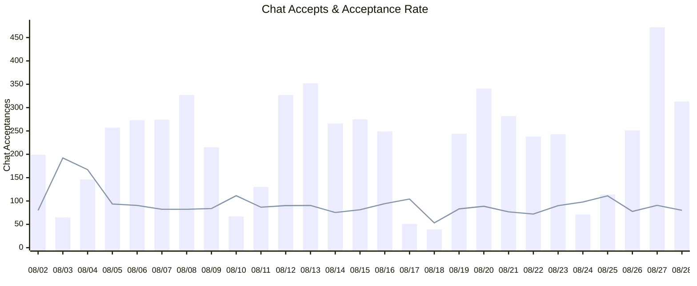
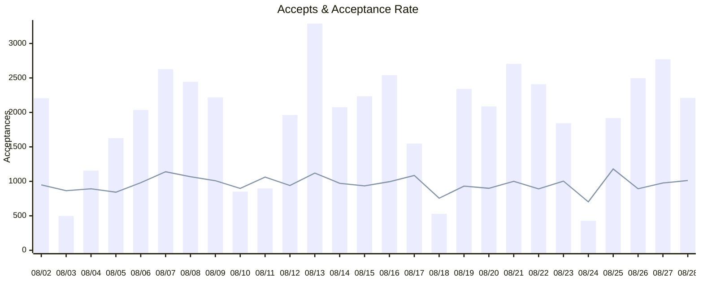
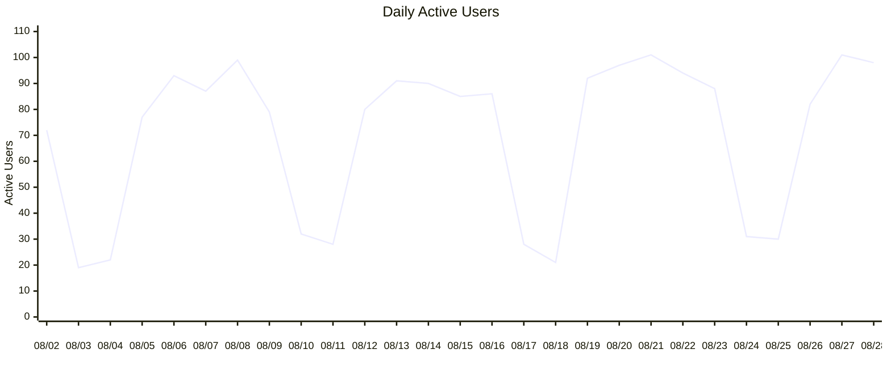
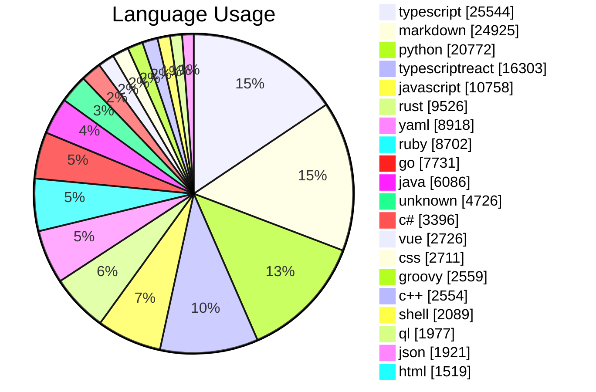
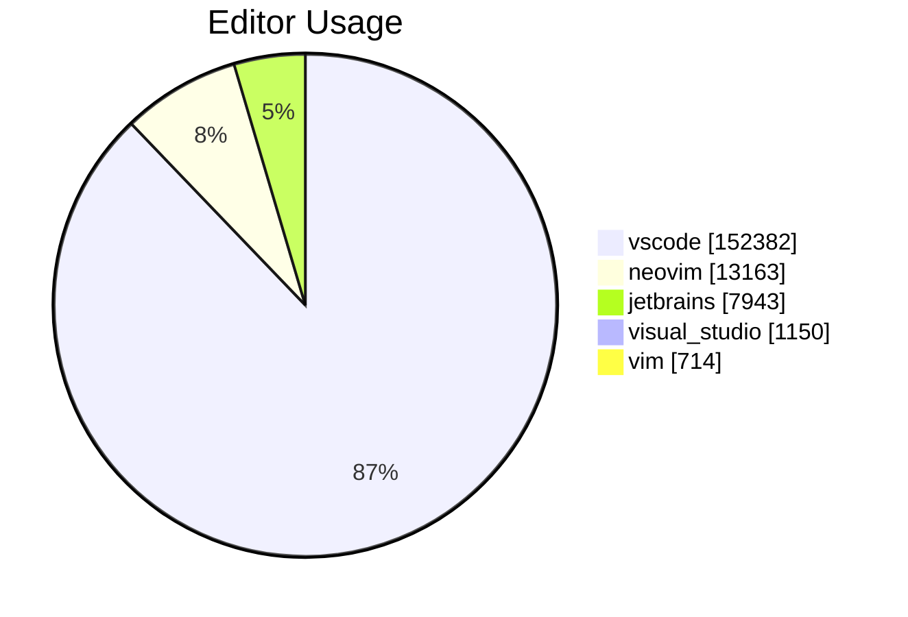

# Copilot Usage Action

Get Copilot usage data as:
* Md Job Summary
* CSV
* XML
* JSON

Powered by the [REST API endpoints for GitHub Copilot usage metrics](https://docs.github.com/en/rest/copilot/copilot-usage).

> [!TIP]
> 🚀 Get this running FAST by using the [template](https://github.com/austenstone/copilot-usage-template)

## Usage
Create a workflow (eg: `.github/workflows/copilot-usage.yml`). See [Creating a Workflow file](https://help.github.com/en/articles/configuring-a-workflow#creating-a-workflow-file).

### PAT(Personal Access Token)

You will need to [create a PAT(Personal Access Token)](https://github.com/settings/tokens/new?scopes=admin:org) that has the `copilot`, `manage_billing:copilot`, `admin:org`, `admin:enterprise`, or `manage_billing:enterprise` scope to use this endpoint.

Add this PAT as a secret so we can use it as input `github-token`, see [Creating encrypted secrets for a repository](https://docs.github.com/en/enterprise-cloud@latest/actions/security-guides/encrypted-secrets#creating-encrypted-secrets-for-a-repository). 

#### Basic Example

The default behavior is to get the usage for the repository owner which is likely the organization.

> [!IMPORTANT]  
> You need to set the secret `TOKEN` in your repository settings.

```yml
name: Copilot Usage
on:
  schedule:
    - cron: '0 0 * * *'
  workflow_dispatch:

jobs:
  run:
    name: Run Action
    runs-on: ubuntu-latest
    steps:
      - uses: austenstone/copilot-usage@v4.1
        with:
          github-token: ${{ secrets.TOKEN }}
```
#### Example get team usage

```yml
      - uses: austenstone/copilot-usage@v4.1
        with:
          github-token: ${{ secrets.TOKEN }}
          organization: 'org-slug'
          team: 'team-slug'
```

#### Example get enterprise usage

```yml
      - uses: austenstone/copilot-usage@v4.1
        with:
          github-token: ${{ secrets.TOKEN }}
          enterprise: 'enterprise-slug'
```

#### Example get CSV

```yml
      - uses: austenstone/copilot-usage@v4.1
        with:
          github-token: ${{ secrets.TOKEN }}
          csv: true
```

#### Example sending email PDF report

> [!IMPORTANT]  
> You must set secrets for `EMAIL` and `PASSWORD` to send the email. You must use an [App Password](https://support.google.com/accounts/answer/185833?visit_id=638496193361004722-1436339969&p=InvalidSecondFactor&rd=1#app-passwords) for Gmail.

```yml
name: Email Copilot Report
on:
  workflow_dispatch:
  schedule:
    - cron: '0 0 * * *'

jobs:
  run:
    runs-on: ubuntu-latest
    steps:
      - uses: austenstone/copilot-usage@v4.1
        with:
          github-token: ${{ secrets.TOKEN }}
      - uses: austenstone/job-summary@v2.0
        id: pdf
        with:
          name: copilot-usage
      - uses: dawidd6/action-send-mail@v4
        with:
          server_address: smtp.gmail.com
          server_port: 465
          username: ${{ secrets.EMAIL }}
          password: ${{ secrets.PASSWORD }}
          from: ${{ secrets.EMAIL }}
          to: ${{ secrets.EMAIL }} # Recipient email
          subject: "Copilot Usage Report (${{ steps.usage.outputs.since }} - ${{ steps.usage.outputs.until }})"
          html_body: |
            <!DOCTYPE html>
            <html>
            
            <body>
              <h1>Copilot Usage Report</h1>
              <p>Attached is the Copilot Usage Report for ${{ steps.usage.outputs.since }} - ${{ steps.usage.outputs.until }}!</p>
              <p>
                <a href="https://github.com/${{ github.repository }}/actions/runs/${{ github.run_id }}#:~:text=Copilot%20Usage%20summary">View the full report on
                  GitHub.com</a>
              </p>

              ${{ steps.pdf.outputs.job-summary-html }}
              
            </body>
            
            </html>
          attachments: ${{ steps.pdf.outputs.pdf-file }}
```

> [!TIP]
> Try using other messaging systems such as [slack](https://github.com/marketplace/actions/slack-send), [teams](https://github.com/marketplace/actions/microsoft-teams-notification), [discord](https://github.com/marketplace/actions/discord-message-notify), etc.


## ➡️ Inputs

We look first for `enterprise` input, then `team`, and finally `organization`. If none are provided, we default to the repository owner which is likely the organization.

Various inputs are defined in [`action.yml`](action.yml):

| Name | Description | Default |
| --- | --- | --- |
| github-token | The GitHub token used to create an authenticated client | |
| enterprise | The GitHub enterprise slug | |
| organization | The organization slug | ${{ github.repository_owner }} |
| job-summary | Whether to generate a report | true |
| csv | Whether to generate a CSV as a workflow artifact | false |
| csv-options | The options for the CSV report | |
| xml | Whether to generate an XML as a workflow artifact | false |
| xml-options | The options for the XML report | |
| team | The team slug | |
| days | The number of days to show usage metrics for | |
| since | Show usage metrics since this date. This is a timestamp, in `YYYY-MM-DD` format. Maximum value is 28 days ago | |
| until | Show usage metrics until this date. This is a timestamp, in `YYYY-MM-DD` format. Maximum value is 28 days ago | |
| time-zone | The time zone to use for the report | UTC |

## ⬅️ Outputs
| Name | Description |
| --- | - |
| result | The copilot usage as a JSON string |
| since | The date since which the usage metrics are shown |
| until | The date until which the usage metrics are shown |

### Endpoints

The endpoints used by this action...

* GET /enterprises/{enterprise}/copilot/usage
* GET /orgs/{org}/team/{team}/copilot/usage
* GET /orgs/{org}/copilot/usage
* GET /orgs/{org}/copilot/billing
* GET /orgs/{org}/copilot/billing/seats

## Example Job Summary

[View latest reports](https://github.com/austenstone/copilot-usage/actions/workflows/usage.yml)

<details>
<summary>Click to expand example!</summary>

<h1>Copilot Usage<br>27 days (8/2/2024 - 8/28/2024)</h1>
<h2>Copilot Chat</h2>
<ul><li>Acceptances: 6,081</li><li>Turns: 33,888</li><li>Acceptance Rate: 17.94%</li><li>Average Daily Users: 69.56</li></ul>


<h2>Copilot Completions</h2>
<ul><li>Suggestions: 175,352</li><li>Acceptances: 51,946</li><li>Acceptance Rate: 29.62%</li><li>Lines of Code Accepted: 72,397</li></ul>




<h1>Language Usage</h1>


<table><tr><th>Language</th><th>Suggestions</th><th>Acceptances</th><th>Acceptance Rate</th><th>Lines Suggested</th><th>Lines Accepted</th><th>Active Users</th></tr><tr><td>python</td><td>20,772</td><td>9,126</td><td>43.93%</td><td>33,773</td><td>12,014</td><td>22</td></tr><tr><td>typescript</td><td>25,544</td><td>7,957</td><td>31.15%</td><td>44,954</td><td>9,710</td><td>19</td></tr><tr><td>typescriptreact</td><td>16,303</td><td>5,370</td><td>32.94%</td><td>27,046</td><td>6,323</td><td>19</td></tr><tr><td>markdown</td><td>24,925</td><td>4,248</td><td>17.04%</td><td>37,295</td><td>5,209</td><td>24</td></tr><tr><td>javascript</td><td>10,758</td><td>4,152</td><td>38.59%</td><td>22,112</td><td>7,111</td><td>20</td></tr><tr><td>ruby</td><td>8,702</td><td>2,912</td><td>33.46%</td><td>12,936</td><td>3,383</td><td>13</td></tr><tr><td>go</td><td>7,731</td><td>2,403</td><td>31.08%</td><td>11,690</td><td>2,579</td><td>7</td></tr><tr><td>rust</td><td>9,526</td><td>2,395</td><td>25.14%</td><td>49,682</td><td>4,170</td><td>4</td></tr><tr><td>yaml</td><td>8,918</td><td>2,324</td><td>26.06%</td><td>17,046</td><td>3,722</td><td>19</td></tr><tr><td>java</td><td>6,086</td><td>2,221</td><td>36.49%</td><td>21,360</td><td>4,890</td><td>11</td></tr><tr><td>c#</td><td>3,396</td><td>1,184</td><td>34.86%</td><td>9,471</td><td>1,689</td><td>6</td></tr><tr><td>vue</td><td>2,726</td><td>847</td><td>31.07%</td><td>10,161</td><td>1,384</td><td>2</td></tr><tr><td>unknown</td><td>4,726</td><td>758</td><td>16.04%</td><td>8,716</td><td>871</td><td>13</td></tr><tr><td>sql</td><td>1,152</td><td>655</td><td>56.86%</td><td>1,838</td><td>981</td><td>4</td></tr><tr><td>shell</td><td>2,089</td><td>617</td><td>29.54%</td><td>3,428</td><td>789</td><td>9</td></tr><tr><td>css</td><td>2,711</td><td>584</td><td>21.54%</td><td>5,927</td><td>790</td><td>7</td></tr><tr><td>c++</td><td>2,554</td><td>546</td><td>21.38%</td><td>6,961</td><td>948</td><td>5</td></tr><tr><td>html</td><td>1,519</td><td>441</td><td>29.03%</td><td>3,333</td><td>693</td><td>7</td></tr><tr><td>groovy</td><td>2,559</td><td>412</td><td>16.10%</td><td>5,252</td><td>797</td><td>4</td></tr><tr><td>json</td><td>1,921</td><td>327</td><td>17.02%</td><td>5,307</td><td>760</td><td>11</td></tr><tr><td>ql</td><td>1,977</td><td>277</td><td>14.01%</td><td>12,227</td><td>284</td><td>3</td></tr><tr><td>scss</td><td>1,116</td><td>267</td><td>23.92%</td><td>2,075</td><td>328</td><td>5</td></tr><tr><td>dockerfile</td><td>554</td><td>246</td><td>44.40%</td><td>735</td><td>278</td><td>4</td></tr><tr><td>fsharp</td><td>750</td><td>232</td><td>30.93%</td><td>1,446</td><td>566</td><td>2</td></tr><tr><td>hcl</td><td>611</td><td>192</td><td>31.42%</td><td>1,355</td><td>407</td><td>4</td></tr><tr><td>lua</td><td>548</td><td>138</td><td>25.18%</td><td>1,552</td><td>142</td><td>2</td></tr><tr><td>json with comments</td><td>941</td><td>137</td><td>14.56%</td><td>2,090</td><td>220</td><td>6</td></tr><tr><td>postgres</td><td>372</td><td>113</td><td>30.38%</td><td>571</td><td>77</td><td>2</td></tr><tr><td>toml</td><td>484</td><td>103</td><td>21.28%</td><td>1,415</td><td>117</td><td>2</td></tr><tr><td>ini</td><td>713</td><td>93</td><td>13.04%</td><td>1,006</td><td>90</td><td>3</td></tr><tr><td>blade</td><td>200</td><td>91</td><td>45.50%</td><td>563</td><td>197</td><td>2</td></tr><tr><td>powershell</td><td>274</td><td>90</td><td>32.85%</td><td>634</td><td>156</td><td>3</td></tr><tr><td>php</td><td>236</td><td>81</td><td>34.32%</td><td>492</td><td>133</td><td>3</td></tr><tr><td>xml</td><td>238</td><td>79</td><td>33.19%</td><td>508</td><td>129</td><td>3</td></tr><tr><td>razor</td><td>152</td><td>67</td><td>44.08%</td><td>636</td><td>194</td><td>2</td></tr><tr><td>dotenv</td><td>386</td><td>61</td><td>15.80%</td><td>450</td><td>56</td><td>5</td></tr><tr><td>makefile</td><td>99</td><td>50</td><td>50.51%</td><td>152</td><td>37</td><td>2</td></tr><tr><td>text</td><td>371</td><td>24</td><td>6.47%</td><td>628</td><td>21</td><td>4</td></tr><tr><td>kotlin</td><td>57</td><td>19</td><td>33.33%</td><td>101</td><td>16</td><td>2</td></tr><tr><td>slang</td><td>48</td><td>17</td><td>35.42%</td><td>57</td><td>12</td><td>2</td></tr><tr><td>abap</td><td>35</td><td>16</td><td>45.71%</td><td>125</td><td>48</td><td>2</td></tr><tr><td>r</td><td>48</td><td>14</td><td>29.17%</td><td>55</td><td>16</td><td>2</td></tr><tr><td>dart</td><td>57</td><td>13</td><td>22.81%</td><td>70</td><td>11</td><td>2</td></tr><tr><td>json5</td><td>60</td><td>9</td><td>15.00%</td><td>71</td><td>9</td><td>2</td></tr><tr><td>swift</td><td>36</td><td>5</td><td>13.89%</td><td>41</td><td>4</td><td>2</td></tr><tr><td>javascriptreact</td><td>57</td><td>5</td><td>8.77%</td><td>65</td><td>5</td><td>2</td></tr><tr><td>kusto</td><td>6</td><td>5</td><td>83.33%</td><td>11</td><td>3</td><td>2</td></tr><tr><td>elixir</td><td>14</td><td>4</td><td>28.57%</td><td>26</td><td>10</td><td>2</td></tr><tr><td>aspdotnet</td><td>18</td><td>3</td><td>16.67%</td><td>70</td><td>4</td><td>2</td></tr><tr><td>sshconfig</td><td>4</td><td>3</td><td>75.00%</td><td>28</td><td>0</td><td>2</td></tr><tr><td>sky</td><td>7</td><td>2</td><td>28.57%</td><td>10</td><td>5</td><td>2</td></tr><tr><td>coffeescript</td><td>13</td><td>2</td><td>15.38%</td><td>15</td><td>2</td><td>2</td></tr><tr><td>properties</td><td>1</td><td>1</td><td>100.00%</td><td>1</td><td>1</td><td>2</td></tr><tr><td>objective-cpp</td><td>142</td><td>1</td><td>0.70%</td><td>150</td><td>1</td><td>2</td></tr><tr><td>cobol</td><td>12</td><td>1</td><td>8.33%</td><td>21</td><td>1</td><td>2</td></tr><tr><td>bat</td><td>12</td><td>1</td><td>8.33%</td><td>13</td><td>1</td><td>2</td></tr><tr><td>julia</td><td>8</td><td>1</td><td>12.50%</td><td>11</td><td>1</td><td>2</td></tr><tr><td>env</td><td>4</td><td>1</td><td>25.00%</td><td>7</td><td>1</td><td>2</td></tr><tr><td>svelte</td><td>13</td><td>1</td><td>7.69%</td><td>14</td><td>0</td><td>2</td></tr><tr><td>ejs</td><td>1</td><td>1</td><td>100.00%</td><td>1</td><td>0</td><td>2</td></tr><tr><td>c</td><td>11</td><td>1</td><td>9.09%</td><td>11</td><td>1</td><td>2</td></tr><tr><td>csv</td><td>2</td><td>0</td><td>0.00%</td><td>2</td><td>0</td><td>1</td></tr><tr><td>ignore list</td><td>1</td><td>0</td><td>0.00%</td><td>2</td><td>0</td><td>1</td></tr><tr><td>html+erb</td><td>4</td><td>0</td><td>0.00%</td><td>4</td><td>0</td><td>1</td></tr><tr><td>mermaid</td><td>5</td><td>0</td><td>0.00%</td><td>5</td><td>0</td><td>1</td></tr><tr><td>perl</td><td>16</td><td>0</td><td>0.00%</td><td>22</td><td>0</td><td>1</td></tr><tr><td>tex</td><td>11</td><td>0</td><td>0.00%</td><td>12</td><td>0</td><td>1</td></tr><tr><td>zsh</td><td>9</td><td>0</td><td>0.00%</td><td>31</td><td>0</td><td>1</td></tr></table>
<h1>Editor Usage</h1>


<table><tr><th>Editor</th><th>Suggestions</th><th>Acceptances</th><th>Acceptance Rate</th><th>Lines Suggested</th><th>Lines Accepted</th><th>Active Users</th></tr><tr><td>vscode</td><td>152,382</td><td>45,238</td><td>29.69%</td><td>260,404</td><td>61,046</td><td>24</td></tr><tr><td>neovim</td><td>13,163</td><td>3,590</td><td>27.27%</td><td>68,025</td><td>5,888</td><td>2</td></tr><tr><td>jetbrains</td><td>7,943</td><td>2,637</td><td>33.20%</td><td>27,494</td><td>4,479</td><td>4</td></tr><tr><td>visual_studio</td><td>1,150</td><td>400</td><td>34.78%</td><td>2,257</td><td>881</td><td>2</td></tr><tr><td>vim</td><td>714</td><td>81</td><td>11.34%</td><td>9,695</td><td>103</td><td>2</td></tr></table>
<h1>Daily Usage</h1>
<ul><li>Most Active Day: 8/27/2024 (101 active users)</li><li>Highest Acceptance Rate: 8/25/2024 (35.76%)</li></ul>
<table><tr><th>Day</th><th>Suggestions</th><th>Acceptances</th><th>Acceptance Rate</th><th>Lines Suggested</th><th>Lines Accepted</th><th>Active Users</th><th>Chat Acceptances</th><th>Chat Turns</th><th>Active Chat Users</th></tr><tr><td>8/2/2024</td><td>7,664</td><td>2,205</td><td>28.77%</td><td>16,456</td><td>2,902</td><td>72</td><td>199</td><td>1,202</td><td>79</td></tr><tr><td>8/3/2024</td><td>1,897</td><td>497</td><td>26.20%</td><td>3,565</td><td>723</td><td>19</td><td>65</td><td>163</td><td>16</td></tr><tr><td>8/4/2024</td><td>4,274</td><td>1,156</td><td>27.05%</td><td>12,065</td><td>1,549</td><td>22</td><td>146</td><td>421</td><td>18</td></tr><tr><td>8/5/2024</td><td>6,369</td><td>1,627</td><td>25.55%</td><td>12,334</td><td>2,132</td><td>77</td><td>257</td><td>1,323</td><td>77</td></tr><tr><td>8/6/2024</td><td>6,851</td><td>2,036</td><td>29.72%</td><td>16,668</td><td>2,728</td><td>93</td><td>273</td><td>1,454</td><td>92</td></tr><tr><td>8/7/2024</td><td>7,608</td><td>2,627</td><td>34.53%</td><td>16,663</td><td>3,633</td><td>87</td><td>274</td><td>1,608</td><td>93</td></tr><tr><td>8/8/2024</td><td>7,556</td><td>2,445</td><td>32.36%</td><td>13,927</td><td>3,538</td><td>99</td><td>327</td><td>1,915</td><td>98</td></tr><tr><td>8/9/2024</td><td>7,248</td><td>2,218</td><td>30.60%</td><td>20,802</td><td>2,985</td><td>79</td><td>215</td><td>1,237</td><td>82</td></tr><tr><td>8/10/2024</td><td>3,128</td><td>851</td><td>27.21%</td><td>10,670</td><td>1,312</td><td>32</td><td>67</td><td>290</td><td>24</td></tr><tr><td>8/11/2024</td><td>2,790</td><td>898</td><td>32.19%</td><td>6,460</td><td>1,307</td><td>28</td><td>130</td><td>723</td><td>19</td></tr><tr><td>8/12/2024</td><td>6,893</td><td>1,963</td><td>28.48%</td><td>14,693</td><td>2,703</td><td>80</td><td>327</td><td>1,748</td><td>86</td></tr><tr><td>8/13/2024</td><td>9,689</td><td>3,289</td><td>33.95%</td><td>20,814</td><td>4,774</td><td>91</td><td>352</td><td>1,877</td><td>99</td></tr><tr><td>8/14/2024</td><td>7,045</td><td>2,076</td><td>29.47%</td><td>13,420</td><td>3,107</td><td>90</td><td>266</td><td>1,702</td><td>95</td></tr><tr><td>8/15/2024</td><td>7,884</td><td>2,234</td><td>28.34%</td><td>14,400</td><td>3,028</td><td>85</td><td>275</td><td>1,633</td><td>91</td></tr><tr><td>8/16/2024</td><td>8,421</td><td>2,540</td><td>30.16%</td><td>15,873</td><td>3,782</td><td>86</td><td>249</td><td>1,272</td><td>85</td></tr><tr><td>8/17/2024</td><td>4,704</td><td>1,548</td><td>32.91%</td><td>7,651</td><td>1,905</td><td>28</td><td>51</td><td>236</td><td>19</td></tr><tr><td>8/18/2024</td><td>2,310</td><td>529</td><td>22.90%</td><td>4,313</td><td>714</td><td>21</td><td>39</td><td>354</td><td>19</td></tr><tr><td>8/19/2024</td><td>8,297</td><td>2,341</td><td>28.22%</td><td>14,865</td><td>2,955</td><td>92</td><td>244</td><td>1,416</td><td>89</td></tr><tr><td>8/20/2024</td><td>7,656</td><td>2,087</td><td>27.26%</td><td>13,660</td><td>2,835</td><td>97</td><td>341</td><td>1,853</td><td>92</td></tr><tr><td>8/21/2024</td><td>8,919</td><td>2,705</td><td>30.33%</td><td>19,327</td><td>4,039</td><td>101</td><td>282</td><td>1,772</td><td>100</td></tr><tr><td>8/22/2024</td><td>8,922</td><td>2,408</td><td>26.99%</td><td>16,067</td><td>3,474</td><td>94</td><td>238</td><td>1,592</td><td>98</td></tr><tr><td>8/23/2024</td><td>6,059</td><td>1,843</td><td>30.42%</td><td>11,042</td><td>2,168</td><td>88</td><td>243</td><td>1,302</td><td>77</td></tr><tr><td>8/24/2024</td><td>2,004</td><td>427</td><td>21.31%</td><td>3,773</td><td>626</td><td>31</td><td>71</td><td>350</td><td>18</td></tr><tr><td>8/25/2024</td><td>5,364</td><td>1,918</td><td>35.76%</td><td>15,951</td><td>2,771</td><td>30</td><td>114</td><td>495</td><td>24</td></tr><tr><td>8/26/2024</td><td>9,229</td><td>2,497</td><td>27.06%</td><td>19,269</td><td>3,237</td><td>82</td><td>251</td><td>1,557</td><td>82</td></tr><tr><td>8/27/2024</td><td>9,367</td><td>2,771</td><td>29.58%</td><td>17,907</td><td>4,194</td><td>101</td><td>472</td><td>2,508</td><td>107</td></tr><tr><td>8/28/2024</td><td>7,204</td><td>2,210</td><td>30.68%</td><td>15,240</td><td>3,276</td><td>98</td><td>313</td><td>1,885</td><td>99</td></tr></table>
<h1>Seat Info</h1>
<ul><li>Seat Management Setting: assign_all</li><li>Public Code Suggestions Enabled: allow</li><li>IDE Chat Enabled: enabled</li><li>Platform IDE Enabled: disabled</li><li>Platform Chat Enabled: enabled</li><li>CLI Enabled: enabled</li><li>Total Seats: 827</li><li>Added this cycle: 22</li><li>Pending invites: 0</li><li>Pending cancellations: 0</li><li>Active this cycle: 568</li><li>Inactive this cycle: 259</li></ul>
<h1>Seat Assignments</h1>
<table><tr><th>Avatar</th><th>Login</th><th>Last Activity</th><th>Last Editor Used</th><th>Created At</th><th>Updated At</th><th>Pending Cancellation Date</th><th>Team</th></tr><tr><td></td><td>siddjoshi</td><td>8/25/2024</td><td>vscode/1.92.2/</td><td>8/28/2023</td><td>8/28/2024</td><td>undefined</td><td> </td></tr><tr><td></td><td>gr2m</td><td>8/29/2024</td><td>vscode/1.92.2/copilot/1.223.0</td><td>8/28/2023</td><td>8/27/2024</td><td>undefined</td><td> </td></tr><tr><td></td><td>kelseyrae</td><td>8/21/2024</td><td>copilot-chat-platform</td><td>8/28/2023</td><td>8/20/2024</td><td>undefined</td><td> </td></tr><tr><td></td><td>jsh-wu</td><td>8/28/2024</td><td>GitHubGhostPilot/1.0.0/unknown</td><td>8/28/2023</td><td>8/20/2024</td><td>undefined</td><td> </td></tr><tr><td></td><td>MichaelRFairhurst</td><td>8/23/2024</td><td>GitHubGhostPilot/1.0.0/unknown</td><td>8/28/2023</td><td>8/20/2024</td><td>undefined</td><td> </td></tr><tr><td></td><td>juanpflores</td><td>8/2/2024</td><td>copilot-summarization-pr</td><td>8/28/2023</td><td>8/14/2024</td><td>undefined</td><td> </td></tr><tr><td></td><td>matthewisabel</td><td>8/27/2024</td><td>copilot-chat-platform</td><td>8/28/2023</td><td>8/6/2024</td><td>undefined</td><td> </td></tr><tr><td></td><td>nickoelsner</td><td>8/29/2024</td><td>vscode/1.92.2/</td><td>8/28/2023</td><td>8/6/2024</td><td>undefined</td><td> </td></tr><tr><td></td><td>NingGe01</td><td>8/25/2024</td><td>copilot-chat-platform</td><td>8/28/2023</td><td>8/6/2024</td><td>undefined</td><td> </td></tr><tr><td></td><td>RusselViola</td><td>8/27/2024</td><td>copilot-chat-platform</td><td>8/28/2023</td><td>8/6/2024</td><td>undefined</td><td> </td></tr><tr><td></td><td>milags</td><td>8/8/2024</td><td>BrowserGhostPilot/1.0.0/unknown</td><td>8/28/2023</td><td>8/6/2024</td><td>undefined</td><td> </td></tr><tr><td></td><td>nerealegui</td><td>8/18/2024</td><td>copilot-chat-platform</td><td>8/28/2023</td><td>8/6/2024</td><td>undefined</td><td> </td></tr><tr><td></td><td>thatspaige</td><td>7/20/2024</td><td>vscode/1.91.1/</td><td>8/28/2023</td><td>8/6/2024</td><td>undefined</td><td> </td></tr><tr><td></td><td>Peach-Iced-Tina</td><td>6/5/2024</td><td>copilot-chat-platform</td><td>8/28/2023</td><td>8/5/2024</td><td>undefined</td><td> </td></tr><tr><td></td><td>ashleywolf</td><td>8/23/2023</td><td>vscode/1.81.1/copilot/1.100.306</td><td>8/28/2023</td><td>7/30/2024</td><td>undefined</td><td> </td></tr><tr><td></td><td>kqh34</td><td>7/31/2024</td><td>vscode/1.91.1/copilot-chat/0.17.1</td><td>8/28/2023</td><td>7/29/2024</td><td>undefined</td><td> </td></tr><tr><td></td><td>ItalianInSeattle</td><td>No Activity</td><td>N/A</td><td>8/28/2023</td><td>7/29/2024</td><td>undefined</td><td> </td></tr><tr><td></td><td>khenckel</td><td>8/20/2024</td><td>copilot-chat-platform</td><td>8/28/2023</td><td>7/26/2024</td><td>undefined</td><td> </td></tr><tr><td></td><td>MetzinAround</td><td>7/23/2024</td><td>unknown/unknown</td><td>8/28/2023</td><td>7/26/2024</td><td>undefined</td><td> </td></tr><tr><td></td><td>talktopri</td><td>8/20/2024</td><td>BrowserGhostPilot/1.0.0/unknown</td><td>8/28/2023</td><td>7/26/2024</td><td>undefined</td><td> </td></tr><tr><td></td><td>raffertyuy</td><td>8/29/2024</td><td>vscode/1.93.0-insider/copilot-chat/0.20.2024082201</td><td>8/28/2023</td><td>7/26/2024</td><td>undefined</td><td> </td></tr><tr><td></td><td>jelundquist</td><td>No Activity</td><td>N/A</td><td>8/28/2023</td><td>7/23/2024</td><td>undefined</td><td> </td></tr><tr><td></td><td>raykao</td><td>8/26/2024</td><td>copilot-chat-platform</td><td>8/28/2023</td><td>7/23/2024</td><td>undefined</td><td> </td></tr><tr><td></td><td>jdvcDev</td><td>8/29/2024</td><td>vscode/1.90.2/copilot/1.207.0</td><td>8/28/2023</td><td>7/23/2024</td><td>undefined</td><td> </td></tr><tr><td></td><td>mpchenette</td><td>8/28/2024</td><td>vscode/1.92.2/copilot/1.223.0</td><td>8/28/2023</td><td>7/23/2024</td><td>undefined</td><td> </td></tr><tr><td></td><td>amandahmt</td><td>8/22/2024</td><td>vscode/1.92.2/</td><td>8/28/2023</td><td>7/23/2024</td><td>undefined</td><td> </td></tr><tr><td></td><td>LadyKerr</td><td>8/27/2024</td><td>vscode/1.91.1/copilot/1.223.0</td><td>8/28/2023</td><td>7/22/2024</td><td>undefined</td><td> </td></tr><tr><td></td><td>mcherry</td><td>6/3/2024</td><td>copilot-chat-platform</td><td>8/28/2023</td><td>7/18/2024</td><td>undefined</td><td> </td></tr><tr><td></td><td>JBuckley91</td><td>6/2/2023</td><td>vscode/1.78.2/copilot/1.88.132</td><td>8/28/2023</td><td>7/15/2024</td><td>undefined</td><td> </td></tr><tr><td></td><td>kvignali</td><td>8/14/2024</td><td>copilot-chat-platform</td><td>8/28/2023</td><td>7/15/2024</td><td>undefined</td><td> </td></tr><tr><td></td><td>jmangwana</td><td>No Activity</td><td>N/A</td><td>8/28/2023</td><td>7/14/2024</td><td>undefined</td><td> </td></tr><tr><td></td><td>ironchan</td><td>5/16/2024</td><td>copilot-chat-platform</td><td>8/28/2023</td><td>7/11/2024</td><td>undefined</td><td> </td></tr><tr><td></td><td>marietheresa</td><td>8/28/2024</td><td>vscode/1.92.2/</td><td>8/28/2023</td><td>7/11/2024</td><td>undefined</td><td> </td></tr><tr><td></td><td>june1963</td><td>8/28/2024</td><td>GitHubGhostPilot/1.0.0/unknown</td><td>8/28/2023</td><td>7/10/2024</td><td>undefined</td><td> </td></tr><tr><td></td><td>cottonball</td><td>6/5/2024</td><td>copilot-summarization-pr</td><td>8/28/2023</td><td>7/10/2024</td><td>undefined</td><td> </td></tr><tr><td></td><td>mvkaran</td><td>8/29/2024</td><td>vscode/1.92.2/copilot-chat/0.18.2</td><td>8/28/2023</td><td>7/10/2024</td><td>undefined</td><td> </td></tr><tr><td></td><td>catto</td><td>8/19/2024</td><td>copilot-chat-platform</td><td>8/28/2023</td><td>7/10/2024</td><td>undefined</td><td> </td></tr><tr><td></td><td>ronaldtanpo</td><td>8/1/2024</td><td>BrowserGhostPilot/0.0.19/unknown</td><td>8/28/2023</td><td>7/10/2024</td><td>undefined</td><td> </td></tr><tr><td></td><td>kbridgford</td><td>8/28/2024</td><td>vscode/1.90.0/</td><td>8/28/2023</td><td>7/9/2024</td><td>undefined</td><td> </td></tr><tr><td></td><td>jjn</td><td>8/20/2024</td><td>vscode/1.92.0/</td><td>8/28/2023</td><td>7/9/2024</td><td>undefined</td><td> </td></tr><tr><td></td><td>smarj</td><td>8/27/2024</td><td>copilot-chat-platform</td><td>8/28/2023</td><td>7/8/2024</td><td>undefined</td><td> </td></tr><tr><td></td><td>avni</td><td>8/13/2024</td><td>BrowserGhostPilot/1.0.0/unknown</td><td>8/28/2023</td><td>7/5/2024</td><td>undefined</td><td> </td></tr><tr><td></td><td>phoebequincy</td><td>6/4/2024</td><td>copilot-summarization-pr</td><td>8/28/2023</td><td>7/5/2024</td><td>undefined</td><td> </td></tr><tr><td></td><td>karthiksedoc</td><td>8/23/2024</td><td>copilot-chat-platform</td><td>8/28/2023</td><td>7/5/2024</td><td>undefined</td><td> </td></tr><tr><td></td><td>crawdizzle</td><td>2/28/2024</td><td>copilot-chat-platform</td><td>8/28/2023</td><td>7/2/2024</td><td>undefined</td><td> </td></tr><tr><td></td><td>RobotKrabs</td><td>8/23/2024</td><td>copilot-chat-platform</td><td>8/28/2023</td><td>7/2/2024</td><td>undefined</td><td> </td></tr><tr><td></td><td>loujr</td><td>8/28/2024</td><td>copilot-chat-platform</td><td>8/28/2023</td><td>7/2/2024</td><td>undefined</td><td> </td></tr><tr><td></td><td>jdemos</td><td>8/15/2024</td><td>vscode/1.92.1/copilot-chat/0.18.2</td><td>8/28/2023</td><td>6/25/2024</td><td>undefined</td><td> </td></tr><tr><td></td><td>Jim-IV</td><td>8/26/2024</td><td>vscode/1.91.1/</td><td>8/28/2023</td><td>6/25/2024</td><td>undefined</td><td> </td></tr><tr><td></td><td>karasowles</td><td>6/7/2024</td><td>unknown/unknown</td><td>8/28/2023</td><td>6/21/2024</td><td>undefined</td><td> </td></tr><tr><td></td><td>swilson15</td><td>7/9/2024</td><td>BrowserGhostPilot/0.0.17/unknown</td><td>8/28/2023</td><td>6/20/2024</td><td>undefined</td><td> </td></tr><tr><td></td><td>umaranit</td><td>8/27/2024</td><td>vscode/1.92.2/</td><td>8/28/2023</td><td>6/20/2024</td><td>undefined</td><td> </td></tr><tr><td></td><td>sombaner</td><td>8/28/2024</td><td>vscode/1.93.0-insider/copilot-chat/0.20.2024082705</td><td>8/28/2023</td><td>6/20/2024</td><td>undefined</td><td> </td></tr><tr><td></td><td>dipree</td><td>8/16/2024</td><td>vscode/1.92.1/copilot/1.221.0</td><td>8/28/2023</td><td>6/20/2024</td><td>undefined</td><td> </td></tr><tr><td></td><td>AndreaGriffiths11</td><td>8/28/2024</td><td>copilot-chat-platform</td><td>8/28/2023</td><td>6/19/2024</td><td>undefined</td><td> </td></tr><tr><td></td><td>DUBSOpenHub</td><td>8/13/2024</td><td>BrowserGhostPilot/1.0.0/unknown</td><td>8/28/2023</td><td>6/19/2024</td><td>undefined</td><td> </td></tr><tr><td></td><td>ashleymcnamara</td><td>5/16/2024</td><td>vscode/1.89.1/copilot-chat-ide/0.15.1</td><td>8/28/2023</td><td>6/19/2024</td><td>undefined</td><td> </td></tr><tr><td></td><td>anipind</td><td>7/3/2024</td><td>BrowserGhostPilot/0.0.15/unknown</td><td>8/28/2023</td><td>6/19/2024</td><td>undefined</td><td> </td></tr><tr><td></td><td>asarkaria</td><td>8/28/2024</td><td>copilot-chat-platform</td><td>8/28/2023</td><td>6/19/2024</td><td>undefined</td><td> </td></tr><tr><td></td><td>KevinCrosby</td><td>6/10/2024</td><td>unknown/unknown</td><td>8/28/2023</td><td>6/19/2024</td><td>undefined</td><td> </td></tr><tr><td></td><td>martinwoodward</td><td>6/28/2024</td><td>vscode/1.91.0-insider/copilot-chat/0.17.2024062701</td><td>8/28/2023</td><td>6/18/2024</td><td>undefined</td><td> </td></tr><tr><td></td><td>mishmanners</td><td>8/29/2024</td><td>vscode/1.93.0-insider/copilot/1.223.0</td><td>8/28/2023</td><td>6/18/2024</td><td>undefined</td><td> </td></tr><tr><td></td><td>Damovisa</td><td>8/27/2024</td><td>copilot-cli</td><td>8/28/2023</td><td>6/18/2024</td><td>undefined</td><td> </td></tr><tr><td></td><td>jasonkeicher</td><td>8/26/2024</td><td>copilot-chat-platform</td><td>8/28/2023</td><td>6/13/2024</td><td>undefined</td><td> </td></tr><tr><td></td><td>mikewesthub</td><td>8/27/2024</td><td>copilot-chat-platform</td><td>8/28/2023</td><td>6/12/2024</td><td>undefined</td><td> </td></tr><tr><td></td><td>jldeen</td><td>8/26/2024</td><td>vscode/1.92.2/copilot/1.223.0</td><td>8/28/2023</td><td>6/12/2024</td><td>undefined</td><td> </td></tr><tr><td></td><td>jdooley-clt</td><td>8/19/2024</td><td>copilot-chat-platform</td><td>8/28/2023</td><td>6/12/2024</td><td>undefined</td><td> </td></tr><tr><td></td><td>sahalley</td><td>6/21/2024</td><td>copilot-chat-platform</td><td>8/28/2023</td><td>6/11/2024</td><td>undefined</td><td> </td></tr><tr><td></td><td>marzann</td><td>8/6/2024</td><td>BrowserGhostPilot/0.0.19/unknown</td><td>8/28/2023</td><td>6/11/2024</td><td>undefined</td><td> </td></tr><tr><td></td><td>howard-lio</td><td>8/16/2024</td><td>BrowserGhostPilot/1.0.0/unknown</td><td>8/28/2023</td><td>6/11/2024</td><td>undefined</td><td> </td></tr><tr><td></td><td>Kenyatta-forbes</td><td>5/24/2024</td><td>copilot-chat-platform</td><td>8/28/2023</td><td>6/11/2024</td><td>undefined</td><td> </td></tr><tr><td></td><td>filmgirl</td><td>8/6/2024</td><td>vscode/1.92.0/</td><td>8/28/2023</td><td>6/11/2024</td><td>undefined</td><td> </td></tr><tr><td></td><td>kylerdam</td><td>No Activity</td><td>N/A</td><td>8/28/2023</td><td>6/11/2024</td><td>undefined</td><td> </td></tr><tr><td></td><td>kristenmreynolds</td><td>8/6/2024</td><td>BrowserGhostPilot/0.0.19/unknown</td><td>8/28/2023</td><td>6/11/2024</td><td>undefined</td><td> </td></tr><tr><td></td><td>nicolaswill</td><td>8/26/2024</td><td>GitHubGhostPilot/1.0.0/unknown</td><td>8/28/2023</td><td>6/10/2024</td><td>undefined</td><td> </td></tr><tr><td></td><td>allandcp</td><td>8/26/2024</td><td>vscode/1.92.2/</td><td>8/28/2023</td><td>6/7/2024</td><td>undefined</td><td> </td></tr><tr><td></td><td>patrick-vuong</td><td>8/1/2024</td><td>vscode/1.92.0-insider/</td><td>8/28/2023</td><td>5/24/2024</td><td>undefined</td><td> </td></tr><tr><td></td><td>abelyas</td><td>7/3/2024</td><td>BrowserGhostPilot/0.0.15/unknown</td><td>8/28/2023</td><td>5/21/2024</td><td>undefined</td><td> </td></tr><tr><td></td><td>jolvera14</td><td>6/3/2024</td><td>copilot-chat-platform</td><td>8/28/2023</td><td>5/21/2024</td><td>undefined</td><td> </td></tr><tr><td></td><td>eltyagi</td><td>8/29/2024</td><td>vscode/1.89.1/copilot/1.223.0</td><td>8/28/2023</td><td>5/21/2024</td><td>undefined</td><td> </td></tr><tr><td></td><td>NateRickard</td><td>8/28/2024</td><td>vscode/1.92.2/</td><td>8/28/2023</td><td>5/15/2024</td><td>undefined</td><td> </td></tr><tr><td></td><td>jessicapascua</td><td>8/2/2024</td><td>copilot-chat-platform</td><td>8/28/2023</td><td>5/10/2024</td><td>undefined</td><td> </td></tr><tr><td></td><td>sinemakinci1</td><td>8/28/2024</td><td>vscode/1.92.2/</td><td>8/28/2023</td><td>5/9/2024</td><td>undefined</td><td> </td></tr><tr><td></td><td>sylvieraie</td><td>5/16/2024</td><td>copilot-chat-platform</td><td>8/28/2023</td><td>5/8/2024</td><td>undefined</td><td> </td></tr><tr><td></td><td>victoriaNine</td><td>8/28/2024</td><td>vscode/1.89.0/copilot/1.223.0</td><td>8/28/2023</td><td>5/8/2024</td><td>undefined</td><td> </td></tr><tr><td></td><td>yaliniprabha5</td><td>8/22/2024</td><td>vscode/1.92.2/</td><td>8/28/2023</td><td>5/7/2024</td><td>undefined</td><td> </td></tr><tr><td></td><td>mnkiefer</td><td>8/29/2024</td><td>vscode/1.92.2/copilot/1.223.0</td><td>8/28/2023</td><td>5/7/2024</td><td>undefined</td><td> </td></tr><tr><td></td><td>blakebrunson</td><td>8/28/2024</td><td>copilot-chat-platform</td><td>8/28/2023</td><td>5/2/2024</td><td>undefined</td><td> </td></tr><tr><td></td><td>beckymadisonkier</td><td>6/11/2024</td><td>unknown/unknown</td><td>8/28/2023</td><td>5/1/2024</td><td>undefined</td><td> </td></tr><tr><td></td><td>wrampazo</td><td>8/20/2024</td><td>vscode/1.92.2/copilot/1.223.0</td><td>8/28/2023</td><td>4/30/2024</td><td>undefined</td><td> </td></tr><tr><td></td><td>ebarber72</td><td>8/14/2024</td><td>copilot-chat-platform</td><td>8/28/2023</td><td>4/29/2024</td><td>undefined</td><td> </td></tr><tr><td></td><td>shinyay</td><td>8/29/2024</td><td>vscode/1.93.0-insider/copilot/1.223.1073</td><td>8/28/2023</td><td>4/22/2024</td><td>undefined</td><td> </td></tr><tr><td></td><td>jendadd</td><td>8/28/2024</td><td>GitHubGhostPilot/1.0.0/unknown</td><td>8/28/2023</td><td>4/21/2024</td><td>undefined</td><td> </td></tr><tr><td></td><td>alison-mullis</td><td>7/1/2024</td><td>BrowserGhostPilot/0.0.15/unknown</td><td>8/28/2023</td><td>4/17/2024</td><td>undefined</td><td> </td></tr><tr><td></td><td>leehjoshua</td><td>8/28/2024</td><td>GitHubGhostPilot/1.0.0/unknown</td><td>8/28/2023</td><td>4/16/2024</td><td>undefined</td><td> </td></tr><tr><td></td><td>eshwer</td><td>8/28/2024</td><td>copilot-chat-platform</td><td>8/28/2023</td><td>4/16/2024</td><td>undefined</td><td> </td></tr><tr><td></td><td>adrianchiran</td><td>8/20/2024</td><td>BrowserGhostPilot/1.0.0/unknown</td><td>8/28/2023</td><td>4/16/2024</td><td>undefined</td><td> </td></tr><tr><td></td><td>marygismondi</td><td>5/15/2024</td><td>copilot-chat-platform</td><td>8/28/2023</td><td>4/16/2024</td><td>undefined</td><td> </td></tr><tr><td></td><td>laurajjiang</td><td>2/10/2024</td><td>vscode/1.86.0/copilot/1.156.0</td><td>8/28/2023</td><td>4/11/2024</td><td>undefined</td><td> </td></tr><tr><td></td><td>KenjiTsunoda</td><td>3/1/2024</td><td>copilot-chat-platform</td><td>8/28/2023</td><td>4/8/2024</td><td>undefined</td><td> </td></tr><tr><td></td><td>omokoh</td><td>8/29/2024</td><td>copilot-chat-platform</td><td>8/28/2023</td><td>4/5/2024</td><td>undefined</td><td> </td></tr><tr><td></td><td>dfosco</td><td>8/28/2024</td><td>vscode/1.92.2/</td><td>8/28/2023</td><td>4/2/2024</td><td>undefined</td><td> </td></tr><tr><td></td><td>CO-olag</td><td>8/26/2024</td><td>GitHubGhostPilot/1.0.0/unknown</td><td>8/28/2023</td><td>4/2/2024</td><td>undefined</td><td> </td></tr><tr><td></td><td>alxayo</td><td>8/29/2024</td><td>copilot-chat-platform</td><td>8/28/2023</td><td>4/1/2024</td><td>undefined</td><td> </td></tr><tr><td></td><td>meenark24</td><td>7/5/2024</td><td>copilot-chat-platform</td><td>8/28/2023</td><td>3/29/2024</td><td>undefined</td><td> </td></tr><tr><td></td><td>srirampe</td><td>No Activity</td><td>N/A</td><td>8/28/2023</td><td>3/28/2024</td><td>undefined</td><td> </td></tr><tr><td></td><td>azooinmyluggage</td><td>2/14/2024</td><td>vscode/1.87.0-insider/copilot/1.159.701</td><td>8/28/2023</td><td>3/27/2024</td><td>undefined</td><td> </td></tr><tr><td></td><td>evi-liu</td><td>8/21/2024</td><td>copilot-chat-platform</td><td>8/28/2023</td><td>3/26/2024</td><td>undefined</td><td> </td></tr><tr><td></td><td>pallsama</td><td>8/27/2024</td><td>copilot-chat-platform</td><td>8/28/2023</td><td>3/26/2024</td><td>undefined</td><td> </td></tr><tr><td></td><td>jyoungpak</td><td>8/20/2024</td><td>copilot-chat-platform</td><td>8/28/2023</td><td>3/26/2024</td><td>undefined</td><td> </td></tr><tr><td></td><td>mayagao</td><td>8/26/2024</td><td>copilot-chat-platform</td><td>8/28/2023</td><td>3/26/2024</td><td>undefined</td><td> </td></tr><tr><td></td><td>lisaadang</td><td>8/29/2024</td><td>copilot-chat-platform</td><td>8/28/2023</td><td>3/26/2024</td><td>undefined</td><td> </td></tr><tr><td></td><td>joshfarrant</td><td>8/29/2024</td><td>zed/0.1.0/zed-copilot/0.0.1</td><td>8/28/2023</td><td>3/26/2024</td><td>undefined</td><td> </td></tr><tr><td></td><td>nnasaki</td><td>8/29/2024</td><td>vscode/1.92.2/copilot/1.223.0</td><td>8/28/2023</td><td>3/21/2024</td><td>undefined</td><td> </td></tr><tr><td></td><td>tassia-sp</td><td>8/28/2024</td><td>vscode/1.92.2/</td><td>8/28/2023</td><td>3/20/2024</td><td>undefined</td><td> </td></tr><tr><td></td><td>connienguyen</td><td>8/28/2024</td><td>copilot-chat-platform</td><td>8/28/2023</td><td>3/19/2024</td><td>undefined</td><td> </td></tr><tr><td></td><td>kathleenqin</td><td>8/27/2024</td><td>unknown-editor/0/unknown-editor-plugin/0</td><td>8/28/2023</td><td>3/19/2024</td><td>undefined</td><td> </td></tr><tr><td></td><td>theclarpenter</td><td>No Activity</td><td>N/A</td><td>8/28/2023</td><td>3/19/2024</td><td>undefined</td><td> </td></tr><tr><td></td><td>jessiejyen</td><td>8/8/2024</td><td>copilot-chat-platform</td><td>8/28/2023</td><td>3/19/2024</td><td>undefined</td><td> </td></tr><tr><td></td><td>simmonsjenna</td><td>7/24/2024</td><td>vscode/1.91.1/</td><td>8/28/2023</td><td>3/19/2024</td><td>undefined</td><td> </td></tr><tr><td></td><td>ncouraud</td><td>8/20/2024</td><td>vscode/1.92.2/copilot/1.223.0</td><td>8/28/2023</td><td>3/19/2024</td><td>undefined</td><td> </td></tr><tr><td></td><td>petercort</td><td>8/28/2024</td><td>vscode/1.92.2/copilot/1.223.0</td><td>8/28/2023</td><td>3/19/2024</td><td>undefined</td><td> </td></tr><tr><td></td><td>ooolaniyi</td><td>8/14/2024</td><td>BrowserGhostPilot/0.0.19/unknown</td><td>8/28/2023</td><td>3/19/2024</td><td>undefined</td><td> </td></tr><tr><td></td><td>sull8000</td><td>7/1/2024</td><td>copilot-chat-platform</td><td>8/28/2023</td><td>3/19/2024</td><td>undefined</td><td> </td></tr><tr><td></td><td>daniel23an</td><td>3/7/2024</td><td>copilot-chat-platform</td><td>8/28/2023</td><td>3/14/2024</td><td>undefined</td><td> </td></tr><tr><td></td><td>kfolkes</td><td>8/29/2024</td><td>vscode/1.92.2/copilot/1.223.0</td><td>8/28/2023</td><td>3/14/2024</td><td>undefined</td><td> </td></tr><tr><td></td><td>jkordick</td><td>8/28/2024</td><td>copilot-chat-platform</td><td>8/28/2023</td><td>3/13/2024</td><td>undefined</td><td> </td></tr><tr><td></td><td>ChrisRomp</td><td>8/23/2024</td><td>copilot-cli</td><td>8/28/2023</td><td>3/12/2024</td><td>undefined</td><td> </td></tr><tr><td></td><td>arnaudlh</td><td>8/28/2024</td><td>copilot-cli</td><td>8/28/2023</td><td>3/12/2024</td><td>undefined</td><td> </td></tr><tr><td></td><td>Steve-Glass</td><td>8/3/2023</td><td>vscode/1.80.2/copilot/1.99.289</td><td>8/28/2023</td><td>3/11/2024</td><td>undefined</td><td> </td></tr><tr><td></td><td>danielstocker</td><td>6/2/2024</td><td>vscode/1.89.1/copilot/1.194.0</td><td>8/28/2023</td><td>3/7/2024</td><td>undefined</td><td> </td></tr><tr><td></td><td>navyasric</td><td>8/23/2024</td><td>copilot-chat-platform</td><td>8/28/2023</td><td>3/6/2024</td><td>undefined</td><td> </td></tr><tr><td></td><td>carlincherry</td><td>8/21/2024</td><td>copilot-chat-platform</td><td>8/28/2023</td><td>3/5/2024</td><td>undefined</td><td> </td></tr><tr><td></td><td>leobalter</td><td>8/28/2024</td><td>GitHubGhostPilot/1.0.0/unknown</td><td>8/28/2023</td><td>3/5/2024</td><td>undefined</td><td> </td></tr><tr><td></td><td>eyalgal</td><td>3/28/2024</td><td>copilot-chat-platform</td><td>8/28/2023</td><td>3/5/2024</td><td>undefined</td><td> </td></tr><tr><td></td><td>jramos02</td><td>4/3/2024</td><td>vscode/1.87.2/unknown</td><td>8/28/2023</td><td>3/5/2024</td><td>undefined</td><td> </td></tr><tr><td></td><td>sunnyi101</td><td>7/11/2024</td><td>copilot-chat-platform</td><td>8/28/2023</td><td>3/5/2024</td><td>undefined</td><td> </td></tr><tr><td></td><td>oriolson</td><td>8/26/2024</td><td>copilot-chat-platform</td><td>8/28/2023</td><td>3/5/2024</td><td>undefined</td><td> </td></tr><tr><td></td><td>tommcknight</td><td>6/26/2024</td><td>vscode/1.90.0/copilot-chat-ide/0.16.1</td><td>8/28/2023</td><td>3/5/2024</td><td>undefined</td><td> </td></tr><tr><td></td><td>yuichielectric-demo</td><td>3/19/2024</td><td>copilot-chat-platform</td><td>8/28/2023</td><td>2/28/2024</td><td>undefined</td><td> </td></tr><tr><td></td><td>aminatiriafen</td><td>8/22/2024</td><td>copilot-chat-platform</td><td>8/28/2023</td><td>2/21/2024</td><td>undefined</td><td> </td></tr><tr><td></td><td>sosundaram</td><td>6/3/2024</td><td>copilot-chat-platform</td><td>8/28/2023</td><td>2/21/2024</td><td>undefined</td><td> </td></tr><tr><td></td><td>mattobee</td><td>8/24/2024</td><td>vscode/1.92.2/copilot/1.223.0</td><td>8/28/2023</td><td>2/21/2024</td><td>undefined</td><td> </td></tr><tr><td></td><td>LauraRod32</td><td>3/12/2024</td><td>copilot-chat-platform</td><td>8/28/2023</td><td>2/21/2024</td><td>undefined</td><td> </td></tr><tr><td></td><td>dkalmin</td><td>8/27/2024</td><td>vscode/1.92.2/</td><td>8/28/2023</td><td>2/15/2024</td><td>undefined</td><td> </td></tr><tr><td></td><td>evanrodriguez</td><td>8/28/2024</td><td>GitHubGhostPilot/1.0.0/unknown</td><td>8/28/2023</td><td>2/13/2024</td><td>undefined</td><td> </td></tr><tr><td></td><td>AndrewMFlick</td><td>3/12/2024</td><td>copilot-chat-platform</td><td>8/28/2023</td><td>2/12/2024</td><td>undefined</td><td> </td></tr><tr><td></td><td>ashley-oop</td><td>7/10/2024</td><td>BrowserGhostPilot/0.0.18/unknown</td><td>8/28/2023</td><td>2/9/2024</td><td>undefined</td><td> </td></tr><tr><td></td><td>nathos</td><td>7/22/2024</td><td>copilot-chat-platform</td><td>8/28/2023</td><td>2/1/2024</td><td>undefined</td><td> </td></tr><tr><td></td><td>arfon</td><td>8/29/2024</td><td>copilot-chat-platform</td><td>8/28/2023</td><td>2/1/2024</td><td>undefined</td><td> </td></tr><tr><td></td><td>kyanny</td><td>8/27/2024</td><td>vscode/1.92.2/</td><td>8/28/2023</td><td>2/1/2024</td><td>undefined</td><td> </td></tr><tr><td></td><td>mgriffin</td><td>5/26/2023</td><td>vscode/1.78.2/copilot/1.86.82</td><td>8/28/2023</td><td>2/1/2024</td><td>undefined</td><td> </td></tr><tr><td></td><td>lowply</td><td>8/29/2024</td><td>vscode/1.92.2/copilot/1.223.0</td><td>8/28/2023</td><td>2/1/2024</td><td>undefined</td><td> </td></tr><tr><td></td><td>elstudio</td><td>8/23/2024</td><td>GitHubGhostPilot/1.0.0/unknown</td><td>8/28/2023</td><td>2/1/2024</td><td>undefined</td><td> </td></tr><tr><td></td><td>azizshamim</td><td>8/14/2024</td><td>copilot-chat-platform</td><td>8/28/2023</td><td>2/1/2024</td><td>undefined</td><td> </td></tr><tr><td></td><td>brntbeer</td><td>7/8/2024</td><td>BrowserGhostPilot/0.0.16/unknown</td><td>8/28/2023</td><td>2/1/2024</td><td>undefined</td><td> </td></tr><tr><td></td><td>ahpook</td><td>7/26/2024</td><td>copilot-chat-platform</td><td>8/28/2023</td><td>2/1/2024</td><td>undefined</td><td> </td></tr><tr><td></td><td>jk0</td><td>6/25/2024</td><td>Vim/9.0.0142/copilot.vim/1.17.0</td><td>8/28/2023</td><td>2/1/2024</td><td>undefined</td><td> </td></tr><tr><td></td><td>kevinreedy</td><td>8/22/2024</td><td>vscode/1.90.0/copilot/1.220.0</td><td>8/28/2023</td><td>2/1/2024</td><td>undefined</td><td> </td></tr><tr><td></td><td>alexisabril</td><td>8/27/2024</td><td>copilot-chat-platform</td><td>8/28/2023</td><td>2/1/2024</td><td>undefined</td><td> </td></tr><tr><td></td><td>frye</td><td>8/7/2024</td><td>copilot-cli</td><td>8/28/2023</td><td>2/1/2024</td><td>undefined</td><td> </td></tr><tr><td></td><td>timrogers</td><td>8/29/2024</td><td>vscode/1.93.0-insider/copilot/1.223.1073</td><td>8/28/2023</td><td>2/1/2024</td><td>undefined</td><td> </td></tr><tr><td></td><td>asiermartinez</td><td>8/28/2024</td><td>copilot-chat-platform</td><td>8/28/2023</td><td>2/1/2024</td><td>undefined</td><td> </td></tr><tr><td></td><td>danielguillan</td><td>8/28/2024</td><td>vscode/1.89.0/</td><td>8/28/2023</td><td>2/1/2024</td><td>undefined</td><td> </td></tr><tr><td></td><td>yuichielectric</td><td>8/29/2024</td><td>vscode/1.92.1/copilot/1.223.0</td><td>8/28/2023</td><td>2/1/2024</td><td>undefined</td><td> </td></tr><tr><td></td><td>chrispat</td><td>4/18/2024</td><td>copilot-chat-platform</td><td>8/28/2023</td><td>2/1/2024</td><td>undefined</td><td> </td></tr><tr><td></td><td>tobiasahlin</td><td>8/27/2024</td><td>copilot-chat-platform</td><td>8/28/2023</td><td>2/1/2024</td><td>undefined</td><td> </td></tr><tr><td></td><td>sam1el</td><td>8/23/2024</td><td>vscode/1.92.2/copilot/1.223.0</td><td>8/28/2023</td><td>2/1/2024</td><td>undefined</td><td> </td></tr><tr><td></td><td>yaili</td><td>8/22/2024</td><td>BrowserGhostPilot/1.0.0/unknown</td><td>8/28/2023</td><td>2/1/2024</td><td>undefined</td><td> </td></tr><tr><td></td><td>eroullit</td><td>8/28/2024</td><td>copilot-chat-platform</td><td>8/28/2023</td><td>2/1/2024</td><td>undefined</td><td> </td></tr><tr><td></td><td>broccolini</td><td>7/27/2024</td><td>BrowserGhostPilot/0.0.19/unknown</td><td>8/28/2023</td><td>2/1/2024</td><td>undefined</td><td> </td></tr><tr><td></td><td>cvega</td><td>8/28/2024</td><td>vscode/1.92.2/copilot/1.223.0</td><td>8/28/2023</td><td>2/1/2024</td><td>undefined</td><td> </td></tr><tr><td></td><td>simurai</td><td>8/29/2024</td><td>vscode/1.92.2/copilot/1.223.0</td><td>8/28/2023</td><td>2/1/2024</td><td>undefined</td><td> </td></tr><tr><td></td><td>davideg</td><td>8/20/2024</td><td>vscode/1.85.0/copilot-chat-ide/0.11.1</td><td>8/28/2023</td><td>2/1/2024</td><td>undefined</td><td> </td></tr><tr><td></td><td>pravipati</td><td>3/21/2024</td><td>copilot-chat-platform</td><td>8/28/2023</td><td>2/1/2024</td><td>undefined</td><td> </td></tr><tr><td></td><td>tonycch</td><td>8/29/2024</td><td>copilot-chat-platform</td><td>8/28/2023</td><td>2/1/2024</td><td>undefined</td><td> </td></tr><tr><td></td><td>howrad</td><td>7/3/2024</td><td>BrowserGhostPilot/0.0.16/unknown</td><td>8/28/2023</td><td>2/1/2024</td><td>undefined</td><td> </td></tr><tr><td></td><td>MylesBorins</td><td>8/28/2024</td><td>vscode/1.92.2/</td><td>8/28/2023</td><td>2/1/2024</td><td>undefined</td><td> </td></tr><tr><td></td><td>evgenyrahman</td><td>8/29/2024</td><td>vscode/1.92.2/copilot-chat/0.18.2</td><td>8/28/2023</td><td>2/1/2024</td><td>undefined</td><td> </td></tr><tr><td></td><td>jbjonesjr</td><td>7/10/2024</td><td>copilot-chat-platform</td><td>8/28/2023</td><td>2/1/2024</td><td>undefined</td><td> </td></tr><tr><td></td><td>tgrall</td><td>8/28/2024</td><td>JetBrains-IU/241.19072.14/</td><td>8/28/2023</td><td>2/1/2024</td><td>undefined</td><td> </td></tr><tr><td></td><td>adrianmg</td><td>8/19/2024</td><td>BrowserGhostPilot/1.0.0/unknown</td><td>8/28/2023</td><td>2/1/2024</td><td>undefined</td><td> </td></tr><tr><td></td><td>pnsk</td><td>8/26/2024</td><td>vscode/1.92.2/</td><td>8/28/2023</td><td>2/1/2024</td><td>undefined</td><td> </td></tr><tr><td></td><td>pedrolacerda</td><td>8/29/2024</td><td>vscode/1.93.0-insider/</td><td>8/28/2023</td><td>2/1/2024</td><td>undefined</td><td> </td></tr><tr><td></td><td>ericwbailey</td><td>8/29/2024</td><td>vscode/1.92.2/copilot/1.223.0</td><td>8/28/2023</td><td>2/1/2024</td><td>undefined</td><td> </td></tr><tr><td></td><td>rudy750</td><td>8/23/2024</td><td>vscode/1.92.0/</td><td>8/28/2023</td><td>2/1/2024</td><td>undefined</td><td> </td></tr><tr><td></td><td>peter-murray</td><td>8/29/2024</td><td>vscode/1.92.2/copilot/1.223.0</td><td>8/28/2023</td><td>2/1/2024</td><td>undefined</td><td> </td></tr><tr><td></td><td>edokoa</td><td>5/8/2024</td><td>JetBrains-IU/231.9392.1/copilot-chat-ide/1.5.2.5392-nightly</td><td>8/28/2023</td><td>2/1/2024</td><td>undefined</td><td> </td></tr><tr><td></td><td>affrae</td><td>8/28/2024</td><td>vscode/1.92.2/copilot-chat/0.18.2</td><td>8/28/2023</td><td>2/1/2024</td><td>undefined</td><td> </td></tr><tr><td></td><td>shawnajean</td><td>8/23/2024</td><td>GitHubGhostPilot/1.0.0/unknown</td><td>8/28/2023</td><td>2/1/2024</td><td>undefined</td><td> </td></tr><tr><td></td><td>lerebear</td><td>8/28/2024</td><td>GitHubGhostPilot/1.0.0/unknown</td><td>8/28/2023</td><td>2/1/2024</td><td>undefined</td><td> </td></tr><tr><td></td><td>chrisreddington</td><td>8/27/2024</td><td>vscode/1.92.1/copilot/1.223.1068</td><td>8/28/2023</td><td>2/1/2024</td><td>undefined</td><td> </td></tr><tr><td></td><td>steven-solomon</td><td>8/27/2024</td><td>vscode/1.90.2/</td><td>8/28/2023</td><td>2/1/2024</td><td>undefined</td><td> </td></tr><tr><td></td><td>ctcampbell</td><td>8/7/2024</td><td>copilot-summarization-pr</td><td>8/28/2023</td><td>2/1/2024</td><td>undefined</td><td> </td></tr><tr><td></td><td>lukasoppermann</td><td>8/29/2024</td><td>vscode/1.92.2/copilot/1.223.0</td><td>8/28/2023</td><td>2/1/2024</td><td>undefined</td><td> </td></tr><tr><td></td><td>asizikov</td><td>8/20/2024</td><td>JetBrains-RD/241.18968.19/copilot-intellij/1.5.17.6489-nightly</td><td>8/28/2023</td><td>2/1/2024</td><td>undefined</td><td> </td></tr><tr><td></td><td>sarahs</td><td>8/16/2024</td><td>copilot-chat-platform</td><td>8/28/2023</td><td>2/1/2024</td><td>undefined</td><td> </td></tr><tr><td></td><td>jefeish</td><td>8/28/2024</td><td>vscode/1.92.2/</td><td>8/28/2023</td><td>2/1/2024</td><td>undefined</td><td> </td></tr><tr><td></td><td>skylar-anderson</td><td>8/28/2024</td><td>vscode/1.92.0/</td><td>8/28/2023</td><td>2/1/2024</td><td>undefined</td><td> </td></tr><tr><td></td><td>mariorod</td><td>8/27/2024</td><td>copilot-chat-platform</td><td>8/28/2023</td><td>2/1/2024</td><td>undefined</td><td> </td></tr><tr><td></td><td>jacola</td><td>8/29/2024</td><td>copilot-summarization-pr</td><td>8/28/2023</td><td>2/1/2024</td><td>undefined</td><td> </td></tr><tr><td></td><td>maximedegreve</td><td>8/19/2024</td><td>copilot-chat-platform</td><td>8/28/2023</td><td>2/1/2024</td><td>undefined</td><td> </td></tr><tr><td></td><td>mr-mig</td><td>6/28/2023</td><td>vscode/1.78.2/copilot/1.93.194</td><td>8/28/2023</td><td>2/1/2024</td><td>undefined</td><td> </td></tr><tr><td></td><td>pierluigi</td><td>8/28/2024</td><td>vscode/1.92.2/copilot/1.223.0</td><td>8/28/2023</td><td>2/1/2024</td><td>undefined</td><td> </td></tr><tr><td></td><td>theRealMarkCastillo</td><td>8/27/2024</td><td>JetBrains-RD/241.19072.26/</td><td>8/28/2023</td><td>2/1/2024</td><td>undefined</td><td> </td></tr><tr><td></td><td>brandonrosage</td><td>9/27/2023</td><td>vscode/1.82.2/copilot-chat/0.7.1</td><td>8/28/2023</td><td>2/1/2024</td><td>undefined</td><td> </td></tr><tr><td></td><td>garnertb</td><td>8/29/2024</td><td>vscode/1.92.2/copilot/1.223.0</td><td>8/28/2023</td><td>2/1/2024</td><td>undefined</td><td> </td></tr><tr><td></td><td>igorcosta</td><td>8/5/2024</td><td>vscode/1.90.1/copilot/1.219.0</td><td>8/28/2023</td><td>2/1/2024</td><td>undefined</td><td> </td></tr><tr><td></td><td>parroty</td><td>8/29/2024</td><td>vscode/1.92.2/copilot-chat/0.18.2</td><td>8/28/2023</td><td>2/1/2024</td><td>undefined</td><td> </td></tr><tr><td></td><td>y-me-y</td><td>8/23/2024</td><td>GitHubGhostPilot/1.0.0/unknown</td><td>8/28/2023</td><td>2/1/2024</td><td>undefined</td><td> </td></tr><tr><td></td><td>kfrank</td><td>8/21/2024</td><td>BrowserGhostPilot/1.0.0/unknown</td><td>8/28/2023</td><td>2/1/2024</td><td>undefined</td><td> </td></tr><tr><td></td><td>tjcorr</td><td>8/23/2024</td><td>vscode/1.93.0-insider/</td><td>8/28/2023</td><td>2/1/2024</td><td>undefined</td><td> </td></tr><tr><td></td><td>kai</td><td>8/14/2024</td><td>vscode/1.93.0-insider/copilot/1.222.0</td><td>8/28/2023</td><td>2/1/2024</td><td>undefined</td><td> </td></tr><tr><td></td><td>cmwinters</td><td>8/27/2024</td><td>vscode/1.92.2/copilot/1.223.1070</td><td>8/28/2023</td><td>2/1/2024</td><td>undefined</td><td> </td></tr><tr><td></td><td>namzo</td><td>8/27/2024</td><td>vscode/1.92.2/copilot-chat/0.18.2</td><td>8/28/2023</td><td>2/1/2024</td><td>undefined</td><td> </td></tr><tr><td></td><td>cheeragpatel</td><td>8/9/2024</td><td>vscode/1.92.0/</td><td>8/28/2023</td><td>2/1/2024</td><td>undefined</td><td> </td></tr><tr><td></td><td>tinaheidinger</td><td>8/19/2024</td><td>copilot-summarization-pr</td><td>8/28/2023</td><td>2/1/2024</td><td>undefined</td><td> </td></tr><tr><td></td><td>jennysharps</td><td>8/29/2024</td><td>vscode/1.92.1/copilot/1.223.1073</td><td>8/28/2023</td><td>2/1/2024</td><td>undefined</td><td> </td></tr><tr><td></td><td>omearaj</td><td>8/26/2024</td><td>copilot-chat-platform</td><td>8/28/2023</td><td>2/1/2024</td><td>undefined</td><td> </td></tr><tr><td></td><td>josepalafox</td><td>5/4/2024</td><td>vscode/1.89.0-insider/copilot/1.186.856</td><td>8/28/2023</td><td>2/1/2024</td><td>undefined</td><td> </td></tr><tr><td></td><td>sampart</td><td>8/23/2024</td><td>GitHubGhostPilot/1.0.0/unknown</td><td>8/28/2023</td><td>2/1/2024</td><td>undefined</td><td> </td></tr><tr><td></td><td>dylan-smith</td><td>8/28/2024</td><td>GitHubGhostPilot/1.0.0/unknown</td><td>8/28/2023</td><td>2/1/2024</td><td>undefined</td><td> </td></tr><tr><td></td><td>miromasat</td><td>8/29/2024</td><td>vscode/1.93.0-insider/copilot/1.223.1073</td><td>8/28/2023</td><td>2/1/2024</td><td>undefined</td><td> </td></tr><tr><td></td><td>craigerrington</td><td>8/26/2024</td><td>unknown-editor/0/unknown-editor-plugin/0</td><td>8/28/2023</td><td>2/1/2024</td><td>undefined</td><td> </td></tr><tr><td></td><td>samoshin</td><td>8/22/2024</td><td>copilot-chat-platform</td><td>8/28/2023</td><td>2/1/2024</td><td>undefined</td><td> </td></tr><tr><td></td><td>mario-campos</td><td>8/28/2024</td><td>copilot-chat-platform</td><td>8/28/2023</td><td>2/1/2024</td><td>undefined</td><td> </td></tr><tr><td></td><td>hpsin</td><td>8/28/2024</td><td>vscode/1.92.1/</td><td>8/28/2023</td><td>2/1/2024</td><td>undefined</td><td> </td></tr><tr><td></td><td>sennap</td><td>6/4/2024</td><td>vscode/1.89.0-insider/copilot-chat-ide/0.15.2024042201</td><td>8/28/2023</td><td>2/1/2024</td><td>undefined</td><td> </td></tr><tr><td></td><td>justinbyo</td><td>7/16/2024</td><td>BrowserGhostPilot/0.0.18/unknown</td><td>8/28/2023</td><td>2/1/2024</td><td>undefined</td><td> </td></tr><tr><td></td><td>glorialangreo</td><td>8/28/2024</td><td>copilot-chat-platform</td><td>8/28/2023</td><td>2/1/2024</td><td>undefined</td><td> </td></tr><tr><td></td><td>felickz</td><td>8/29/2024</td><td>copilot-chat-platform</td><td>8/28/2023</td><td>2/1/2024</td><td>undefined</td><td> </td></tr><tr><td></td><td>davidstaheli</td><td>8/17/2024</td><td>copilot-chat-platform</td><td>8/28/2023</td><td>2/1/2024</td><td>undefined</td><td> </td></tr><tr><td></td><td>devopsjester</td><td>8/26/2024</td><td>copilot-mobile-ios</td><td>8/28/2023</td><td>2/1/2024</td><td>undefined</td><td> </td></tr><tr><td></td><td>rhoticity</td><td>7/3/2024</td><td>BrowserGhostPilot/0.0.15/unknown</td><td>8/28/2023</td><td>2/1/2024</td><td>undefined</td><td> </td></tr><tr><td></td><td>gpadak</td><td>7/22/2024</td><td>BrowserGhostPilot/0.0.19/unknown</td><td>8/28/2023</td><td>2/1/2024</td><td>undefined</td><td> </td></tr><tr><td></td><td>victorp13</td><td>8/14/2024</td><td>vscode/1.92.1/copilot/1.222.0</td><td>8/28/2023</td><td>2/1/2024</td><td>undefined</td><td> </td></tr><tr><td></td><td>jenschelkopf</td><td>8/8/2024</td><td>copilot-chat-platform</td><td>8/28/2023</td><td>2/1/2024</td><td>undefined</td><td> </td></tr><tr><td></td><td>glennwester</td><td>8/29/2024</td><td>vscode/1.92.2/</td><td>8/28/2023</td><td>2/1/2024</td><td>undefined</td><td> </td></tr><tr><td></td><td>pouretrebelle</td><td>8/25/2024</td><td>vscode/1.90.1/</td><td>8/28/2023</td><td>2/1/2024</td><td>undefined</td><td> </td></tr><tr><td></td><td>esbena</td><td>8/27/2024</td><td>vscode/1.93.0-insider/</td><td>8/28/2023</td><td>2/1/2024</td><td>undefined</td><td> </td></tr><tr><td></td><td>colindembovsky</td><td>8/28/2024</td><td>vscode/1.92.2/</td><td>8/28/2023</td><td>2/1/2024</td><td>undefined</td><td> </td></tr><tr><td></td><td>davelacy</td><td>8/28/2024</td><td>vscode/1.92.2/</td><td>8/28/2023</td><td>2/1/2024</td><td>undefined</td><td> </td></tr><tr><td></td><td>Moose0621</td><td>8/27/2024</td><td>vscode/1.93.0-insider/copilot/1.222.0</td><td>8/28/2023</td><td>2/1/2024</td><td>undefined</td><td> </td></tr><tr><td></td><td>thomasphorton</td><td>8/1/2024</td><td>vscode/1.90.2/</td><td>8/28/2023</td><td>2/1/2024</td><td>undefined</td><td> </td></tr><tr><td></td><td>niroshan</td><td>8/29/2024</td><td>vscode/1.92.2/</td><td>8/28/2023</td><td>2/1/2024</td><td>undefined</td><td> </td></tr><tr><td></td><td>peterloveland</td><td>8/26/2024</td><td>vscode/1.92.1/</td><td>8/28/2023</td><td>2/1/2024</td><td>undefined</td><td> </td></tr><tr><td></td><td>cmcnally</td><td>8/28/2024</td><td>GitHubGhostPilot/1.0.0/unknown</td><td>8/28/2023</td><td>2/1/2024</td><td>undefined</td><td> </td></tr><tr><td></td><td>gracevor</td><td>8/21/2024</td><td>BrowserGhostPilot/1.0.0/unknown</td><td>8/28/2023</td><td>2/1/2024</td><td>undefined</td><td> </td></tr><tr><td></td><td>dudutorres</td><td>8/1/2024</td><td>copilot-chat-platform</td><td>8/28/2023</td><td>2/1/2024</td><td>undefined</td><td> </td></tr><tr><td></td><td>JannesPeters</td><td>8/21/2024</td><td>copilot-chat-platform</td><td>8/28/2023</td><td>2/1/2024</td><td>undefined</td><td> </td></tr><tr><td></td><td>hohn</td><td>8/28/2024</td><td>vscode/1.90.2/copilot-chat/0.16.1</td><td>8/28/2023</td><td>2/1/2024</td><td>undefined</td><td> </td></tr><tr><td></td><td>kellyarwine</td><td>7/1/2024</td><td>copilot-chat-platform</td><td>8/28/2023</td><td>2/1/2024</td><td>undefined</td><td> </td></tr><tr><td></td><td>cjoneill</td><td>8/16/2024</td><td>vscode/1.93.0-insider/</td><td>8/28/2023</td><td>2/1/2024</td><td>undefined</td><td> </td></tr><tr><td></td><td>mperrotti</td><td>8/29/2024</td><td>vscode/1.91.1/</td><td>8/28/2023</td><td>2/1/2024</td><td>undefined</td><td> </td></tr><tr><td></td><td>anweiss</td><td>8/28/2024</td><td>vscode/1.92.2/</td><td>8/28/2023</td><td>2/1/2024</td><td>undefined</td><td> </td></tr><tr><td></td><td>ScottArbeit</td><td>8/28/2024</td><td>VisualStudio/17.12.0-pre.1.0/</td><td>8/28/2023</td><td>2/1/2024</td><td>undefined</td><td> </td></tr><tr><td></td><td>GeekMasher</td><td>8/29/2024</td><td>vscode/1.84.0/copilot/1.223.0</td><td>8/28/2023</td><td>2/1/2024</td><td>undefined</td><td> </td></tr><tr><td></td><td>helaili</td><td>7/19/2024</td><td>vscode/1.91.0/copilot/1.213.0</td><td>8/28/2023</td><td>2/1/2024</td><td>undefined</td><td> </td></tr><tr><td></td><td>mfilosa</td><td>3/28/2024</td><td>copilot-chat-platform</td><td>8/28/2023</td><td>2/1/2024</td><td>undefined</td><td> </td></tr><tr><td></td><td>nebuk89</td><td>8/28/2024</td><td>GitHubGhostPilot/1.0.0/unknown</td><td>8/28/2023</td><td>2/1/2024</td><td>undefined</td><td> </td></tr><tr><td></td><td>apdarr</td><td>8/28/2024</td><td>copilot-chat-platform</td><td>8/28/2023</td><td>2/1/2024</td><td>undefined</td><td> </td></tr><tr><td></td><td>abhinavvadrevu</td><td>8/9/2024</td><td>copilot-chat-platform</td><td>8/28/2023</td><td>2/1/2024</td><td>undefined</td><td> </td></tr><tr><td></td><td>2percentsilk</td><td>7/31/2024</td><td>vscode/1.91.0/</td><td>8/28/2023</td><td>2/1/2024</td><td>undefined</td><td> </td></tr><tr><td></td><td>pluehne</td><td>8/13/2024</td><td>BrowserGhostPilot/1.0.0/unknown</td><td>8/28/2023</td><td>2/1/2024</td><td>undefined</td><td> </td></tr><tr><td></td><td>echohack</td><td>8/28/2024</td><td>vscode/1.92.2/copilot/1.223.0</td><td>8/28/2023</td><td>2/1/2024</td><td>undefined</td><td> </td></tr><tr><td></td><td>maiix</td><td>7/4/2024</td><td>BrowserGhostPilot/0.0.16/unknown</td><td>8/28/2023</td><td>2/1/2024</td><td>undefined</td><td> </td></tr><tr><td></td><td>martedesco</td><td>8/20/2024</td><td>vscode/1.92.0/copilot/1.223.0</td><td>8/28/2023</td><td>2/1/2024</td><td>undefined</td><td> </td></tr><tr><td></td><td>howdyray</td><td>8/8/2024</td><td>BrowserGhostPilot/1.0.0/unknown</td><td>8/28/2023</td><td>2/1/2024</td><td>undefined</td><td> </td></tr><tr><td></td><td>courtneycl</td><td>7/3/2024</td><td>BrowserGhostPilot/0.0.15/unknown</td><td>8/28/2023</td><td>2/1/2024</td><td>undefined</td><td> </td></tr><tr><td></td><td>fatcomma</td><td>8/29/2024</td><td>copilot-chat-platform</td><td>8/28/2023</td><td>2/1/2024</td><td>undefined</td><td> </td></tr><tr><td></td><td>djdefi</td><td>8/28/2024</td><td>copilot-summarization-pr</td><td>8/28/2023</td><td>2/1/2024</td><td>undefined</td><td> </td></tr><tr><td></td><td>jpritchard</td><td>8/8/2024</td><td>vscode/1.92.0/</td><td>8/28/2023</td><td>2/1/2024</td><td>undefined</td><td> </td></tr><tr><td></td><td>colossus9</td><td>8/29/2024</td><td>vscode/1.92.2/copilot/1.223.1073</td><td>8/28/2023</td><td>2/1/2024</td><td>undefined</td><td> </td></tr><tr><td></td><td>igwejk</td><td>8/28/2024</td><td>vscode/1.92.2/</td><td>8/28/2023</td><td>2/1/2024</td><td>undefined</td><td> </td></tr><tr><td></td><td>pholleran</td><td>8/21/2024</td><td>copilot-chat-platform</td><td>8/28/2023</td><td>2/1/2024</td><td>undefined</td><td> </td></tr><tr><td></td><td>arilivigni</td><td>8/29/2024</td><td>GitHubGhostPilot/1.0.0/unknown</td><td>8/28/2023</td><td>2/1/2024</td><td>undefined</td><td> </td></tr><tr><td></td><td>davelosert</td><td>8/29/2024</td><td>vscode/1.92.2/copilot/1.223.0</td><td>8/28/2023</td><td>2/1/2024</td><td>undefined</td><td> </td></tr><tr><td></td><td>logan-porelle</td><td>8/29/2024</td><td>vscode/1.92.2/</td><td>8/28/2023</td><td>2/1/2024</td><td>undefined</td><td> </td></tr><tr><td></td><td>jonjozwiak</td><td>8/29/2024</td><td>vscode/1.92.2/</td><td>8/28/2023</td><td>2/1/2024</td><td>undefined</td><td> </td></tr><tr><td></td><td>equalizer999</td><td>8/1/2024</td><td>BrowserGhostPilot/0.0.19/unknown</td><td>8/28/2023</td><td>2/1/2024</td><td>undefined</td><td> </td></tr><tr><td></td><td>six7</td><td>8/29/2024</td><td>GitHubGhostPilot/1.0.0/unknown</td><td>8/28/2023</td><td>2/1/2024</td><td>undefined</td><td> </td></tr><tr><td></td><td>dassencio</td><td>7/17/2024</td><td>vscode/1.89.1/copilot-chat/0.15.2024043005</td><td>8/28/2023</td><td>2/1/2024</td><td>undefined</td><td> </td></tr><tr><td></td><td>gateixeira</td><td>8/29/2024</td><td>GitHubGhostPilot/1.0.0/unknown</td><td>8/28/2023</td><td>2/1/2024</td><td>undefined</td><td> </td></tr><tr><td></td><td>cmuto09</td><td>8/28/2024</td><td>unknown-editor/0/unknown-editor-plugin/0</td><td>8/28/2023</td><td>2/1/2024</td><td>undefined</td><td> </td></tr><tr><td></td><td>colinbeales</td><td>8/29/2024</td><td>vscode/1.92.2/</td><td>8/28/2023</td><td>2/1/2024</td><td>undefined</td><td> </td></tr><tr><td></td><td>leftrightleft</td><td>8/27/2024</td><td>GitHubGhostPilot/1.0.0/unknown</td><td>8/28/2023</td><td>2/1/2024</td><td>undefined</td><td> </td></tr><tr><td></td><td>malantin</td><td>8/27/2024</td><td>vscode/1.92.2/</td><td>8/28/2023</td><td>2/1/2024</td><td>undefined</td><td> </td></tr><tr><td></td><td>Dedac</td><td>8/20/2024</td><td>copilot-summarization-pr</td><td>8/28/2023</td><td>2/1/2024</td><td>undefined</td><td> </td></tr><tr><td></td><td>sj</td><td>8/15/2024</td><td>BrowserGhostPilot/0.0.19/unknown</td><td>8/28/2023</td><td>2/1/2024</td><td>undefined</td><td> </td></tr><tr><td></td><td>ncalteen</td><td>8/29/2024</td><td>vscode/1.92.2/copilot/1.223.0</td><td>8/28/2023</td><td>2/1/2024</td><td>undefined</td><td> </td></tr><tr><td></td><td>mbaluda</td><td>8/29/2024</td><td>vscode/1.92.2/copilot-chat/0.18.2</td><td>8/28/2023</td><td>2/1/2024</td><td>undefined</td><td> </td></tr><tr><td></td><td>jaredsb</td><td>8/28/2024</td><td>vscode/1.92.1/</td><td>8/28/2023</td><td>2/1/2024</td><td>undefined</td><td> </td></tr><tr><td></td><td>peckjon</td><td>8/26/2024</td><td>vscode/1.92.2/copilot/1.223.0</td><td>8/28/2023</td><td>2/1/2024</td><td>undefined</td><td> </td></tr><tr><td></td><td>RyanHecht</td><td>8/28/2024</td><td>JetBrains-IC/233.15325.26/copilot-intellij/1.5.17.6399-nightly</td><td>8/28/2023</td><td>2/1/2024</td><td>undefined</td><td> </td></tr><tr><td></td><td>fatenhealy</td><td>8/20/2024</td><td>vscode/1.91.1/copilot-chat/0.17.1</td><td>8/28/2023</td><td>2/1/2024</td><td>undefined</td><td> </td></tr><tr><td></td><td>lcartey</td><td>8/27/2024</td><td>vscode/1.92.0/</td><td>8/28/2023</td><td>2/1/2024</td><td>undefined</td><td> </td></tr><tr><td></td><td>kenmuse</td><td>8/29/2024</td><td>vscode/1.92.2/</td><td>8/28/2023</td><td>2/1/2024</td><td>undefined</td><td> </td></tr><tr><td></td><td>bryantson</td><td>8/28/2024</td><td>vscode/1.92.1/copilot/1.223.0</td><td>8/28/2023</td><td>2/1/2024</td><td>undefined</td><td> </td></tr><tr><td></td><td>ravikprasad</td><td>8/1/2024</td><td>copilot-chat-platform</td><td>8/28/2023</td><td>2/1/2024</td><td>undefined</td><td> </td></tr><tr><td></td><td>sharonlo</td><td>8/26/2024</td><td>copilot-chat-platform</td><td>8/28/2023</td><td>2/1/2024</td><td>undefined</td><td> </td></tr><tr><td></td><td>chrisgavin</td><td>8/29/2024</td><td>vscode/1.92.2/copilot/1.223.0</td><td>8/28/2023</td><td>2/1/2024</td><td>undefined</td><td> </td></tr><tr><td></td><td>fernandez</td><td>No Activity</td><td>N/A</td><td>8/28/2023</td><td>2/1/2024</td><td>undefined</td><td> </td></tr><tr><td></td><td>pjmeyer</td><td>6/2/2023</td><td>vscode/1.78.2/copilot/1.88.132</td><td>8/28/2023</td><td>2/1/2024</td><td>undefined</td><td> </td></tr><tr><td></td><td>sarahkemi</td><td>8/28/2024</td><td>vscode/1.92.0/copilot-chat/0.18.2</td><td>8/28/2023</td><td>2/1/2024</td><td>undefined</td><td> </td></tr><tr><td></td><td>rsymo</td><td>8/29/2024</td><td>vscode/1.92.2/copilot/1.223.0</td><td>8/28/2023</td><td>2/1/2024</td><td>undefined</td><td> </td></tr><tr><td></td><td>kllund</td><td>10/23/2023</td><td>vscode/1.82.2/copilot-chat/0.7.1</td><td>8/28/2023</td><td>2/1/2024</td><td>undefined</td><td> </td></tr><tr><td></td><td>ahromis</td><td>8/28/2024</td><td>copilot-chat-platform</td><td>8/28/2023</td><td>2/1/2024</td><td>undefined</td><td> </td></tr><tr><td></td><td>ppremk</td><td>6/24/2024</td><td>BrowserGhostPilot/0.0.13/unknown</td><td>8/28/2023</td><td>2/1/2024</td><td>undefined</td><td> </td></tr><tr><td></td><td>erinhav</td><td>8/26/2024</td><td>unknown-editor/0/unknown-editor-plugin/0</td><td>8/28/2023</td><td>2/1/2024</td><td>undefined</td><td> </td></tr><tr><td></td><td>chrishodson</td><td>8/26/2024</td><td>vscode/1.92.2/</td><td>8/28/2023</td><td>2/1/2024</td><td>undefined</td><td> </td></tr><tr><td></td><td>WritingPanda</td><td>8/15/2024</td><td>vscode/1.92.2/</td><td>8/28/2023</td><td>2/1/2024</td><td>undefined</td><td> </td></tr><tr><td></td><td>aprilla</td><td>7/24/2024</td><td>copilot-chat-platform</td><td>8/28/2023</td><td>2/1/2024</td><td>undefined</td><td> </td></tr><tr><td></td><td>amenocal</td><td>8/28/2024</td><td>vscode/1.89.1/copilot/1.223.1072</td><td>8/28/2023</td><td>2/1/2024</td><td>undefined</td><td> </td></tr><tr><td></td><td>arnofranz</td><td>8/29/2024</td><td>vscode/1.92.1/copilot/1.223.0</td><td>8/28/2023</td><td>2/1/2024</td><td>undefined</td><td> </td></tr><tr><td></td><td>GeekTrainer</td><td>8/28/2024</td><td>vscode/1.92.1/copilot-chat/0.18.2</td><td>8/28/2023</td><td>2/1/2024</td><td>undefined</td><td> </td></tr><tr><td></td><td>dchomh</td><td>8/22/2024</td><td>copilot-chat-platform</td><td>8/28/2023</td><td>2/1/2024</td><td>undefined</td><td> </td></tr><tr><td></td><td>timoyates</td><td>6/5/2024</td><td>copilot-summarization-pr</td><td>8/28/2023</td><td>2/1/2024</td><td>undefined</td><td> </td></tr><tr><td></td><td>davidjarzebowski</td><td>8/28/2024</td><td>GitHubGhostPilot/1.0.0/unknown</td><td>8/28/2023</td><td>2/1/2024</td><td>undefined</td><td> </td></tr><tr><td></td><td>ausdrew</td><td>8/21/2024</td><td>vscode/1.92.2/</td><td>8/28/2023</td><td>2/1/2024</td><td>undefined</td><td> </td></tr><tr><td></td><td>griffinashe</td><td>8/15/2024</td><td>copilot-chat-platform</td><td>8/28/2023</td><td>2/1/2024</td><td>undefined</td><td> </td></tr><tr><td></td><td>stephenotalora</td><td>8/28/2024</td><td>vscode/1.92.2/</td><td>8/28/2023</td><td>2/1/2024</td><td>undefined</td><td> </td></tr><tr><td></td><td>heyamie</td><td>7/23/2024</td><td>copilot-chat-platform</td><td>8/28/2023</td><td>2/1/2024</td><td>undefined</td><td> </td></tr><tr><td></td><td>DanielMeixner</td><td>8/28/2024</td><td>vscode/1.92.0/copilot-chat/0.18.2</td><td>8/28/2023</td><td>2/1/2024</td><td>undefined</td><td> </td></tr><tr><td></td><td>marzvrover</td><td>8/29/2024</td><td>vscode/1.92.2/</td><td>8/28/2023</td><td>2/1/2024</td><td>undefined</td><td> </td></tr><tr><td></td><td>PickHub</td><td>8/28/2024</td><td>GitHubGhostPilot/1.0.0/unknown</td><td>8/28/2023</td><td>2/1/2024</td><td>undefined</td><td> </td></tr><tr><td></td><td>NickLiffen</td><td>8/27/2024</td><td>vscode/1.92.2/copilot/1.223.0</td><td>8/28/2023</td><td>2/1/2024</td><td>undefined</td><td> </td></tr><tr><td></td><td>imanmahjoubi</td><td>8/26/2024</td><td>copilot-mobile-ios</td><td>8/28/2023</td><td>2/1/2024</td><td>undefined</td><td> </td></tr><tr><td></td><td>tallys</td><td>6/23/2024</td><td>vscode/1.88.1/copilot/1.206.0</td><td>8/28/2023</td><td>2/1/2024</td><td>undefined</td><td> </td></tr><tr><td></td><td>karthik-rameshkumar</td><td>8/26/2024</td><td>vscode/1.92.1/</td><td>8/28/2023</td><td>2/1/2024</td><td>undefined</td><td> </td></tr><tr><td></td><td>homeles</td><td>8/28/2024</td><td>vscode/1.92.1/copilot/1.221.0</td><td>8/28/2023</td><td>2/1/2024</td><td>undefined</td><td> </td></tr><tr><td></td><td>andrewakim</td><td>8/15/2024</td><td>vscode/1.92.0/copilot/1.222.0</td><td>8/28/2023</td><td>2/1/2024</td><td>undefined</td><td> </td></tr><tr><td></td><td>gidavies</td><td>8/29/2024</td><td>vscode/1.92.2/</td><td>8/28/2023</td><td>2/1/2024</td><td>undefined</td><td> </td></tr><tr><td></td><td>robertefreeman</td><td>3/17/2023</td><td>vscode/1.76.0/copilot/1.78.9758</td><td>8/28/2023</td><td>2/1/2024</td><td>undefined</td><td> </td></tr><tr><td></td><td>justsostephen</td><td>No Activity</td><td>N/A</td><td>8/28/2023</td><td>2/1/2024</td><td>undefined</td><td> </td></tr><tr><td></td><td>dylanatsmith</td><td>8/29/2024</td><td>vscode/1.92.2/copilot-chat/0.18.2</td><td>8/28/2023</td><td>2/1/2024</td><td>undefined</td><td> </td></tr><tr><td></td><td>mixpix3ls</td><td>8/28/2024</td><td>vscode/1.92.1/copilot-chat/0.18.2</td><td>8/28/2023</td><td>2/1/2024</td><td>undefined</td><td> </td></tr><tr><td></td><td>zjaveed</td><td>8/16/2024</td><td>vscode/1.92.1/</td><td>8/28/2023</td><td>2/1/2024</td><td>undefined</td><td> </td></tr><tr><td></td><td>michaelsainz</td><td>8/3/2024</td><td>vscode/1.91.1/copilot/1.214.0</td><td>8/28/2023</td><td>2/1/2024</td><td>undefined</td><td> </td></tr><tr><td></td><td>adrienpessu</td><td>8/6/2024</td><td>JetBrains-RR/242.19890.43/</td><td>8/28/2023</td><td>2/1/2024</td><td>undefined</td><td> </td></tr><tr><td></td><td>fmadotto</td><td>8/27/2024</td><td>copilot-chat-platform</td><td>8/28/2023</td><td>2/1/2024</td><td>undefined</td><td> </td></tr><tr><td></td><td>alliethu</td><td>8/27/2024</td><td>GitHubGhostPilot/1.0.0/unknown</td><td>8/28/2023</td><td>2/1/2024</td><td>undefined</td><td> </td></tr><tr><td></td><td>tbenning</td><td>8/16/2024</td><td>BrowserGhostPilot/1.0.0/unknown</td><td>8/28/2023</td><td>2/1/2024</td><td>undefined</td><td> </td></tr><tr><td></td><td>xcorail</td><td>8/21/2024</td><td>copilot-chat-platform</td><td>8/28/2023</td><td>2/1/2024</td><td>undefined</td><td> </td></tr><tr><td></td><td>candyho</td><td>No Activity</td><td>N/A</td><td>8/28/2023</td><td>2/1/2024</td><td>undefined</td><td> </td></tr><tr><td></td><td>pmartindev</td><td>8/28/2024</td><td>vscode/1.92.2/</td><td>8/28/2023</td><td>2/1/2024</td><td>undefined</td><td> </td></tr><tr><td></td><td>patrick-knight</td><td>8/27/2024</td><td>vscode/1.92.1/</td><td>8/28/2023</td><td>2/1/2024</td><td>undefined</td><td> </td></tr><tr><td></td><td>azenMatt</td><td>7/16/2024</td><td>copilot-chat-platform</td><td>8/28/2023</td><td>2/1/2024</td><td>undefined</td><td> </td></tr><tr><td></td><td>philernst</td><td>8/28/2024</td><td>vscode/1.92.1/copilot/1.223.0</td><td>8/28/2023</td><td>2/1/2024</td><td>undefined</td><td> </td></tr><tr><td></td><td>tdupoiron</td><td>8/9/2024</td><td>vscode/1.92.1/copilot-chat/0.18.1</td><td>8/28/2023</td><td>2/1/2024</td><td>undefined</td><td> </td></tr><tr><td></td><td>rob-derosa</td><td>8/8/2024</td><td>vscode/1.91.1/copilot/1.221.0</td><td>8/28/2023</td><td>2/1/2024</td><td>undefined</td><td> </td></tr><tr><td></td><td>tspascoal</td><td>8/29/2024</td><td>vscode/1.93.0-insider/</td><td>8/28/2023</td><td>2/1/2024</td><td>undefined</td><td> </td></tr><tr><td></td><td>maya-ross</td><td>8/13/2024</td><td>vscode/1.92.1/copilot-chat/0.18.1</td><td>8/28/2023</td><td>2/1/2024</td><td>undefined</td><td> </td></tr><tr><td></td><td>ltan1026</td><td>No Activity</td><td>N/A</td><td>8/28/2023</td><td>2/1/2024</td><td>undefined</td><td> </td></tr><tr><td></td><td>turbo</td><td>8/19/2024</td><td>vscode/1.91.1/copilot/1.223.0</td><td>8/28/2023</td><td>2/1/2024</td><td>undefined</td><td> </td></tr><tr><td></td><td>arisacoba</td><td>8/29/2024</td><td>GitHubGhostPilot/1.0.0/unknown</td><td>8/28/2023</td><td>2/1/2024</td><td>undefined</td><td> </td></tr><tr><td></td><td>carogalvin</td><td>7/30/2024</td><td>vscode/1.89.1/</td><td>8/28/2023</td><td>2/1/2024</td><td>undefined</td><td> </td></tr><tr><td></td><td>collinmcneese</td><td>8/29/2024</td><td>vscode/1.92.2/copilot/1.223.0</td><td>8/28/2023</td><td>2/1/2024</td><td>undefined</td><td> </td></tr><tr><td></td><td>emmaviolet</td><td>6/12/2024</td><td>unknown/unknown</td><td>8/28/2023</td><td>2/1/2024</td><td>undefined</td><td> </td></tr><tr><td></td><td>samsmithnz</td><td>8/28/2024</td><td>copilot-summarization-pr</td><td>8/28/2023</td><td>2/1/2024</td><td>undefined</td><td> </td></tr><tr><td></td><td>JaymePerlman</td><td>8/22/2024</td><td>copilot-chat-platform</td><td>8/28/2023</td><td>2/1/2024</td><td>undefined</td><td> </td></tr><tr><td></td><td>AmandaSwan</td><td>8/28/2024</td><td>GitHubGhostPilot/1.0.0/unknown</td><td>8/28/2023</td><td>2/1/2024</td><td>undefined</td><td> </td></tr><tr><td></td><td>KateCatlin</td><td>8/28/2024</td><td>unknown-editor/0/unknown-editor-plugin/0</td><td>8/28/2023</td><td>2/1/2024</td><td>undefined</td><td> </td></tr><tr><td></td><td>wi11ialvl</td><td>8/28/2024</td><td>GitHubGhostPilot/1.0.0/unknown</td><td>8/28/2023</td><td>2/1/2024</td><td>undefined</td><td> </td></tr><tr><td></td><td>lmnleaf</td><td>8/27/2024</td><td>copilot-chat-platform</td><td>8/28/2023</td><td>2/1/2024</td><td>undefined</td><td> </td></tr><tr><td></td><td>bvanhou</td><td>7/10/2024</td><td>vscode/1.89.1/copilot-chat/0.15.2</td><td>8/28/2023</td><td>2/1/2024</td><td>undefined</td><td> </td></tr><tr><td></td><td>craiglpeters</td><td>8/28/2024</td><td>copilot-chat-platform</td><td>8/28/2023</td><td>2/1/2024</td><td>undefined</td><td> </td></tr><tr><td></td><td>jmassardo</td><td>8/21/2024</td><td>vscode/1.92.2/copilot/1.223.0</td><td>8/28/2023</td><td>2/1/2024</td><td>undefined</td><td> </td></tr><tr><td></td><td>dawita66</td><td>8/22/2024</td><td>unknown-editor/0/unknown-editor-plugin/0</td><td>8/28/2023</td><td>2/1/2024</td><td>undefined</td><td> </td></tr><tr><td></td><td>MosJef</td><td>8/27/2024</td><td>vscode/1.92.2/</td><td>8/28/2023</td><td>2/1/2024</td><td>undefined</td><td> </td></tr><tr><td></td><td>gaurav-ketkar</td><td>8/26/2024</td><td>GitHubGhostPilot/1.0.0/unknown</td><td>8/28/2023</td><td>2/1/2024</td><td>undefined</td><td> </td></tr><tr><td></td><td>ShikhaThakkar</td><td>3/26/2023</td><td>vscode/1.76.2/copilot/1.78.9758</td><td>8/28/2023</td><td>2/1/2024</td><td>undefined</td><td> </td></tr><tr><td></td><td>btessiau</td><td>8/28/2024</td><td>vscode/1.92.2/</td><td>8/28/2023</td><td>2/1/2024</td><td>undefined</td><td> </td></tr><tr><td></td><td>DevOptimusPrime</td><td>8/29/2024</td><td>vscode/1.92.2/</td><td>8/28/2023</td><td>2/1/2024</td><td>undefined</td><td> </td></tr><tr><td></td><td>cameronstew</td><td>8/21/2024</td><td>copilot-chat-platform</td><td>8/28/2023</td><td>2/1/2024</td><td>undefined</td><td> </td></tr><tr><td></td><td>megamanics</td><td>8/22/2024</td><td>zed/0.1.0/zed-copilot/0.0.1</td><td>8/28/2023</td><td>2/1/2024</td><td>undefined</td><td> </td></tr><tr><td></td><td>ambilykk</td><td>8/29/2024</td><td>copilot-chat-platform</td><td>8/28/2023</td><td>2/1/2024</td><td>undefined</td><td> </td></tr><tr><td></td><td>bxtp4p</td><td>8/29/2024</td><td>vscode/1.92.2/copilot/1.200.0</td><td>8/28/2023</td><td>2/1/2024</td><td>undefined</td><td> </td></tr><tr><td></td><td>nsolerieu</td><td>8/8/2024</td><td>copilot-chat-platform</td><td>8/28/2023</td><td>2/1/2024</td><td>undefined</td><td> </td></tr><tr><td></td><td>shubharao</td><td>2/4/2024</td><td>vscode/1.85.1/copilot-chat/0.11.1</td><td>8/28/2023</td><td>2/1/2024</td><td>undefined</td><td> </td></tr><tr><td></td><td>ryano0oceros</td><td>8/28/2024</td><td>vscode/1.92.2/</td><td>8/28/2023</td><td>2/1/2024</td><td>undefined</td><td> </td></tr><tr><td></td><td>stehf</td><td>8/26/2024</td><td>GitHubGhostPilot/1.0.0/unknown</td><td>8/28/2023</td><td>2/1/2024</td><td>undefined</td><td> </td></tr><tr><td></td><td>cmrice</td><td>6/20/2024</td><td>vscode/1.90.1/copilot/1.205.945</td><td>8/28/2023</td><td>2/1/2024</td><td>undefined</td><td> </td></tr><tr><td></td><td>fleejy</td><td>8/21/2024</td><td>BrowserGhostPilot/1.0.0/unknown</td><td>8/28/2023</td><td>2/1/2024</td><td>undefined</td><td> </td></tr><tr><td></td><td>RyStanley89</td><td>8/25/2024</td><td>GitHubGhostPilot/1.0.0/unknown</td><td>8/28/2023</td><td>2/1/2024</td><td>undefined</td><td> </td></tr><tr><td></td><td>celestialeye</td><td>6/7/2024</td><td>vscode/1.91.0-insider/copilot/1.200.0</td><td>8/28/2023</td><td>2/1/2024</td><td>undefined</td><td> </td></tr><tr><td></td><td>yuuki1967</td><td>8/26/2024</td><td>vscode/1.92.2/copilot/1.223.0</td><td>8/28/2023</td><td>2/1/2024</td><td>undefined</td><td> </td></tr><tr><td></td><td>jemoll</td><td>No Activity</td><td>N/A</td><td>8/28/2023</td><td>2/1/2024</td><td>undefined</td><td> </td></tr><tr><td></td><td>maryhehehe</td><td>12/15/2023</td><td>vscode/1.83.1/copilot-chat/0.8.0</td><td>8/28/2023</td><td>2/1/2024</td><td>undefined</td><td> </td></tr><tr><td></td><td>tiaraleslie</td><td>8/14/2024</td><td>vscode/1.89.1/</td><td>8/28/2023</td><td>2/1/2024</td><td>undefined</td><td> </td></tr><tr><td></td><td>aschutz01</td><td>7/30/2024</td><td>BrowserGhostPilot/0.0.19/unknown</td><td>8/28/2023</td><td>2/1/2024</td><td>undefined</td><td> </td></tr><tr><td></td><td>mcantu</td><td>8/27/2024</td><td>vscode/1.93.0-insider/</td><td>8/28/2023</td><td>2/1/2024</td><td>undefined</td><td> </td></tr><tr><td></td><td>meggiebot</td><td>No Activity</td><td>N/A</td><td>8/28/2023</td><td>2/1/2024</td><td>undefined</td><td> </td></tr><tr><td></td><td>Shaeli</td><td>8/29/2024</td><td>vscode/1.92.0/copilot/1.223.0</td><td>8/28/2023</td><td>2/1/2024</td><td>undefined</td><td> </td></tr><tr><td></td><td>Hanayoo</td><td>7/26/2024</td><td>copilot-chat-platform</td><td>8/28/2023</td><td>2/1/2024</td><td>undefined</td><td> </td></tr><tr><td></td><td>coadaflorin</td><td>8/28/2024</td><td>vscode/1.91.1/copilot/1.219.0</td><td>8/28/2023</td><td>2/1/2024</td><td>undefined</td><td> </td></tr><tr><td></td><td>devarshgandhi</td><td>7/11/2024</td><td>copilot-chat-platform</td><td>8/28/2023</td><td>2/1/2024</td><td>undefined</td><td> </td></tr><tr><td></td><td>nielspineda</td><td>4/2/2024</td><td>copilot-chat-platform</td><td>8/28/2023</td><td>2/1/2024</td><td>undefined</td><td> </td></tr><tr><td></td><td>iburtally</td><td>1/15/2024</td><td>vscode/1.85.1/copilot-chat/0.11.1</td><td>8/28/2023</td><td>2/1/2024</td><td>undefined</td><td> </td></tr><tr><td></td><td>ohiosveryown</td><td>8/29/2024</td><td>vscode/1.92.1/copilot/1.223.0</td><td>8/28/2023</td><td>2/1/2024</td><td>undefined</td><td> </td></tr><tr><td></td><td>kurriwurst</td><td>8/13/2024</td><td>BrowserGhostPilot/1.0.0/unknown</td><td>8/28/2023</td><td>2/1/2024</td><td>undefined</td><td> </td></tr><tr><td></td><td>jhutchings1</td><td>8/26/2024</td><td>GitHubGhostPilot/1.0.0/unknown</td><td>8/28/2023</td><td>2/1/2024</td><td>undefined</td><td> </td></tr><tr><td></td><td>slgraff</td><td>8/8/2024</td><td>vscode/1.92.1/copilot/1.221.0</td><td>8/28/2023</td><td>2/1/2024</td><td>undefined</td><td> </td></tr><tr><td></td><td>cgaudette</td><td>4/17/2024</td><td>vscode/1.88.1/copilot/1.180.0</td><td>8/28/2023</td><td>2/1/2024</td><td>undefined</td><td> </td></tr><tr><td></td><td>reeseglasscock</td><td>8/19/2024</td><td>BrowserGhostPilot/1.0.0/unknown</td><td>8/28/2023</td><td>2/1/2024</td><td>undefined</td><td> </td></tr><tr><td></td><td>benksmillie</td><td>8/28/2024</td><td>copilot-chat-platform</td><td>8/28/2023</td><td>2/1/2024</td><td>undefined</td><td> </td></tr><tr><td></td><td>raytalks</td><td>7/11/2024</td><td>BrowserGhostPilot/0.0.17/unknown</td><td>8/28/2023</td><td>2/1/2024</td><td>undefined</td><td> </td></tr><tr><td></td><td>hollenberry</td><td>7/26/2024</td><td>copilot-chat-platform</td><td>8/28/2023</td><td>2/1/2024</td><td>undefined</td><td> </td></tr><tr><td></td><td>rezrah</td><td>8/29/2024</td><td>vscode/1.93.0-insider/</td><td>8/28/2023</td><td>2/1/2024</td><td>undefined</td><td> </td></tr><tr><td></td><td>stvehayes</td><td>8/24/2024</td><td>vscode/1.92.2/copilot/1.223.1065</td><td>8/28/2023</td><td>2/1/2024</td><td>undefined</td><td> </td></tr><tr><td></td><td>malirezai</td><td>3/22/2024</td><td>vscode/1.87.2/copilot/1.175.0</td><td>8/28/2023</td><td>2/1/2024</td><td>undefined</td><td> </td></tr><tr><td></td><td>john89521</td><td>8/22/2024</td><td>copilot-chat-platform</td><td>8/28/2023</td><td>2/1/2024</td><td>undefined</td><td> </td></tr><tr><td></td><td>HIMADRI518</td><td>8/5/2024</td><td>copilot-chat-platform</td><td>8/28/2023</td><td>2/1/2024</td><td>undefined</td><td> </td></tr><tr><td></td><td>theztefan</td><td>8/20/2024</td><td>vscode/1.92.1/</td><td>8/28/2023</td><td>2/1/2024</td><td>undefined</td><td> </td></tr><tr><td></td><td>Sam-Rowe</td><td>8/29/2024</td><td>vscode/1.92.0/copilot-chat/0.18.2</td><td>8/28/2023</td><td>2/1/2024</td><td>undefined</td><td> </td></tr><tr><td></td><td>speakmin</td><td>8/9/2024</td><td>vscode/1.92.1/</td><td>8/28/2023</td><td>2/1/2024</td><td>undefined</td><td> </td></tr><tr><td></td><td>looshlee</td><td>7/30/2024</td><td>BrowserGhostPilot/0.0.19/unknown</td><td>8/28/2023</td><td>2/1/2024</td><td>undefined</td><td> </td></tr><tr><td></td><td>JaredEgolf</td><td>8/13/2024</td><td>vscode/1.92.1/</td><td>8/28/2023</td><td>2/1/2024</td><td>undefined</td><td> </td></tr><tr><td></td><td>bthomas2622</td><td>8/21/2024</td><td>vscode/1.92.2/copilot/1.223.0</td><td>8/28/2023</td><td>2/1/2024</td><td>undefined</td><td> </td></tr><tr><td></td><td>BrightnBubbly</td><td>8/13/2024</td><td>copilot-summarization-pr</td><td>8/28/2023</td><td>2/1/2024</td><td>undefined</td><td> </td></tr><tr><td></td><td>srvchawla</td><td>8/20/2024</td><td>copilot-chat-platform</td><td>8/28/2023</td><td>2/1/2024</td><td>undefined</td><td> </td></tr><tr><td></td><td>artemsaveliev</td><td>8/29/2024</td><td>vscode/1.92.2/copilot-chat/0.18.2</td><td>8/28/2023</td><td>2/1/2024</td><td>undefined</td><td> </td></tr><tr><td></td><td>whsalazar</td><td>8/28/2024</td><td>vscode/1.92.2/copilot/1.223.0</td><td>8/28/2023</td><td>2/1/2024</td><td>undefined</td><td> </td></tr><tr><td></td><td>yuhattor</td><td>8/29/2024</td><td>vscode/1.92.2/copilot/1.223.1071</td><td>8/28/2023</td><td>2/1/2024</td><td>undefined</td><td> </td></tr><tr><td></td><td>ElizabethBarrord</td><td>8/26/2024</td><td>vscode/1.92.1/copilot/1.223.0</td><td>8/28/2023</td><td>2/1/2024</td><td>undefined</td><td> </td></tr><tr><td></td><td>zerotyr</td><td>8/26/2024</td><td>vscode/1.92.2/copilot/1.223.1066</td><td>8/28/2023</td><td>2/1/2024</td><td>undefined</td><td> </td></tr><tr><td></td><td>sparlant</td><td>8/7/2024</td><td>vscode/1.91.1/copilot/1.219.0</td><td>8/28/2023</td><td>2/1/2024</td><td>undefined</td><td> </td></tr><tr><td></td><td>omerbensaadon</td><td>8/21/2024</td><td>BrowserGhostPilot/1.0.0/unknown</td><td>8/28/2023</td><td>2/1/2024</td><td>undefined</td><td> </td></tr><tr><td></td><td>avidjames</td><td>No Activity</td><td>N/A</td><td>8/28/2023</td><td>2/1/2024</td><td>undefined</td><td> </td></tr><tr><td></td><td>siminapasat</td><td>8/12/2024</td><td>copilot-chat-platform</td><td>8/28/2023</td><td>2/1/2024</td><td>undefined</td><td> </td></tr><tr><td></td><td>dmckinstry</td><td>8/1/2024</td><td>BrowserGhostPilot/0.0.19/unknown</td><td>8/28/2023</td><td>2/1/2024</td><td>undefined</td><td> </td></tr><tr><td></td><td>vishaljsoni</td><td>8/28/2024</td><td>copilot-chat-platform</td><td>8/28/2023</td><td>2/1/2024</td><td>undefined</td><td> </td></tr><tr><td></td><td>Dylan-Rinker</td><td>8/28/2024</td><td>vscode/1.92.2/</td><td>8/28/2023</td><td>2/1/2024</td><td>undefined</td><td> </td></tr><tr><td></td><td>SmallLemur</td><td>8/29/2024</td><td>VisualStudio/17.9.3/copilot-vs/1.147.0.0</td><td>8/28/2023</td><td>2/1/2024</td><td>undefined</td><td> </td></tr><tr><td></td><td>superrrabbit</td><td>7/15/2024</td><td>copilot-chat-platform</td><td>8/28/2023</td><td>2/1/2024</td><td>undefined</td><td> </td></tr><tr><td></td><td>parkerbxyz</td><td>8/29/2024</td><td>GitHubGhostPilot/1.0.0/unknown</td><td>8/28/2023</td><td>2/1/2024</td><td>undefined</td><td> </td></tr><tr><td></td><td>gusshawstewart</td><td>8/29/2024</td><td>vscode/1.92.2/copilot/1.223.1071</td><td>8/28/2023</td><td>2/1/2024</td><td>undefined</td><td> </td></tr><tr><td></td><td>AustinJayBecker</td><td>8/28/2024</td><td>copilot-chat-platform</td><td>8/28/2023</td><td>2/1/2024</td><td>undefined</td><td> </td></tr><tr><td></td><td>halain987</td><td>No Activity</td><td>N/A</td><td>8/28/2023</td><td>2/1/2024</td><td>undefined</td><td> </td></tr><tr><td></td><td>beardofedu</td><td>8/27/2024</td><td>vscode/1.92.2/</td><td>8/28/2023</td><td>2/1/2024</td><td>undefined</td><td> </td></tr><tr><td></td><td>jsommer</td><td>8/23/2024</td><td>vscode/1.92.2/</td><td>8/28/2023</td><td>2/1/2024</td><td>undefined</td><td> </td></tr><tr><td></td><td>karlwithak1</td><td>No Activity</td><td>N/A</td><td>8/28/2023</td><td>2/1/2024</td><td>undefined</td><td> </td></tr><tr><td></td><td>langermank</td><td>8/28/2024</td><td>vscode/1.92.2/copilot/1.223.0</td><td>8/28/2023</td><td>2/1/2024</td><td>undefined</td><td> </td></tr><tr><td></td><td>eclairedelune</td><td>7/2/2024</td><td>copilot-chat-platform</td><td>8/28/2023</td><td>2/1/2024</td><td>undefined</td><td> </td></tr><tr><td></td><td>thejoebourneidentity</td><td>8/27/2024</td><td>vscode/1.92.2/copilot/1.223.0</td><td>8/28/2023</td><td>2/1/2024</td><td>undefined</td><td> </td></tr><tr><td></td><td>ThatStoney</td><td>8/7/2024</td><td>BrowserGhostPilot/1.0.0/unknown</td><td>8/28/2023</td><td>2/1/2024</td><td>undefined</td><td> </td></tr><tr><td></td><td>CameronFoxly</td><td>8/19/2024</td><td>vscode/1.91.1/</td><td>8/28/2023</td><td>2/1/2024</td><td>undefined</td><td> </td></tr><tr><td></td><td>dorothymitchell</td><td>10/26/2023</td><td>vscode/1.83.1/copilot-chat/0.8.2023092902</td><td>8/28/2023</td><td>2/1/2024</td><td>undefined</td><td> </td></tr><tr><td></td><td>domusicman</td><td>8/15/2024</td><td>vscode/1.91.1/copilot/1.220.0</td><td>8/28/2023</td><td>2/1/2024</td><td>undefined</td><td> </td></tr><tr><td></td><td>joshjohanning</td><td>8/27/2024</td><td>copilot-chat-platform</td><td>8/28/2023</td><td>2/1/2024</td><td>undefined</td><td> </td></tr><tr><td></td><td>alexislucio</td><td>7/25/2024</td><td>BrowserGhostPilot/0.0.19/unknown</td><td>8/28/2023</td><td>2/1/2024</td><td>undefined</td><td> </td></tr><tr><td></td><td>danielhardej</td><td>8/29/2024</td><td>vscode/1.92.2/</td><td>8/28/2023</td><td>2/1/2024</td><td>undefined</td><td> </td></tr><tr><td></td><td>mickeygousset</td><td>8/27/2024</td><td>copilot-summarization-pr</td><td>8/28/2023</td><td>2/1/2024</td><td>undefined</td><td> </td></tr><tr><td></td><td>AnthonyBorton</td><td>8/22/2024</td><td>copilot-chat-platform</td><td>8/28/2023</td><td>2/1/2024</td><td>undefined</td><td> </td></tr><tr><td></td><td>dhruvg20</td><td>8/29/2024</td><td>vscode/1.92.2/copilot/1.223.0</td><td>8/28/2023</td><td>2/1/2024</td><td>undefined</td><td> </td></tr><tr><td></td><td>nolecram</td><td>8/28/2024</td><td>vscode/1.92.2/</td><td>8/28/2023</td><td>2/1/2024</td><td>undefined</td><td> </td></tr><tr><td></td><td>YasirAlibrahem</td><td>8/29/2024</td><td>vscode/1.92.1/</td><td>8/28/2023</td><td>2/1/2024</td><td>undefined</td><td> </td></tr><tr><td></td><td>abelberhane</td><td>8/27/2024</td><td>vscode/1.92.2/</td><td>8/28/2023</td><td>2/1/2024</td><td>undefined</td><td> </td></tr><tr><td></td><td>bekahwhittle</td><td>5/2/2024</td><td>copilot-summarization-pr</td><td>8/28/2023</td><td>2/1/2024</td><td>undefined</td><td> </td></tr><tr><td></td><td>hemory</td><td>8/27/2024</td><td>copilot-chat-platform</td><td>8/28/2023</td><td>2/1/2024</td><td>undefined</td><td> </td></tr><tr><td></td><td>knewbury01</td><td>8/29/2024</td><td>GitHubGhostPilot/1.0.0/unknown</td><td>8/28/2023</td><td>2/1/2024</td><td>undefined</td><td> </td></tr><tr><td></td><td>ssulei7</td><td>8/28/2024</td><td>vscode/Neovim/0.10.1/CopilotChat.nvim/2.0.0</td><td>8/28/2023</td><td>2/1/2024</td><td>undefined</td><td> </td></tr><tr><td></td><td>mortenp1337</td><td>8/29/2024</td><td>copilot-chat-platform</td><td>8/28/2023</td><td>2/1/2024</td><td>undefined</td><td> </td></tr><tr><td></td><td>dekigai</td><td>No Activity</td><td>N/A</td><td>8/28/2023</td><td>2/1/2024</td><td>undefined</td><td> </td></tr><tr><td></td><td>austenstone</td><td>8/29/2024</td><td>vscode/1.92.2/copilot/1.223.0</td><td>8/28/2023</td><td>2/1/2024</td><td>undefined</td><td> </td></tr><tr><td></td><td>jcantosz</td><td>8/28/2024</td><td>vscode/1.92.2/copilot/1.223.1071</td><td>8/28/2023</td><td>2/1/2024</td><td>undefined</td><td> </td></tr><tr><td></td><td>skelleyrc51</td><td>No Activity</td><td>N/A</td><td>8/28/2023</td><td>2/1/2024</td><td>undefined</td><td> </td></tr><tr><td></td><td>catulii</td><td>7/8/2024</td><td>BrowserGhostPilot/0.0.16/unknown</td><td>8/28/2023</td><td>2/1/2024</td><td>undefined</td><td> </td></tr><tr><td></td><td>M1XZG</td><td>3/5/2024</td><td>vscode/1.87.0-insider/copilot/1.165.0</td><td>8/28/2023</td><td>2/1/2024</td><td>undefined</td><td> </td></tr><tr><td></td><td>rerwinx</td><td>7/12/2024</td><td>vscode/1.91.0/</td><td>8/28/2023</td><td>2/1/2024</td><td>undefined</td><td> </td></tr><tr><td></td><td>SvanBoxel</td><td>8/28/2024</td><td>vscode/1.92.1/</td><td>8/28/2023</td><td>2/1/2024</td><td>undefined</td><td> </td></tr><tr><td></td><td>shakerg</td><td>8/1/2024</td><td>vscode/1.91.0/</td><td>8/28/2023</td><td>2/1/2024</td><td>undefined</td><td> </td></tr><tr><td></td><td>MikaelaMcGrath</td><td>8/28/2024</td><td>unknown-editor/0/unknown-editor-plugin/0</td><td>8/28/2023</td><td>2/1/2024</td><td>undefined</td><td> </td></tr><tr><td></td><td>optimisticjc</td><td>8/28/2024</td><td>copilot-chat-platform</td><td>8/28/2023</td><td>2/1/2024</td><td>undefined</td><td> </td></tr><tr><td></td><td>gitstua</td><td>8/28/2024</td><td>copilot-summarization-pr</td><td>8/28/2023</td><td>2/1/2024</td><td>undefined</td><td> </td></tr><tr><td></td><td>ravigadhia</td><td>3/6/2024</td><td>vscode/1.86.1/copilot/1.171.0</td><td>8/28/2023</td><td>2/1/2024</td><td>undefined</td><td> </td></tr><tr><td></td><td>osarobo</td><td>8/8/2024</td><td>BrowserGhostPilot/1.0.0/unknown</td><td>8/28/2023</td><td>2/1/2024</td><td>undefined</td><td> </td></tr><tr><td></td><td>rafskov</td><td>8/10/2024</td><td>vscode/1.92.0/</td><td>8/28/2023</td><td>2/1/2024</td><td>undefined</td><td> </td></tr><tr><td></td><td>repository-sync</td><td>No Activity</td><td>N/A</td><td>8/28/2023</td><td>2/1/2024</td><td>undefined</td><td> </td></tr><tr><td></td><td>scubaninja</td><td>8/20/2024</td><td>vscode/1.92.2/</td><td>8/28/2023</td><td>2/1/2024</td><td>undefined</td><td> </td></tr><tr><td></td><td>Eldrick19</td><td>8/29/2024</td><td>vscode/1.93.0-insider/copilot-chat/0.20.2024082802</td><td>8/28/2023</td><td>2/1/2024</td><td>undefined</td><td> </td></tr><tr><td></td><td>D1M1TR10S</td><td>8/28/2024</td><td>copilot-chat-platform</td><td>8/28/2023</td><td>2/1/2024</td><td>undefined</td><td> </td></tr><tr><td></td><td>jesussandreas</td><td>2/24/2024</td><td>vscode/1.85.2/copilot-chat/0.11.1</td><td>8/28/2023</td><td>2/1/2024</td><td>undefined</td><td> </td></tr><tr><td></td><td>alwell-kevin</td><td>8/27/2024</td><td>vscode/1.92.2/copilot-chat/0.18.2</td><td>8/28/2023</td><td>2/1/2024</td><td>undefined</td><td> </td></tr><tr><td></td><td>chiph</td><td>8/26/2024</td><td>vscode/1.92.1/</td><td>8/28/2023</td><td>2/1/2024</td><td>undefined</td><td> </td></tr><tr><td></td><td>alecbuchanan</td><td>8/28/2024</td><td>vscode/1.92.2/copilot/1.223.0</td><td>8/28/2023</td><td>2/1/2024</td><td>undefined</td><td> </td></tr><tr><td></td><td>helentongli213</td><td>7/24/2024</td><td>copilot-chat-platform</td><td>8/28/2023</td><td>2/1/2024</td><td>undefined</td><td> </td></tr><tr><td></td><td>scenoka</td><td>8/6/2024</td><td>vscode/1.92.0/</td><td>8/28/2023</td><td>2/1/2024</td><td>undefined</td><td> </td></tr><tr><td></td><td>abbylentz</td><td>7/1/2024</td><td>BrowserGhostPilot/0.0.15/unknown</td><td>8/28/2023</td><td>2/1/2024</td><td>undefined</td><td> </td></tr><tr><td></td><td>nyczain</td><td>8/1/2024</td><td>copilot-chat-platform</td><td>8/28/2023</td><td>2/1/2024</td><td>undefined</td><td> </td></tr><tr><td></td><td>radhikarn</td><td>10/24/2023</td><td>vscode/1.83.1/copilot-chat/0.8.0</td><td>8/28/2023</td><td>2/1/2024</td><td>undefined</td><td> </td></tr><tr><td></td><td>rockin-robinson</td><td>8/26/2024</td><td>vscode/1.92.2/</td><td>8/28/2023</td><td>2/1/2024</td><td>undefined</td><td> </td></tr><tr><td></td><td>nomdal</td><td>8/27/2024</td><td>copilot-summarization-pr</td><td>8/28/2023</td><td>2/1/2024</td><td>undefined</td><td> </td></tr><tr><td></td><td>CharleneMcKeown</td><td>8/29/2024</td><td>vscode/1.92.1/copilot-chat/0.17.1</td><td>8/28/2023</td><td>2/1/2024</td><td>undefined</td><td> </td></tr><tr><td></td><td>jkcso</td><td>8/23/2024</td><td>vscode/1.92.2/</td><td>8/28/2023</td><td>2/1/2024</td><td>undefined</td><td> </td></tr><tr><td></td><td>amarun22</td><td>8/21/2024</td><td>vscode/1.92.2/copilot-chat/0.18.2</td><td>8/28/2023</td><td>2/1/2024</td><td>undefined</td><td> </td></tr><tr><td></td><td>nbousselham</td><td>No Activity</td><td>N/A</td><td>8/28/2023</td><td>2/1/2024</td><td>undefined</td><td> </td></tr><tr><td></td><td>crhondeau</td><td>No Activity</td><td>N/A</td><td>8/28/2023</td><td>2/1/2024</td><td>undefined</td><td> </td></tr><tr><td></td><td>brent-oss</td><td>8/28/2024</td><td>vscode/1.92.2/</td><td>8/28/2023</td><td>2/1/2024</td><td>undefined</td><td> </td></tr><tr><td></td><td>swarnendukayal</td><td>8/28/2024</td><td>vscode/1.92.0/</td><td>8/28/2023</td><td>2/1/2024</td><td>undefined</td><td> </td></tr><tr><td></td><td>cfahlbusch</td><td>8/21/2024</td><td>copilot-mobile-ios</td><td>8/28/2023</td><td>2/1/2024</td><td>undefined</td><td> </td></tr><tr><td></td><td>tjsingh85</td><td>8/29/2024</td><td>copilot-chat-platform</td><td>8/28/2023</td><td>2/1/2024</td><td>undefined</td><td> </td></tr><tr><td></td><td>hemantkumar</td><td>No Activity</td><td>N/A</td><td>8/28/2023</td><td>2/1/2024</td><td>undefined</td><td> </td></tr><tr><td></td><td>i-marsh</td><td>8/22/2024</td><td>copilot-chat-platform</td><td>8/28/2023</td><td>2/1/2024</td><td>undefined</td><td> </td></tr><tr><td></td><td>ngonz</td><td>3/27/2024</td><td>copilot-chat-platform</td><td>8/28/2023</td><td>2/1/2024</td><td>undefined</td><td> </td></tr><tr><td></td><td>mcfluffinstein</td><td>8/6/2024</td><td>vscode/1.91.1/</td><td>8/28/2023</td><td>2/1/2024</td><td>undefined</td><td> </td></tr><tr><td></td><td>raymondtiu</td><td>8/13/2024</td><td>copilot-chat-platform</td><td>8/28/2023</td><td>2/1/2024</td><td>undefined</td><td> </td></tr><tr><td></td><td>nataliebradley</td><td>5/25/2024</td><td>copilot-chat-platform</td><td>8/28/2023</td><td>2/1/2024</td><td>undefined</td><td> </td></tr><tr><td></td><td>Msanzdelrio</td><td>8/23/2024</td><td>vscode/1.92.2/</td><td>8/28/2023</td><td>2/1/2024</td><td>undefined</td><td> </td></tr><tr><td></td><td>kuhlman-labs</td><td>8/28/2024</td><td>vscode/1.92.2/</td><td>8/28/2023</td><td>2/1/2024</td><td>undefined</td><td> </td></tr><tr><td></td><td>nikhil-thampi</td><td>8/27/2024</td><td>vscode/1.91.1/</td><td>8/28/2023</td><td>2/1/2024</td><td>undefined</td><td> </td></tr><tr><td></td><td>ImKei</td><td>7/9/2024</td><td>vscode/1.90.2/copilot/1.208.0</td><td>8/28/2023</td><td>2/1/2024</td><td>undefined</td><td> </td></tr><tr><td></td><td>AlenaNik</td><td>8/28/2024</td><td>copilot-chat-platform</td><td>8/28/2023</td><td>2/1/2024</td><td>undefined</td><td> </td></tr><tr><td></td><td>shosando</td><td>8/27/2024</td><td>copilot-chat-platform</td><td>8/28/2023</td><td>2/1/2024</td><td>undefined</td><td> </td></tr><tr><td></td><td>xrvk</td><td>5/7/2024</td><td>vscode/1.89.0/copilot/1.186.0</td><td>8/28/2023</td><td>2/1/2024</td><td>undefined</td><td> </td></tr><tr><td></td><td>ehayles</td><td>1/30/2024</td><td>vscode/1.85.2/copilot-chat/0.11.1</td><td>8/28/2023</td><td>2/1/2024</td><td>undefined</td><td> </td></tr><tr><td></td><td>chinatsuikeno</td><td>8/27/2024</td><td>copilot-chat-platform</td><td>8/28/2023</td><td>2/1/2024</td><td>undefined</td><td> </td></tr><tr><td></td><td>ichelsea</td><td>8/27/2024</td><td>unknown-editor/0/unknown-editor-plugin/0</td><td>8/28/2023</td><td>2/1/2024</td><td>undefined</td><td> </td></tr><tr><td></td><td>son7211</td><td>8/29/2024</td><td>vscode/1.92.2/</td><td>8/28/2023</td><td>2/1/2024</td><td>undefined</td><td> </td></tr><tr><td></td><td>iamcjwilliams</td><td>8/13/2024</td><td>BrowserGhostPilot/1.0.0/unknown</td><td>8/28/2023</td><td>2/1/2024</td><td>undefined</td><td> </td></tr><tr><td></td><td>wchabbott</td><td>4/24/2024</td><td>copilot-chat-platform</td><td>8/28/2023</td><td>2/1/2024</td><td>undefined</td><td> </td></tr><tr><td></td><td>joeoak</td><td>8/29/2024</td><td>vscode/1.92.2/</td><td>8/28/2023</td><td>2/1/2024</td><td>undefined</td><td> </td></tr><tr><td></td><td>aegilops</td><td>8/9/2024</td><td>vscode/1.92.0/</td><td>8/28/2023</td><td>2/1/2024</td><td>undefined</td><td> </td></tr><tr><td></td><td>kevfoste</td><td>8/28/2024</td><td>copilot-chat-platform</td><td>8/28/2023</td><td>2/1/2024</td><td>undefined</td><td> </td></tr><tr><td></td><td>jf205</td><td>7/16/2024</td><td>copilot-chat-platform</td><td>8/28/2023</td><td>2/1/2024</td><td>undefined</td><td> </td></tr><tr><td></td><td>KittyChiu</td><td>8/29/2024</td><td>vscode/1.92.2/</td><td>8/28/2023</td><td>2/1/2024</td><td>undefined</td><td> </td></tr><tr><td></td><td>cipppu</td><td>4/24/2024</td><td>vscode/1.88.1/copilot/1.181.0</td><td>8/28/2023</td><td>2/1/2024</td><td>undefined</td><td> </td></tr><tr><td></td><td>tanvi416</td><td>8/22/2024</td><td>vscode/1.92.0/copilot-chat/0.18.2</td><td>8/28/2023</td><td>2/1/2024</td><td>undefined</td><td> </td></tr><tr><td></td><td>dbao21</td><td>3/13/2024</td><td>copilot-chat-platform</td><td>8/28/2023</td><td>2/1/2024</td><td>undefined</td><td> </td></tr><tr><td></td><td>djredman99</td><td>8/29/2024</td><td>copilot-chat-platform</td><td>8/28/2023</td><td>2/1/2024</td><td>undefined</td><td> </td></tr><tr><td></td><td>aleah</td><td>5/15/2024</td><td>copilot-chat-platform</td><td>8/28/2023</td><td>2/1/2024</td><td>undefined</td><td> </td></tr><tr><td></td><td>star6ix9</td><td>8/20/2024</td><td>copilot-chat-platform</td><td>8/28/2023</td><td>2/1/2024</td><td>undefined</td><td> </td></tr><tr><td></td><td>evafengel</td><td>11/8/2023</td><td>vscode/1.84.0/copilot-chat/0.10.0</td><td>8/28/2023</td><td>2/1/2024</td><td>undefined</td><td> </td></tr><tr><td></td><td>Zenulous</td><td>8/29/2024</td><td>copilot-chat-platform</td><td>8/28/2023</td><td>2/1/2024</td><td>undefined</td><td> </td></tr><tr><td></td><td>salsa4ever</td><td>3/27/2024</td><td>copilot-chat-platform</td><td>8/28/2023</td><td>2/1/2024</td><td>undefined</td><td> </td></tr><tr><td></td><td>vila89</td><td>8/25/2024</td><td>copilot-chat-platform</td><td>8/28/2023</td><td>2/1/2024</td><td>undefined</td><td> </td></tr><tr><td></td><td>kagamicat</td><td>8/6/2024</td><td>BrowserGhostPilot/0.0.19/unknown</td><td>8/28/2023</td><td>2/1/2024</td><td>undefined</td><td> </td></tr><tr><td></td><td>jeongsoolee09</td><td>8/28/2024</td><td>GitHubGhostPilot/1.0.0/unknown</td><td>8/28/2023</td><td>2/1/2024</td><td>undefined</td><td> </td></tr><tr><td></td><td>entitlements</td><td>No Activity</td><td>N/A</td><td>8/28/2023</td><td>2/1/2024</td><td>undefined</td><td> </td></tr><tr><td></td><td>JenniferKerns</td><td>2/13/2024</td><td>copilot-chat-platform</td><td>8/28/2023</td><td>2/1/2024</td><td>undefined</td><td> </td></tr><tr><td></td><td>KasiaSun</td><td>2/21/2024</td><td>vscode/1.74.0/copilot/1.93.189</td><td>8/28/2023</td><td>2/1/2024</td><td>undefined</td><td> </td></tr><tr><td></td><td>ramon-hub</td><td>11/6/2023</td><td>vscode/1.83.0/copilot-chat/0.7.1</td><td>8/28/2023</td><td>2/1/2024</td><td>undefined</td><td> </td></tr><tr><td></td><td>DaisyBell9000</td><td>8/21/2024</td><td>vscode/1.91.0/copilot-chat/0.17.1</td><td>8/28/2023</td><td>2/1/2024</td><td>undefined</td><td> </td></tr><tr><td></td><td>brogers588</td><td>8/28/2024</td><td>vscode/1.92.2/copilot-chat/0.19.2024073102</td><td>8/28/2023</td><td>2/1/2024</td><td>undefined</td><td> </td></tr><tr><td></td><td>rohitnb</td><td>8/29/2024</td><td>copilot-chat-platform</td><td>8/28/2023</td><td>2/1/2024</td><td>undefined</td><td> </td></tr><tr><td></td><td>Annawinti</td><td>No Activity</td><td>N/A</td><td>8/28/2023</td><td>2/1/2024</td><td>undefined</td><td> </td></tr><tr><td></td><td>shadowofrhoticity</td><td>No Activity</td><td>N/A</td><td>8/28/2023</td><td>2/1/2024</td><td>undefined</td><td> </td></tr><tr><td></td><td>KarinMepani</td><td>No Activity</td><td>N/A</td><td>8/28/2023</td><td>2/1/2024</td><td>undefined</td><td> </td></tr><tr><td></td><td>digimangos</td><td>8/28/2024</td><td>vscode/1.92.2/</td><td>8/28/2023</td><td>2/1/2024</td><td>undefined</td><td> </td></tr><tr><td></td><td>thedave42</td><td>8/28/2024</td><td>copilot-chat-platform</td><td>8/28/2023</td><td>2/1/2024</td><td>undefined</td><td> </td></tr><tr><td></td><td>jackgkafaty</td><td>8/28/2024</td><td>vscode/1.92.2/</td><td>8/28/2023</td><td>2/1/2024</td><td>undefined</td><td> </td></tr><tr><td></td><td>doallthethings</td><td>8/6/2024</td><td>copilot-chat-platform</td><td>8/28/2023</td><td>2/1/2024</td><td>undefined</td><td> </td></tr><tr><td></td><td>skhalife</td><td>7/2/2024</td><td>copilot-chat-platform</td><td>8/28/2023</td><td>2/1/2024</td><td>undefined</td><td> </td></tr><tr><td></td><td>danielmeppiel</td><td>8/27/2024</td><td>vscode/1.92.2/</td><td>8/28/2023</td><td>2/1/2024</td><td>undefined</td><td> </td></tr><tr><td></td><td>mikedrexler</td><td>7/16/2024</td><td>copilot-mobile-ios</td><td>8/28/2023</td><td>2/1/2024</td><td>undefined</td><td> </td></tr><tr><td></td><td>steffanischeid</td><td>7/26/2024</td><td>BrowserGhostPilot/0.0.19/unknown</td><td>8/28/2023</td><td>2/1/2024</td><td>undefined</td><td> </td></tr><tr><td></td><td>Kremlin</td><td>8/5/2024</td><td>BrowserGhostPilot/0.0.19/unknown</td><td>8/28/2023</td><td>2/1/2024</td><td>undefined</td><td> </td></tr><tr><td></td><td>stebje</td><td>8/27/2024</td><td>JetBrains-IC/241.18034.62/copilot-intellij/1.5.17.6356</td><td>8/28/2023</td><td>2/1/2024</td><td>undefined</td><td> </td></tr><tr><td></td><td>DaveBurnisonMS</td><td>8/27/2024</td><td>copilot-chat-platform</td><td>8/28/2023</td><td>2/1/2024</td><td>undefined</td><td> </td></tr><tr><td></td><td>notevilgpadak</td><td>No Activity</td><td>N/A</td><td>8/28/2023</td><td>2/1/2024</td><td>undefined</td><td> </td></tr><tr><td></td><td>pman-ash</td><td>No Activity</td><td>N/A</td><td>8/28/2023</td><td>2/1/2024</td><td>undefined</td><td> </td></tr><tr><td></td><td>ricduong</td><td>5/11/2024</td><td>copilot-chat-platform</td><td>8/28/2023</td><td>2/1/2024</td><td>undefined</td><td> </td></tr><tr><td></td><td>octobrian</td><td>8/27/2024</td><td>copilot-summarization-pr</td><td>8/28/2023</td><td>2/1/2024</td><td>undefined</td><td> </td></tr><tr><td></td><td>calvinjhuang</td><td>8/16/2024</td><td>copilot-chat-platform</td><td>8/28/2023</td><td>2/1/2024</td><td>undefined</td><td> </td></tr><tr><td></td><td>AlonaHlobina</td><td>8/7/2024</td><td>BrowserGhostPilot/1.0.0/unknown</td><td>8/28/2023</td><td>2/1/2024</td><td>undefined</td><td> </td></tr><tr><td></td><td>caylncomford</td><td>No Activity</td><td>N/A</td><td>8/28/2023</td><td>2/1/2024</td><td>undefined</td><td> </td></tr><tr><td></td><td>AdamTheCreator</td><td>8/14/2024</td><td>BrowserGhostPilot/1.0.0/unknown</td><td>8/28/2023</td><td>2/1/2024</td><td>undefined</td><td> </td></tr><tr><td></td><td>shelbygluck</td><td>8/21/2024</td><td>copilot-summarization-pr</td><td>8/28/2023</td><td>2/1/2024</td><td>undefined</td><td> </td></tr><tr><td></td><td>amberbanamber</td><td>2/11/2024</td><td>vscode/1.86.1/copilot/1.159.0</td><td>8/28/2023</td><td>2/1/2024</td><td>undefined</td><td> </td></tr><tr><td></td><td>timburgan</td><td>8/27/2024</td><td>vscode/1.92.2/copilot/1.223.1068</td><td>8/28/2023</td><td>2/1/2024</td><td>undefined</td><td> </td></tr><tr><td></td><td>ThisIsKirsch</td><td>8/21/2024</td><td>unknown-editor/0/unknown-editor-plugin/0</td><td>8/28/2023</td><td>2/1/2024</td><td>undefined</td><td> </td></tr><tr><td></td><td>AlexDeMichieli</td><td>8/28/2024</td><td>vscode/1.90.1/</td><td>8/28/2023</td><td>2/1/2024</td><td>undefined</td><td> </td></tr><tr><td></td><td>matt-tindall</td><td>7/3/2024</td><td>BrowserGhostPilot/0.0.15/unknown</td><td>8/28/2023</td><td>2/1/2024</td><td>undefined</td><td> </td></tr><tr><td></td><td>marcosbergami</td><td>8/12/2024</td><td>copilot-chat-platform</td><td>8/28/2023</td><td>2/1/2024</td><td>undefined</td><td> </td></tr><tr><td></td><td>lkfortuna</td><td>7/8/2024</td><td>copilot-chat-platform</td><td>8/28/2023</td><td>2/1/2024</td><td>undefined</td><td> </td></tr><tr><td></td><td>Jobey-G</td><td>3/22/2024</td><td>copilot-chat-platform</td><td>8/28/2023</td><td>2/1/2024</td><td>undefined</td><td> </td></tr><tr><td></td><td>decyjphr</td><td>8/29/2024</td><td>vscode/1.92.2/</td><td>8/28/2023</td><td>2/1/2024</td><td>undefined</td><td> </td></tr><tr><td></td><td>jnstuart</td><td>No Activity</td><td>N/A</td><td>8/28/2023</td><td>2/1/2024</td><td>undefined</td><td> </td></tr><tr><td></td><td>erikaxu</td><td>7/25/2024</td><td>BrowserGhostPilot/0.0.19/unknown</td><td>8/28/2023</td><td>2/1/2024</td><td>undefined</td><td> </td></tr><tr><td></td><td>sneha-natekar</td><td>8/29/2024</td><td>GitHubGhostPilot/1.0.0/unknown</td><td>8/28/2023</td><td>2/1/2024</td><td>undefined</td><td> </td></tr><tr><td></td><td>lexdavis</td><td>8/16/2024</td><td>BrowserGhostPilot/1.0.0/unknown</td><td>8/28/2023</td><td>2/1/2024</td><td>undefined</td><td> </td></tr><tr><td></td><td>znjacobs</td><td>8/23/2023</td><td>vscode/1.81.1/copilot-chat/0.6.0</td><td>8/28/2023</td><td>2/1/2024</td><td>undefined</td><td> </td></tr><tr><td></td><td>dkdecesare</td><td>No Activity</td><td>N/A</td><td>8/28/2023</td><td>2/1/2024</td><td>undefined</td><td> </td></tr><tr><td></td><td>andrekolodochka</td><td>8/29/2024</td><td>copilot-summarization-pr</td><td>8/28/2023</td><td>2/1/2024</td><td>undefined</td><td> </td></tr><tr><td></td><td>CharlieBrown-G</td><td>9/27/2023</td><td>vscode/1.82.2/copilot-chat/0.7.1</td><td>8/28/2023</td><td>2/1/2024</td><td>undefined</td><td> </td></tr><tr><td></td><td>bluevis</td><td>No Activity</td><td>N/A</td><td>8/28/2023</td><td>2/1/2024</td><td>undefined</td><td> </td></tr><tr><td></td><td>iamhubber</td><td>7/25/2024</td><td>BrowserGhostPilot/0.0.19/unknown</td><td>8/28/2023</td><td>2/1/2024</td><td>undefined</td><td> </td></tr><tr><td></td><td>jjoseph456</td><td>8/29/2024</td><td>copilot-chat-platform</td><td>8/28/2023</td><td>2/1/2024</td><td>undefined</td><td> </td></tr><tr><td></td><td>jschanfung</td><td>8/28/2024</td><td>vscode/1.91.0/copilot-chat/0.17.1</td><td>8/28/2023</td><td>2/1/2024</td><td>undefined</td><td> </td></tr><tr><td></td><td>llamafox</td><td>No Activity</td><td>N/A</td><td>8/28/2023</td><td>2/1/2024</td><td>undefined</td><td> </td></tr><tr><td></td><td>ayodejiayodele</td><td>8/22/2024</td><td>copilot-chat-platform</td><td>8/28/2023</td><td>2/1/2024</td><td>undefined</td><td> </td></tr><tr><td></td><td>ZackConord</td><td>8/7/2024</td><td>copilot-chat-platform</td><td>8/28/2023</td><td>2/1/2024</td><td>undefined</td><td> </td></tr><tr><td></td><td>ajashams</td><td>No Activity</td><td>N/A</td><td>8/28/2023</td><td>2/1/2024</td><td>undefined</td><td> </td></tr><tr><td></td><td>affraedemo</td><td>No Activity</td><td>N/A</td><td>8/28/2023</td><td>2/1/2024</td><td>undefined</td><td> </td></tr><tr><td></td><td>***bot</td><td>No Activity</td><td>N/A</td><td>8/28/2023</td><td>2/1/2024</td><td>undefined</td><td> </td></tr><tr><td></td><td>sophiaorlando</td><td>8/28/2024</td><td>copilot-chat-platform</td><td>8/28/2023</td><td>2/1/2024</td><td>undefined</td><td> </td></tr><tr><td></td><td>dthoma1</td><td>8/28/2024</td><td>copilot-chat-platform</td><td>8/28/2023</td><td>2/1/2024</td><td>undefined</td><td> </td></tr><tr><td></td><td>shuyinzjk</td><td>8/19/2024</td><td>vscode/1.93.0-insider/copilot-chat/0.20.2024081201</td><td>8/28/2023</td><td>2/1/2024</td><td>undefined</td><td> </td></tr><tr><td></td><td>thatpaulchang</td><td>8/7/2024</td><td>copilot-chat-platform</td><td>8/28/2023</td><td>2/1/2024</td><td>undefined</td><td> </td></tr><tr><td></td><td>kirkwhayman</td><td>No Activity</td><td>N/A</td><td>8/28/2023</td><td>2/1/2024</td><td>undefined</td><td> </td></tr><tr><td></td><td>s-samadi</td><td>8/20/2024</td><td>copilot-chat-platform</td><td>8/28/2023</td><td>2/1/2024</td><td>undefined</td><td> </td></tr><tr><td></td><td>fake-pholleran</td><td>No Activity</td><td>N/A</td><td>8/28/2023</td><td>2/1/2024</td><td>undefined</td><td> </td></tr><tr><td></td><td>meganchristudas</td><td>No Activity</td><td>N/A</td><td>8/28/2023</td><td>2/1/2024</td><td>undefined</td><td> </td></tr><tr><td></td><td>KatePate</td><td>3/20/2024</td><td>copilot-chat-platform</td><td>8/28/2023</td><td>2/1/2024</td><td>undefined</td><td> </td></tr><tr><td></td><td>francescomanni</td><td>8/19/2024</td><td>copilot-chat-platform</td><td>8/28/2023</td><td>2/1/2024</td><td>undefined</td><td> </td></tr><tr><td></td><td>gmondello</td><td>8/28/2024</td><td>vscode/1.92.1/</td><td>8/28/2023</td><td>2/1/2024</td><td>undefined</td><td> </td></tr><tr><td></td><td>juschadha</td><td>8/7/2024</td><td>BrowserGhostPilot/1.0.0/unknown</td><td>8/28/2023</td><td>2/1/2024</td><td>undefined</td><td> </td></tr><tr><td></td><td>anichols11</td><td>No Activity</td><td>N/A</td><td>8/28/2023</td><td>2/1/2024</td><td>undefined</td><td> </td></tr><tr><td></td><td>keanhankins</td><td>8/5/2024</td><td>copilot-chat-platform</td><td>8/28/2023</td><td>2/1/2024</td><td>undefined</td><td> </td></tr><tr><td></td><td>EMitchell850</td><td>No Activity</td><td>N/A</td><td>8/28/2023</td><td>2/1/2024</td><td>undefined</td><td> </td></tr><tr><td></td><td>bkoshea</td><td>8/6/2024</td><td>copilot-chat-platform</td><td>8/28/2023</td><td>2/1/2024</td><td>undefined</td><td> </td></tr><tr><td></td><td>vfm2</td><td>8/29/2024</td><td>vscode/1.92.1/</td><td>8/28/2023</td><td>2/1/2024</td><td>undefined</td><td> </td></tr><tr><td></td><td>valwalker8</td><td>3/11/2024</td><td>copilot-summarization-pr</td><td>8/28/2023</td><td>2/1/2024</td><td>undefined</td><td> </td></tr><tr><td></td><td>abhi-dutta</td><td>8/29/2024</td><td>copilot-chat-platform</td><td>8/28/2023</td><td>2/1/2024</td><td>undefined</td><td> </td></tr><tr><td></td><td>kjgstarr</td><td>5/20/2024</td><td>copilot-chat-platform</td><td>8/28/2023</td><td>2/1/2024</td><td>undefined</td><td> </td></tr><tr><td></td><td>dhanachavan</td><td>8/29/2024</td><td>vscode/1.92.2/copilot-chat/0.18.2</td><td>8/28/2023</td><td>2/1/2024</td><td>undefined</td><td> </td></tr><tr><td></td><td>grrretel</td><td>No Activity</td><td>N/A</td><td>8/28/2023</td><td>2/1/2024</td><td>undefined</td><td> </td></tr><tr><td></td><td>erichanson1</td><td>6/10/2024</td><td>vscode/1.90.0/copilot/1.200.0</td><td>8/28/2023</td><td>2/1/2024</td><td>undefined</td><td> </td></tr><tr><td></td><td>deepumrtn</td><td>8/27/2024</td><td>vscode/1.87.0/copilot/1.223.0</td><td>8/28/2023</td><td>2/1/2024</td><td>undefined</td><td> </td></tr><tr><td></td><td>akimling</td><td>7/29/2024</td><td>BrowserGhostPilot/0.0.19/unknown</td><td>8/28/2023</td><td>2/1/2024</td><td>undefined</td><td> </td></tr><tr><td></td><td>abirismyname</td><td>8/29/2024</td><td>vscode/1.92.1/</td><td>8/28/2023</td><td>2/1/2024</td><td>undefined</td><td> </td></tr><tr><td></td><td>mohan-the-octocat</td><td>8/28/2024</td><td>copilot-chat-platform</td><td>8/28/2023</td><td>2/1/2024</td><td>undefined</td><td> </td></tr><tr><td></td><td>gingerwerner</td><td>8/2/2024</td><td>BrowserGhostPilot/0.0.19/unknown</td><td>8/28/2023</td><td>2/1/2024</td><td>undefined</td><td> </td></tr><tr><td></td><td>tluthin</td><td>8/28/2024</td><td>unknown-editor/0/unknown-editor-plugin/0</td><td>8/28/2023</td><td>2/1/2024</td><td>undefined</td><td> </td></tr><tr><td></td><td>junkofujiwara</td><td>8/29/2024</td><td>vscode/1.92.2/copilot/1.223.0</td><td>8/28/2023</td><td>2/1/2024</td><td>undefined</td><td> </td></tr><tr><td></td><td>YTanaka-byte</td><td>5/30/2023</td><td>vscode/1.78.2/copilot/1.86.82</td><td>8/28/2023</td><td>2/1/2024</td><td>undefined</td><td> </td></tr><tr><td></td><td>dchowaniec</td><td>6/26/2024</td><td>vscode/1.90.1/copilot-chat-ide/0.16.1</td><td>8/28/2023</td><td>2/1/2024</td><td>undefined</td><td> </td></tr><tr><td></td><td>casanova-21</td><td>8/27/2024</td><td>unknown-editor/0/unknown-editor-plugin/0</td><td>8/28/2023</td><td>2/1/2024</td><td>undefined</td><td> </td></tr><tr><td></td><td>jayceeday</td><td>7/4/2024</td><td>copilot-chat-platform</td><td>8/28/2023</td><td>2/1/2024</td><td>undefined</td><td> </td></tr><tr><td></td><td>tommerty</td><td>8/29/2024</td><td>vscode/1.92.2/copilot/1.223.0</td><td>8/28/2023</td><td>2/1/2024</td><td>undefined</td><td> </td></tr><tr><td></td><td>irieasha</td><td>7/26/2024</td><td>BrowserGhostPilot/0.0.19/unknown</td><td>8/28/2023</td><td>2/1/2024</td><td>undefined</td><td> </td></tr><tr><td></td><td>anthms</td><td>8/28/2024</td><td>GitHubGhostPilot/1.0.0/unknown</td><td>8/28/2023</td><td>2/1/2024</td><td>undefined</td><td> </td></tr><tr><td></td><td>Rutg3r</td><td>6/14/2024</td><td>vscode/1.89.1/copilot-chat-ide/0.15.2</td><td>8/28/2023</td><td>2/1/2024</td><td>undefined</td><td> </td></tr><tr><td></td><td>ashleylashaun</td><td>5/30/2024</td><td>copilot-chat-platform</td><td>8/28/2023</td><td>2/1/2024</td><td>undefined</td><td> </td></tr><tr><td></td><td>pastaway2</td><td>8/23/2024</td><td>copilot-chat-platform</td><td>8/28/2023</td><td>2/1/2024</td><td>undefined</td><td> </td></tr><tr><td></td><td>enyil</td><td>8/28/2024</td><td>vscode/1.91.1/</td><td>8/28/2023</td><td>2/1/2024</td><td>undefined</td><td> </td></tr><tr><td></td><td>burkben</td><td>8/27/2024</td><td>copilot-chat-platform</td><td>8/28/2023</td><td>2/1/2024</td><td>undefined</td><td> </td></tr><tr><td></td><td>wdpankow</td><td>7/31/2024</td><td>copilot-chat-platform</td><td>8/28/2023</td><td>2/1/2024</td><td>undefined</td><td> </td></tr><tr><td></td><td>jackyhuang1</td><td>8/29/2024</td><td>vscode/1.92.2/</td><td>8/28/2023</td><td>2/1/2024</td><td>undefined</td><td> </td></tr><tr><td></td><td>ferdlestier</td><td>8/19/2024</td><td>BrowserGhostPilot/1.0.0/unknown</td><td>8/28/2023</td><td>2/1/2024</td><td>undefined</td><td> </td></tr><tr><td></td><td>christinatx</td><td>8/14/2024</td><td>BrowserGhostPilot/1.0.0/unknown</td><td>8/28/2023</td><td>2/1/2024</td><td>undefined</td><td> </td></tr><tr><td></td><td>aimee0704</td><td>No Activity</td><td>N/A</td><td>8/28/2023</td><td>2/1/2024</td><td>undefined</td><td> </td></tr><tr><td></td><td>bigwill414</td><td>8/12/2024</td><td>vscode/1.92.0/</td><td>8/28/2023</td><td>2/1/2024</td><td>undefined</td><td> </td></tr><tr><td></td><td>Sentry01</td><td>8/16/2024</td><td>copilot-chat-platform</td><td>8/28/2023</td><td>2/1/2024</td><td>undefined</td><td> </td></tr><tr><td></td><td>Weshege</td><td>5/22/2024</td><td>copilot-chat-platform</td><td>8/28/2023</td><td>2/1/2024</td><td>undefined</td><td> </td></tr><tr><td></td><td>amrithss</td><td>8/22/2024</td><td>vscode/1.92.2/copilot/1.223.0</td><td>8/28/2023</td><td>2/1/2024</td><td>undefined</td><td> </td></tr><tr><td></td><td>djopatrny</td><td>8/14/2024</td><td>copilot-chat-platform</td><td>8/28/2023</td><td>2/1/2024</td><td>undefined</td><td> </td></tr><tr><td></td><td>amoyle229</td><td>8/22/2024</td><td>BrowserGhostPilot/1.0.0/unknown</td><td>8/28/2023</td><td>2/1/2024</td><td>undefined</td><td> </td></tr><tr><td></td><td>thispaul</td><td>8/22/2024</td><td>vscode/1.92.2/</td><td>8/28/2023</td><td>2/1/2024</td><td>undefined</td><td> </td></tr><tr><td></td><td>polivebranch</td><td>8/29/2024</td><td>vscode/1.93.0-insider/</td><td>8/28/2023</td><td>2/1/2024</td><td>undefined</td><td> </td></tr><tr><td></td><td>snsinahub</td><td>8/28/2024</td><td>vscode/1.92.0/</td><td>8/28/2023</td><td>2/1/2024</td><td>undefined</td><td> </td></tr><tr><td></td><td>bikeswimrun</td><td>7/24/2024</td><td>BrowserGhostPilot/0.0.19/unknown</td><td>8/28/2023</td><td>2/1/2024</td><td>undefined</td><td> </td></tr><tr><td></td><td>antgrutta</td><td>8/29/2024</td><td>vscode/1.92.2/copilot/1.223.0</td><td>8/28/2023</td><td>2/1/2024</td><td>undefined</td><td> </td></tr><tr><td></td><td>gshapira</td><td>8/19/2024</td><td>copilot-chat-platform</td><td>8/28/2023</td><td>2/1/2024</td><td>undefined</td><td> </td></tr><tr><td></td><td>brontevdh</td><td>8/22/2024</td><td>copilot-chat-platform</td><td>8/28/2023</td><td>2/1/2024</td><td>undefined</td><td> </td></tr><tr><td></td><td>stargazer4</td><td>8/29/2024</td><td>vscode/1.92.2/</td><td>8/28/2023</td><td>2/1/2024</td><td>undefined</td><td> </td></tr><tr><td></td><td>briannedavis</td><td>7/24/2024</td><td>BrowserGhostPilot/0.0.19/unknown</td><td>8/28/2023</td><td>2/1/2024</td><td>undefined</td><td> </td></tr><tr><td></td><td>tonycchdemo</td><td>7/19/2023</td><td>vscode/1.80.1/copilot/1.97.270</td><td>8/28/2023</td><td>2/1/2024</td><td>undefined</td><td> </td></tr><tr><td></td><td>AnjaLoether</td><td>No Activity</td><td>N/A</td><td>8/28/2023</td><td>2/1/2024</td><td>undefined</td><td> </td></tr><tr><td></td><td>alkurabi</td><td>5/23/2023</td><td>vscode/1.74.0/copilot/1.86.82</td><td>8/28/2023</td><td>2/1/2024</td><td>undefined</td><td> </td></tr><tr><td></td><td>marianabmb</td><td>8/8/2024</td><td>vscode/1.92.1/copilot/1.221.0</td><td>8/28/2023</td><td>2/1/2024</td><td>undefined</td><td> </td></tr><tr><td></td><td>ankneis</td><td>8/13/2024</td><td>copilot-chat-platform</td><td>8/28/2023</td><td>2/1/2024</td><td>undefined</td><td> </td></tr><tr><td></td><td>robandpdx</td><td>8/23/2024</td><td>vscode/1.92.2/</td><td>8/28/2023</td><td>2/1/2024</td><td>undefined</td><td> </td></tr><tr><td></td><td>griffineng</td><td>8/21/2024</td><td>BrowserGhostPilot/1.0.0/unknown</td><td>8/28/2023</td><td>2/1/2024</td><td>undefined</td><td> </td></tr><tr><td></td><td>maxmash1</td><td>8/28/2024</td><td>vscode/1.92.1/</td><td>8/28/2023</td><td>2/1/2024</td><td>undefined</td><td> </td></tr><tr><td></td><td>Gkpd</td><td>7/10/2024</td><td>vscode/1.92.0-insider/copilot/1.211.978</td><td>8/28/2023</td><td>2/1/2024</td><td>undefined</td><td> </td></tr><tr><td></td><td>boylejj</td><td>8/24/2024</td><td>copilot-chat-platform</td><td>8/28/2023</td><td>2/1/2024</td><td>undefined</td><td> </td></tr><tr><td></td><td>mouismail</td><td>8/1/2024</td><td>vscode/1.91.0/</td><td>8/28/2023</td><td>2/1/2024</td><td>undefined</td><td> </td></tr><tr><td></td><td>zack-evans</td><td>8/29/2024</td><td>copilot-chat-platform</td><td>8/28/2023</td><td>2/1/2024</td><td>undefined</td><td> </td></tr><tr><td></td><td>spaltrowitz</td><td>8/22/2024</td><td>vscode/1.92.2/copilot/1.223.0</td><td>8/28/2023</td><td>2/1/2024</td><td>undefined</td><td> </td></tr><tr><td></td><td>lindseybocatto</td><td>8/23/2024</td><td>copilot-chat-platform</td><td>8/28/2023</td><td>2/1/2024</td><td>undefined</td><td> </td></tr><tr><td></td><td>donthescot</td><td>7/23/2024</td><td>vscode/1.90.2/</td><td>8/28/2023</td><td>2/1/2024</td><td>undefined</td><td> </td></tr><tr><td></td><td>atmarzona</td><td>8/27/2024</td><td>vscode/1.92.2/copilot-chat/0.18.2</td><td>8/28/2023</td><td>2/1/2024</td><td>undefined</td><td> </td></tr><tr><td></td><td>pikaachuchu</td><td>No Activity</td><td>N/A</td><td>8/28/2023</td><td>2/1/2024</td><td>undefined</td><td> </td></tr><tr><td></td><td>j0siepy</td><td>7/29/2024</td><td>copilot-chat-platform</td><td>8/28/2023</td><td>2/1/2024</td><td>undefined</td><td> </td></tr><tr><td></td><td>natalierjackson</td><td>8/23/2024</td><td>GitHubGhostPilot/1.0.0/unknown</td><td>8/28/2023</td><td>2/1/2024</td><td>undefined</td><td> </td></tr><tr><td></td><td>MattG57</td><td>8/6/2024</td><td>vscode/1.92.0/</td><td>8/28/2023</td><td>2/1/2024</td><td>undefined</td><td> </td></tr><tr><td></td><td>eprice555</td><td>8/28/2024</td><td>unknown-editor/0/unknown-editor-plugin/0</td><td>8/28/2023</td><td>2/1/2024</td><td>undefined</td><td> </td></tr><tr><td></td><td>dnielsen2022</td><td>8/14/2024</td><td>vscode/1.85.2/copilot-chat-ide/0.11.1</td><td>8/28/2023</td><td>2/1/2024</td><td>undefined</td><td> </td></tr><tr><td></td><td>ryanriden</td><td>No Activity</td><td>N/A</td><td>8/28/2023</td><td>2/1/2024</td><td>undefined</td><td> </td></tr><tr><td></td><td>mikedorado</td><td>5/20/2024</td><td>copilot-chat-platform</td><td>8/28/2023</td><td>2/1/2024</td><td>undefined</td><td> </td></tr><tr><td></td><td>rachelvflo</td><td>8/23/2024</td><td>unknown-editor/0/unknown-editor-plugin/0</td><td>8/28/2023</td><td>2/1/2024</td><td>undefined</td><td> </td></tr><tr><td></td><td>c0wsaym00</td><td>3/23/2024</td><td>copilot-chat-platform</td><td>8/28/2023</td><td>2/1/2024</td><td>undefined</td><td> </td></tr><tr><td></td><td>katiem0</td><td>8/29/2024</td><td>vscode/1.92.2/</td><td>8/28/2023</td><td>2/1/2024</td><td>undefined</td><td> </td></tr><tr><td></td><td>nattywombat</td><td>8/13/2024</td><td>BrowserGhostPilot/1.0.0/unknown</td><td>8/28/2023</td><td>2/1/2024</td><td>undefined</td><td> </td></tr><tr><td></td><td>rileybroughten</td><td>8/20/2024</td><td>copilot-chat-platform</td><td>8/28/2023</td><td>2/1/2024</td><td>undefined</td><td> </td></tr><tr><td></td><td>aneeshk10</td><td>7/17/2024</td><td>copilot-chat-platform</td><td>8/28/2023</td><td>2/1/2024</td><td>undefined</td><td> </td></tr><tr><td></td><td>alexlato22</td><td>8/15/2023</td><td>vscode/1.81.1/copilot/1.102.333</td><td>8/28/2023</td><td>2/1/2024</td><td>undefined</td><td> </td></tr><tr><td></td><td>eggimo</td><td>No Activity</td><td>N/A</td><td>8/28/2023</td><td>2/1/2024</td><td>undefined</td><td> </td></tr><tr><td></td><td>thebollywoodguy</td><td>8/27/2024</td><td>vscode/1.89.0/copilot/1.223.0</td><td>8/28/2023</td><td>2/1/2024</td><td>undefined</td><td> </td></tr><tr><td></td><td>sofiadmedrano</td><td>8/27/2024</td><td>copilot-chat-platform</td><td>8/28/2023</td><td>2/1/2024</td><td>undefined</td><td> </td></tr><tr><td></td><td>leiyu88</td><td>8/28/2024</td><td>JetBrains-GO/221.6008.15/copilot-intellij/1.4.6.4092</td><td>8/28/2023</td><td>2/1/2024</td><td>undefined</td><td> </td></tr><tr><td></td><td>potaders</td><td>8/26/2024</td><td>GitHubGhostPilot/1.0.0/unknown</td><td>8/28/2023</td><td>2/1/2024</td><td>undefined</td><td> </td></tr><tr><td></td><td>soumya03Surya</td><td>8/27/2024</td><td>copilot-chat-platform</td><td>8/28/2023</td><td>2/1/2024</td><td>undefined</td><td> </td></tr><tr><td></td><td>dim-vin</td><td>7/31/2024</td><td>vscode/1.90.2/</td><td>8/28/2023</td><td>2/1/2024</td><td>undefined</td><td> </td></tr><tr><td></td><td>Rigelvi</td><td>11/18/2023</td><td>vscode/1.82.2/copilot-chat/0.7.1</td><td>8/28/2023</td><td>2/1/2024</td><td>undefined</td><td> </td></tr><tr><td></td><td>chadsampanes</td><td>No Activity</td><td>N/A</td><td>8/28/2023</td><td>2/1/2024</td><td>undefined</td><td> </td></tr><tr><td></td><td>peterbronkho</td><td>No Activity</td><td>N/A</td><td>8/28/2023</td><td>2/1/2024</td><td>undefined</td><td> </td></tr><tr><td></td><td>natalie-iv</td><td>No Activity</td><td>N/A</td><td>8/28/2023</td><td>2/1/2024</td><td>undefined</td><td> </td></tr><tr><td></td><td>syegappan</td><td>6/6/2024</td><td>vscode/1.89.1/copilot/1.194.0</td><td>8/28/2023</td><td>2/1/2024</td><td>undefined</td><td> </td></tr><tr><td></td><td>capytopia</td><td>8/13/2024</td><td>BrowserGhostPilot/1.0.0/unknown</td><td>8/28/2023</td><td>2/1/2024</td><td>undefined</td><td> </td></tr><tr><td></td><td>jcwrimmer</td><td>8/20/2024</td><td>BrowserGhostPilot/1.0.0/unknown</td><td>8/28/2023</td><td>2/1/2024</td><td>undefined</td><td> </td></tr><tr><td></td><td>ghsioux</td><td>8/29/2024</td><td>vscode/1.92.2/copilot/1.223.0</td><td>8/28/2023</td><td>2/1/2024</td><td>undefined</td><td> </td></tr><tr><td></td><td>planahea</td><td>8/19/2024</td><td>BrowserGhostPilot/1.0.0/unknown</td><td>8/28/2023</td><td>2/1/2024</td><td>undefined</td><td> </td></tr><tr><td></td><td>Jfhelin</td><td>8/29/2024</td><td>vscode/1.93.0-insider/</td><td>8/28/2023</td><td>2/1/2024</td><td>undefined</td><td> </td></tr><tr><td></td><td>therealkujo</td><td>8/28/2024</td><td>GitHubGhostPilot/0.0.19/unknown</td><td>8/28/2023</td><td>2/1/2024</td><td>undefined</td><td> </td></tr><tr><td></td><td>Kellieo19</td><td>8/6/2024</td><td>BrowserGhostPilot/0.0.19/unknown</td><td>8/28/2023</td><td>2/1/2024</td><td>undefined</td><td> </td></tr><tr><td></td><td>CynthiaJoseph</td><td>No Activity</td><td>N/A</td><td>8/28/2023</td><td>2/1/2024</td><td>undefined</td><td> </td></tr><tr><td></td><td>navikalsi</td><td>8/1/2024</td><td>copilot-chat-platform</td><td>8/28/2023</td><td>2/1/2024</td><td>undefined</td><td> </td></tr><tr><td></td><td>dane-joh</td><td>No Activity</td><td>N/A</td><td>8/28/2023</td><td>2/1/2024</td><td>undefined</td><td> </td></tr><tr><td></td><td>Lulu-Winterberry</td><td>10/20/2023</td><td>vscode/1.83.1/copilot-chat/0.8.0</td><td>8/28/2023</td><td>2/1/2024</td><td>undefined</td><td> </td></tr><tr><td></td><td>zizyan</td><td>8/22/2024</td><td>vscode/1.92.2/</td><td>8/28/2023</td><td>2/1/2024</td><td>undefined</td><td> </td></tr><tr><td></td><td>mageroni</td><td>8/26/2024</td><td>copilot-cli</td><td>8/28/2023</td><td>2/1/2024</td><td>undefined</td><td> </td></tr><tr><td></td><td>VanLyHoosier</td><td>8/14/2023</td><td>vscode/1.81.1/copilot/1.102.333</td><td>8/28/2023</td><td>2/1/2024</td><td>undefined</td><td> </td></tr><tr><td></td><td>david-wiggs</td><td>8/21/2024</td><td>vscode/1.92.1/</td><td>8/28/2023</td><td>2/1/2024</td><td>undefined</td><td> </td></tr><tr><td></td><td>2ley</td><td>2/27/2024</td><td>copilot-chat-platform</td><td>8/28/2023</td><td>2/1/2024</td><td>undefined</td><td> </td></tr><tr><td></td><td>gitulisca</td><td>8/22/2024</td><td>vscode/1.92.0/copilot/1.223.0</td><td>8/28/2023</td><td>2/1/2024</td><td>undefined</td><td> </td></tr><tr><td></td><td>lauraleap</td><td>8/22/2024</td><td>copilot-chat-platform</td><td>8/28/2023</td><td>2/1/2024</td><td>undefined</td><td> </td></tr><tr><td></td><td>zachvournas</td><td>2/13/2024</td><td>copilot-chat-platform</td><td>8/28/2023</td><td>2/1/2024</td><td>undefined</td><td> </td></tr><tr><td></td><td>jasonwhitney</td><td>No Activity</td><td>N/A</td><td>8/28/2023</td><td>2/1/2024</td><td>undefined</td><td> </td></tr><tr><td></td><td>ellisd4</td><td>8/25/2024</td><td>vscode/1.92.2/copilot/1.223.0</td><td>8/28/2023</td><td>2/1/2024</td><td>undefined</td><td> </td></tr><tr><td></td><td>JakeKimShiba</td><td>8/15/2024</td><td>vscode/1.92.1/</td><td>8/28/2023</td><td>2/1/2024</td><td>undefined</td><td> </td></tr><tr><td></td><td>Jenverse</td><td>8/7/2024</td><td>vscode/1.92.0/copilot-chat/0.18.1</td><td>8/28/2023</td><td>2/1/2024</td><td>undefined</td><td> </td></tr><tr><td></td><td>dav1dc-github</td><td>8/21/2024</td><td>vscode/1.92.2/copilot-chat/0.18.2</td><td>8/28/2023</td><td>2/1/2024</td><td>undefined</td><td> </td></tr><tr><td></td><td>CallMeGreg</td><td>8/28/2024</td><td>knowledge-bases/update</td><td>8/28/2023</td><td>2/1/2024</td><td>undefined</td><td> </td></tr><tr><td></td><td>donaldtheharrison</td><td>8/9/2024</td><td>copilot-chat-platform</td><td>8/28/2023</td><td>2/1/2024</td><td>undefined</td><td> </td></tr><tr><td></td><td>Luke-J-Reid</td><td>8/29/2024</td><td>vscode/1.92.0/</td><td>8/28/2023</td><td>2/1/2024</td><td>undefined</td><td> </td></tr><tr><td></td><td>v-skremer</td><td>No Activity</td><td>N/A</td><td>8/28/2023</td><td>2/1/2024</td><td>undefined</td><td> </td></tr><tr><td></td><td>sreebaily</td><td>5/30/2024</td><td>copilot-chat-platform</td><td>8/28/2023</td><td>2/1/2024</td><td>undefined</td><td> </td></tr><tr><td></td><td>papaissad</td><td>8/28/2024</td><td>JetBrains-IC/233.15325.26/copilot-intellij/1.5.14.6008</td><td>8/28/2023</td><td>2/1/2024</td><td>undefined</td><td> </td></tr><tr><td></td><td>aspeckofdustin</td><td>8/28/2024</td><td>unknown-editor/0/unknown-editor-plugin/0</td><td>8/28/2023</td><td>2/1/2024</td><td>undefined</td><td> </td></tr><tr><td></td><td>LisaCharlotteKane</td><td>7/10/2024</td><td>copilot-chat-platform</td><td>8/28/2023</td><td>2/1/2024</td><td>undefined</td><td> </td></tr><tr><td></td><td>gclhub</td><td>8/8/2024</td><td>BrowserGhostPilot/1.0.0/unknown</td><td>8/28/2023</td><td>2/1/2024</td><td>undefined</td><td> </td></tr><tr><td></td><td>alidacodes</td><td>8/29/2024</td><td>vscode/1.92.2/copilot/1.223.0</td><td>8/28/2023</td><td>2/1/2024</td><td>undefined</td><td> </td></tr><tr><td></td><td>kristenmcm</td><td>No Activity</td><td>N/A</td><td>8/28/2023</td><td>2/1/2024</td><td>undefined</td><td> </td></tr><tr><td></td><td>bss-mc</td><td>8/28/2024</td><td>copilot-chat-platform</td><td>8/28/2023</td><td>2/1/2024</td><td>undefined</td><td> </td></tr><tr><td></td><td>stephanieleo</td><td>7/16/2024</td><td>copilot-chat-platform</td><td>8/28/2023</td><td>2/1/2024</td><td>undefined</td><td> </td></tr><tr><td></td><td>pladuke</td><td>8/7/2024</td><td>copilot-chat-platform</td><td>8/28/2023</td><td>2/1/2024</td><td>undefined</td><td> </td></tr><tr><td></td><td>corycalahan</td><td>8/28/2024</td><td>GitHubGhostPilot/1.0.0/unknown</td><td>8/28/2023</td><td>2/1/2024</td><td>undefined</td><td> </td></tr><tr><td></td><td>danicaokamoto</td><td>8/21/2024</td><td>vscode/1.92.1/copilot/1.223.0</td><td>8/28/2023</td><td>2/1/2024</td><td>undefined</td><td> </td></tr><tr><td></td><td>MrFrenchy</td><td>5/14/2024</td><td>copilot-chat-platform</td><td>8/28/2023</td><td>2/1/2024</td><td>undefined</td><td> </td></tr><tr><td></td><td>its-alex-hsu</td><td>8/26/2024</td><td>copilot-chat-platform</td><td>8/28/2023</td><td>2/1/2024</td><td>undefined</td><td> </td></tr><tr><td></td><td>loc4all-clover</td><td>5/29/2024</td><td>copilot-chat-platform</td><td>8/28/2023</td><td>2/1/2024</td><td>undefined</td><td> </td></tr><tr><td></td><td>mokshadharma</td><td>8/29/2024</td><td>copilot-chat-platform</td><td>8/28/2023</td><td>2/1/2024</td><td>undefined</td><td> </td></tr><tr><td></td><td>JLudwigs</td><td>8/14/2024</td><td>BrowserGhostPilot/1.0.0/unknown</td><td>8/28/2023</td><td>2/1/2024</td><td>undefined</td><td> </td></tr><tr><td></td><td>ALabus6</td><td>3/5/2024</td><td>copilot-chat-platform</td><td>8/28/2023</td><td>2/1/2024</td><td>undefined</td><td> </td></tr><tr><td></td><td>jocelynsu0623</td><td>2/13/2024</td><td>copilot-chat-platform</td><td>8/28/2023</td><td>2/1/2024</td><td>undefined</td><td> </td></tr><tr><td></td><td>smgrow</td><td>8/28/2024</td><td>vscode/1.92.2/copilot-chat/0.19.2024073102</td><td>8/28/2023</td><td>2/1/2024</td><td>undefined</td><td> </td></tr><tr><td></td><td>luispujols</td><td>8/28/2024</td><td>vscode/1.92.2/</td><td>8/28/2023</td><td>2/1/2024</td><td>undefined</td><td> </td></tr><tr><td></td><td>LupitaMGCP</td><td>11/16/2023</td><td>vscode/1.85.0-insider/copilot-chat/0.11.2023111601</td><td>8/28/2023</td><td>2/1/2024</td><td>undefined</td><td> </td></tr><tr><td></td><td>adam-berelowitz</td><td>7/11/2023</td><td>/</td><td>8/28/2023</td><td>2/1/2024</td><td>undefined</td><td> </td></tr><tr><td></td><td>LDinkel</td><td>8/28/2024</td><td>copilot-chat-platform</td><td>8/28/2023</td><td>2/1/2024</td><td>undefined</td><td> </td></tr><tr><td></td><td>tsviz</td><td>8/29/2024</td><td>copilot-chat-platform</td><td>8/28/2023</td><td>2/1/2024</td><td>undefined</td><td> </td></tr><tr><td></td><td>venkat-sundaram</td><td>8/26/2024</td><td>copilot-summarization-pr</td><td>8/28/2023</td><td>2/1/2024</td><td>undefined</td><td> </td></tr><tr><td></td><td>ppoutonnet</td><td>No Activity</td><td>N/A</td><td>8/28/2023</td><td>2/1/2024</td><td>undefined</td><td> </td></tr><tr><td></td><td>jyetheitguy</td><td>8/29/2024</td><td>vscode/1.92.2/</td><td>8/28/2023</td><td>2/1/2024</td><td>undefined</td><td> </td></tr><tr><td></td><td>Caseyhonan</td><td>11/14/2023</td><td>vscode/1.84.2/copilot-chat/0.10.1</td><td>8/28/2023</td><td>2/1/2024</td><td>undefined</td><td> </td></tr><tr><td></td><td>cheriholmes</td><td>8/23/2024</td><td>GitHubGhostPilot/1.0.0/unknown</td><td>8/28/2023</td><td>2/1/2024</td><td>undefined</td><td> </td></tr><tr><td></td><td>MicrosoftRyan</td><td>No Activity</td><td>N/A</td><td>8/28/2023</td><td>2/1/2024</td><td>undefined</td><td> </td></tr><tr><td></td><td>jessicamolenkamp</td><td>11/7/2023</td><td>/</td><td>8/28/2023</td><td>2/1/2024</td><td>undefined</td><td> </td></tr><tr><td></td><td>bevns</td><td>8/29/2024</td><td>vscode/1.92.2/copilot/1.223.0</td><td>8/28/2023</td><td>2/1/2024</td><td>undefined</td><td> </td></tr><tr><td></td><td>ericdrosado</td><td>8/21/2024</td><td>vscode/1.93.0-insider/copilot-chat/0.19.2024080801</td><td>8/28/2023</td><td>2/1/2024</td><td>undefined</td><td> </td></tr><tr><td></td><td>aliciabonnington</td><td>7/1/2024</td><td>BrowserGhostPilot/0.0.15/unknown</td><td>8/28/2023</td><td>2/1/2024</td><td>undefined</td><td> </td></tr><tr><td></td><td>toddmanion</td><td>4/18/2024</td><td>vscode/1.85.2/copilot-chat/0.11.1</td><td>8/28/2023</td><td>2/1/2024</td><td>undefined</td><td> </td></tr><tr><td></td><td>cdolik</td><td>8/29/2024</td><td>copilot-chat-platform</td><td>8/28/2023</td><td>2/1/2024</td><td>undefined</td><td> </td></tr><tr><td></td><td>alexandradonlin</td><td>No Activity</td><td>N/A</td><td>8/28/2023</td><td>2/1/2024</td><td>undefined</td><td> </td></tr><tr><td></td><td>jaclynj</td><td>8/23/2024</td><td>GitHubGhostPilot/1.0.0/unknown</td><td>8/28/2023</td><td>2/1/2024</td><td>undefined</td><td> </td></tr><tr><td></td><td>nkpatterson</td><td>6/6/2024</td><td>vscode/1.90.0/copilot/1.200.0</td><td>8/28/2023</td><td>2/1/2024</td><td>undefined</td><td> </td></tr><tr><td></td><td>secretservice-raleigh</td><td>10/30/2023</td><td>vscode/1.83.1/copilot-chat/0.8.0</td><td>8/28/2023</td><td>2/1/2024</td><td>undefined</td><td> </td></tr><tr><td></td><td>jc-perez</td><td>8/28/2024</td><td>copilot-chat-platform</td><td>8/28/2023</td><td>2/1/2024</td><td>undefined</td><td> </td></tr><tr><td></td><td>data-douser</td><td>8/28/2024</td><td>vscode/1.92.2/copilot/1.223.0</td><td>8/28/2023</td><td>2/1/2024</td><td>undefined</td><td> </td></tr><tr><td></td><td>ClayNelson</td><td>7/25/2024</td><td>vscode/1.91.1/</td><td>8/28/2023</td><td>2/1/2024</td><td>undefined</td><td> </td></tr><tr><td></td><td>nahals</td><td>7/12/2024</td><td>copilot-chat-platform</td><td>8/28/2023</td><td>2/1/2024</td><td>undefined</td><td> </td></tr><tr><td></td><td>ariana-song</td><td>8/21/2024</td><td>BrowserGhostPilot/1.0.0/unknown</td><td>8/28/2023</td><td>2/1/2024</td><td>undefined</td><td> </td></tr><tr><td></td><td>dyigitbas</td><td>8/11/2024</td><td>vscode/1.90.0/</td><td>8/28/2023</td><td>2/1/2024</td><td>undefined</td><td> </td></tr><tr><td></td><td>visrani</td><td>8/29/2024</td><td>vscode/1.91.1/</td><td>8/28/2023</td><td>2/1/2024</td><td>undefined</td><td> </td></tr><tr><td></td><td>pwideman</td><td>8/29/2024</td><td>vscode/1.92.2/copilot/1.223.0</td><td>8/28/2023</td><td>2/1/2024</td><td>undefined</td><td> </td></tr><tr><td></td><td>arfeus1</td><td>11/3/2023</td><td>JetBrains-RD/232.9921.83/copilot-intellij/1.3.3.3572</td><td>8/28/2023</td><td>2/1/2024</td><td>undefined</td><td> </td></tr><tr><td></td><td>brookschambers</td><td>4/25/2024</td><td>copilot-chat-platform</td><td>8/28/2023</td><td>2/1/2024</td><td>undefined</td><td> </td></tr><tr><td></td><td>aarchuleta</td><td>No Activity</td><td>N/A</td><td>8/28/2023</td><td>2/1/2024</td><td>undefined</td><td> </td></tr><tr><td></td><td>gupta-kartik</td><td>8/28/2024</td><td>copilot-chat-platform</td><td>8/28/2023</td><td>2/1/2024</td><td>undefined</td><td> </td></tr><tr><td></td><td>carat-top</td><td>8/15/2024</td><td>copilot-chat-platform</td><td>8/28/2023</td><td>2/1/2024</td><td>undefined</td><td> </td></tr><tr><td></td><td>jennarutledge</td><td>7/9/2024</td><td>BrowserGhostPilot/0.0.17/unknown</td><td>8/28/2023</td><td>2/1/2024</td><td>undefined</td><td> </td></tr><tr><td></td><td>ldennington</td><td>8/26/2024</td><td>copilot-chat-platform</td><td>8/28/2023</td><td>2/1/2024</td><td>undefined</td><td> </td></tr><tr><td></td><td>c-sefkin</td><td>No Activity</td><td>N/A</td><td>8/28/2023</td><td>2/1/2024</td><td>undefined</td><td> </td></tr><tr><td></td><td>Nan-H</td><td>8/28/2024</td><td>copilot-chat-platform</td><td>8/28/2023</td><td>2/1/2024</td><td>undefined</td><td> </td></tr><tr><td></td><td>blackdynomite</td><td>8/2/2024</td><td>vscode/1.82.0/copilot/1.95.239</td><td>8/28/2023</td><td>2/1/2024</td><td>undefined</td><td> </td></tr><tr><td></td><td>JohnBreault</td><td>8/29/2024</td><td>vscode/1.92.2/</td><td>8/28/2023</td><td>2/1/2024</td><td>undefined</td><td> </td></tr><tr><td></td><td>Jazminarceo</td><td>5/16/2024</td><td>copilot-chat-platform</td><td>8/28/2023</td><td>2/1/2024</td><td>undefined</td><td> </td></tr><tr><td></td><td>chrissnl</td><td>3/26/2023</td><td>/</td><td>8/28/2023</td><td>2/1/2024</td><td>undefined</td><td> </td></tr><tr><td></td><td>Fuzzwah</td><td>8/23/2024</td><td>vscode/1.92.0/copilot/1.221.0</td><td>8/28/2023</td><td>2/1/2024</td><td>undefined</td><td> </td></tr><tr><td></td><td>manuelbriseno</td><td>8/22/2024</td><td>vscode/1.93.0-insider/</td><td>8/28/2023</td><td>2/1/2024</td><td>undefined</td><td> </td></tr><tr><td></td><td>lbrobinson</td><td>No Activity</td><td>N/A</td><td>8/28/2023</td><td>2/1/2024</td><td>undefined</td><td> </td></tr><tr><td></td><td>jennynuri1991</td><td>8/8/2024</td><td>copilot-chat-platform</td><td>8/28/2023</td><td>2/1/2024</td><td>undefined</td><td> </td></tr><tr><td></td><td>jonjanego</td><td>8/26/2024</td><td>copilot-chat-platform</td><td>8/28/2023</td><td>2/1/2024</td><td>undefined</td><td> </td></tr><tr><td></td><td>JyotiBB</td><td>7/18/2024</td><td>copilot-chat-platform</td><td>8/28/2023</td><td>2/1/2024</td><td>undefined</td><td> </td></tr><tr><td></td><td>nicklegan</td><td>8/27/2024</td><td>GitHubGhostPilot/1.0.0/unknown</td><td>8/28/2023</td><td>2/1/2024</td><td>undefined</td><td> </td></tr><tr><td></td><td>04Surf</td><td>7/15/2024</td><td>copilot-chat-platform</td><td>8/28/2023</td><td>2/1/2024</td><td>undefined</td><td> </td></tr><tr><td></td><td>gomtimehta</td><td>8/27/2024</td><td>vscode/1.92.1/</td><td>8/28/2023</td><td>2/1/2024</td><td>undefined</td><td> </td></tr><tr><td></td><td>MatisseHack</td><td>8/29/2024</td><td>vscode/1.92.2/copilot/1.223.0</td><td>8/28/2023</td><td>2/1/2024</td><td>undefined</td><td> </td></tr><tr><td></td><td>digitarald</td><td>8/28/2024</td><td>vscode/1.93.0-insider/</td><td>8/28/2023</td><td>2/1/2024</td><td>undefined</td><td> </td></tr><tr><td></td><td>brianwigfield</td><td>8/29/2024</td><td>JetBrains-RD/241.18968.19/copilot-intellij/1.5.17.6356</td><td>8/28/2023</td><td>2/1/2024</td><td>undefined</td><td> </td></tr><tr><td></td><td>emitap</td><td>No Activity</td><td>N/A</td><td>8/28/2023</td><td>2/1/2024</td><td>undefined</td><td> </td></tr><tr><td></td><td>N-Usha</td><td>6/5/2024</td><td>copilot-summarization-pr</td><td>8/28/2023</td><td>2/1/2024</td><td>undefined</td><td> </td></tr><tr><td></td><td>nelsonjeremy</td><td>No Activity</td><td>N/A</td><td>8/28/2023</td><td>2/1/2024</td><td>undefined</td><td> </td></tr><tr><td></td><td>coreywanderful</td><td>7/8/2024</td><td>BrowserGhostPilot/0.0.16/unknown</td><td>8/28/2023</td><td>2/1/2024</td><td>undefined</td><td> </td></tr><tr><td></td><td>lineville</td><td>8/23/2024</td><td>vscode/1.92.2/copilot/1.223.1063</td><td>8/28/2023</td><td>2/1/2024</td><td>undefined</td><td> </td></tr><tr><td></td><td>dwhathaway</td><td>8/27/2024</td><td>GitHubGhostPilot/1.0.0/unknown</td><td>8/28/2023</td><td>2/1/2024</td><td>undefined</td><td> </td></tr><tr><td></td><td>chiedo</td><td>5/14/2024</td><td>vscode/1.88.1/copilot/1.184.0</td><td>8/28/2023</td><td>2/1/2024</td><td>undefined</td><td> </td></tr><tr><td></td><td>joshaber</td><td>8/14/2024</td><td>vscode/1.92.1/copilot/1.221.0</td><td>8/28/2023</td><td>2/1/2024</td><td>undefined</td><td> </td></tr><tr><td></td><td>chrizbo</td><td>5/21/2024</td><td>copilot-chat-platform</td><td>8/28/2023</td><td>2/1/2024</td><td>undefined</td><td> </td></tr><tr><td></td><td>jitran</td><td>7/29/2024</td><td>copilot-chat-platform</td><td>8/28/2023</td><td>2/1/2024</td><td>undefined</td><td> </td></tr><tr><td></td><td>BeeXiong</td><td>6/17/2024</td><td>vscode/1.89.0/copilot-chat-ide/0.15.0</td><td>8/28/2023</td><td>2/1/2024</td><td>undefined</td><td> </td></tr><tr><td></td><td>NicelyDunn7</td><td>8/28/2024</td><td>vscode/1.92.2/</td><td>8/28/2023</td><td>2/1/2024</td><td>undefined</td><td> </td></tr><tr><td></td><td>seblc</td><td>5/27/2024</td><td>vscode/1.89.1/copilot/1.195.0</td><td>8/28/2023</td><td>2/1/2024</td><td>undefined</td><td> </td></tr><tr><td></td><td>dsanchezcr</td><td>8/28/2024</td><td>vscode/1.93.0-insider/</td><td>8/28/2023</td><td>2/1/2024</td><td>undefined</td><td> </td></tr><tr><td></td><td>0GiS0</td><td>8/29/2024</td><td>vscode/1.92.2/copilot-chat/0.18.2</td><td>8/28/2023</td><td>2/1/2024</td><td>undefined</td><td> </td></tr><tr><td></td><td>altsang</td><td>8/26/2024</td><td>vscode/1.92.2/</td><td>8/28/2023</td><td>2/1/2024</td><td>undefined</td><td> </td></tr><tr><td></td><td>janmaarten-a11y</td><td>8/28/2024</td><td>GitHubGhostPilot/1.0.0/unknown</td><td>8/28/2023</td><td>2/1/2024</td><td>undefined</td><td> </td></tr><tr><td></td><td>suuus</td><td>8/29/2024</td><td>vscode/1.93.0-insider/copilot-chat/0.20.2024082901</td><td>8/28/2023</td><td>2/1/2024</td><td>undefined</td><td> </td></tr><tr><td></td><td>dshearer</td><td>8/29/2024</td><td>vscode/1.92.2/</td><td>8/28/2023</td><td>2/1/2024</td><td>undefined</td><td> </td></tr><tr><td></td><td>obvioussean</td><td>8/28/2024</td><td>GitHubGhostPilot/1.0.0/unknown</td><td>8/28/2023</td><td>2/1/2024</td><td>undefined</td><td> </td></tr><tr><td></td><td>itsbigshawn</td><td>8/28/2024</td><td>GitHubGhostPilot/1.0.0/unknown</td><td>8/28/2023</td><td>2/1/2024</td><td>undefined</td><td> </td></tr><tr><td></td><td>scotttesler</td><td>8/27/2024</td><td>vscode/1.92.2/copilot/1.223.1068</td><td>8/28/2023</td><td>2/1/2024</td><td>undefined</td><td> </td></tr><tr><td></td><td>just-joshing</td><td>8/27/2024</td><td>vscode/1.92.2/copilot/1.223.1068</td><td>8/28/2023</td><td>2/1/2024</td><td>undefined</td><td> </td></tr><tr><td></td><td>jeremyhayes</td><td>8/29/2024</td><td>GitHubGhostPilot/1.0.0/unknown</td><td>8/28/2023</td><td>2/1/2024</td><td>undefined</td><td> </td></tr><tr><td></td><td>jozhan</td><td>8/21/2024</td><td>BrowserGhostPilot/1.0.0/unknown</td><td>8/28/2023</td><td>2/1/2024</td><td>undefined</td><td> </td></tr><tr><td></td><td>cagesellchen</td><td>8/26/2024</td><td>GitHubGhostPilot/1.0.0/unknown</td><td>8/28/2023</td><td>2/1/2024</td><td>undefined</td><td> </td></tr></table>
<a href="https://github.com/organizations/***/settings/copilot/seat_management">Manage Access for ***</a>

</details>
