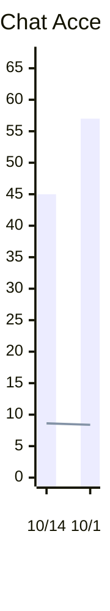
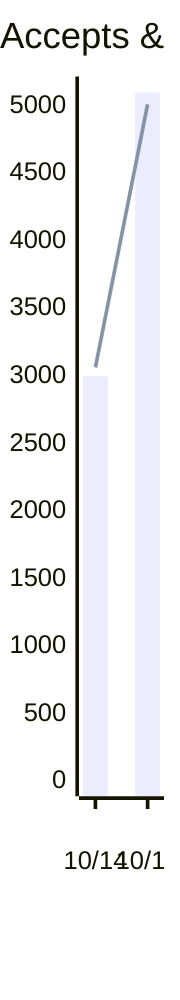
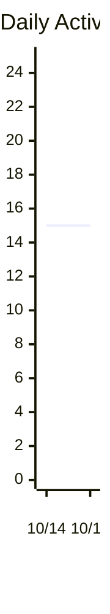
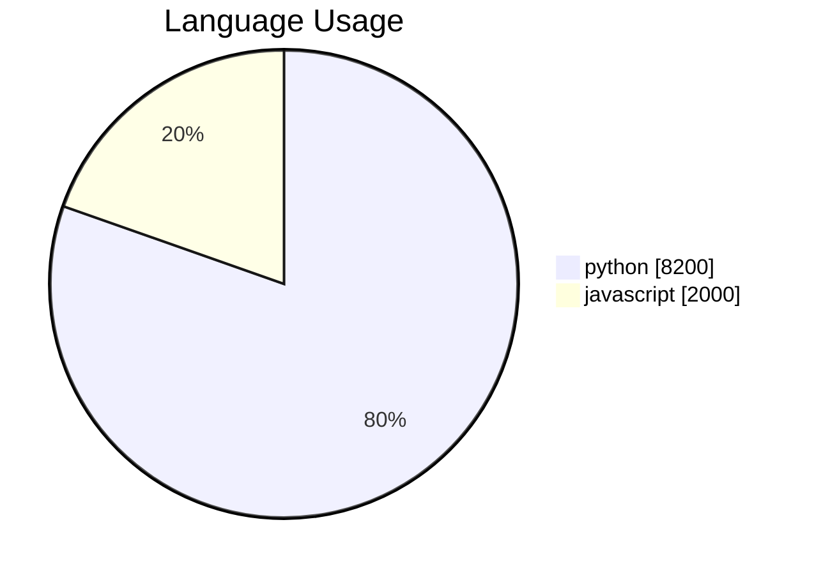
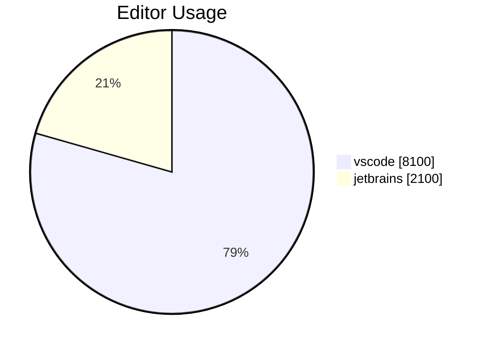

<h1>Copilot Usage 2 days (10/14/2023 - 10/15/2023)</h1>
<h2>Copilot Chat</h2>
<ul><li>Acceptances: 102</li><li>Turns: 805</li><li>Acceptance Rate: 12.67%</li><li>Average Daily Users: 10.00</li></ul>

<h2>Copilot Completions</h2>
<ul><li>Suggestions: 10,200</li><li>Acceptances: 8,100</li><li>Acceptance Rate: 79.41%</li><li>Lines of Code Accepted: 8,500</li></ul>

<h1>Language Usage</h1>

<table><tr><th>Language</th><th>Suggestions</th><th>Acceptances</th><th>Acceptance Rate</th><th>Lines Suggested</th><th>Lines Accepted</th><th>Active Users</th></tr><tr><td>python</td><td>8,200</td><td>6,500</td><td>79.27%</td><td>9,400</td><td>6,700</td><td>5</td></tr><tr><td>javascript</td><td>2,000</td><td>1,400</td><td>70.00%</td><td>3,100</td><td>2,000</td><td>5</td></tr></table>
<h1>Editor Usage</h1>

<table><tr><th>Editor</th><th>Suggestions</th><th>Acceptances</th><th>Acceptance Rate</th><th>Lines Suggested</th><th>Lines Accepted</th><th>Active Users</th></tr><tr><td>vscode</td><td>8,100</td><td>6,400</td><td>79.01%</td><td>9,300</td><td>6,600</td><td>5</td></tr><tr><td>jetbrains</td><td>2,100</td><td>1,500</td><td>71.43%</td><td>3,200</td><td>2,100</td><td>5</td></tr></table>
<h1>Daily Usage</h1>
<ul><li>Most Active Day: 10/15/2023 (15 active users)</li><li>Highest Acceptance Rate: 10/15/2023 (98.08%)</li></ul>
<table><tr><th>Day</th><th>Suggestions</th><th>Acceptances</th><th>Acceptance Rate</th><th>Lines Suggested</th><th>Lines Accepted</th><th>Active Users</th><th>Chat Acceptances</th><th>Chat Turns</th><th>Active Chat Users</th></tr><tr><td>10/14/2023</td><td>5,000</td><td>3,000</td><td>60.00%</td><td>7,000</td><td>3,500</td><td>15</td><td>45</td><td>350</td><td>8</td></tr><tr><td>10/15/2023</td><td>5,200</td><td>5,100</td><td>98.08%</td><td>5,300</td><td>5,000</td><td>15</td><td>57</td><td>455</td><td>12</td></tr></table>
<h1>Weekly Usage</h1>
<table><tr><th>Day</th><th>Suggestions</th><th>Acceptances</th><th>Acceptance Rate</th><th>Lines Suggested</th><th>Lines Accepted</th><th>Active Users</th><th>Chat Acceptances</th><th>Chat Turns</th><th>Active Chat Users</th></tr><tr><td>41</td><td>10,200</td><td>8,100</td><td>79.41%</td><td>12,300</td><td>8,500</td><td>15</td><td>102</td><td>805</td><td>12</td></tr></table>
