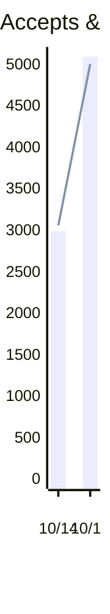
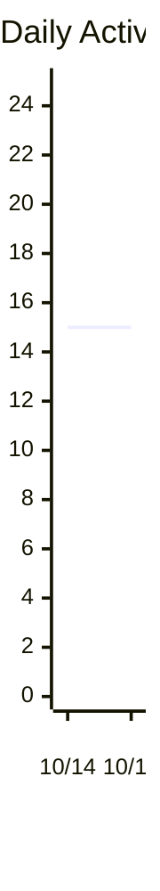
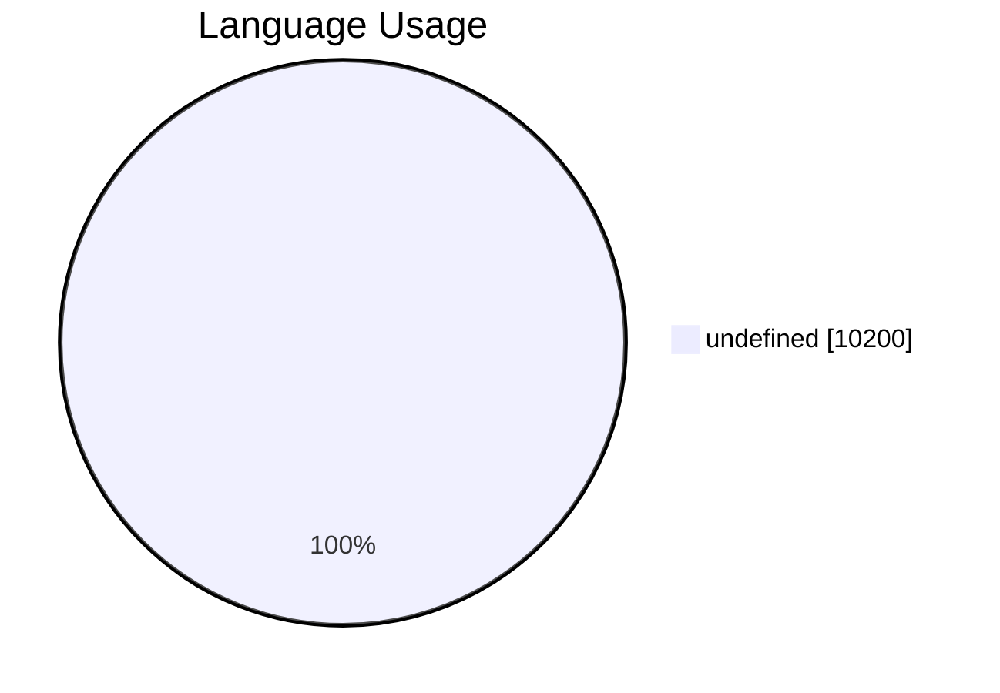
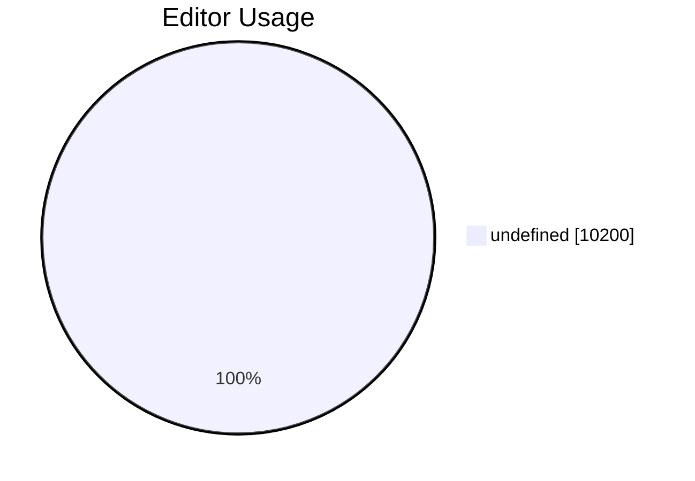
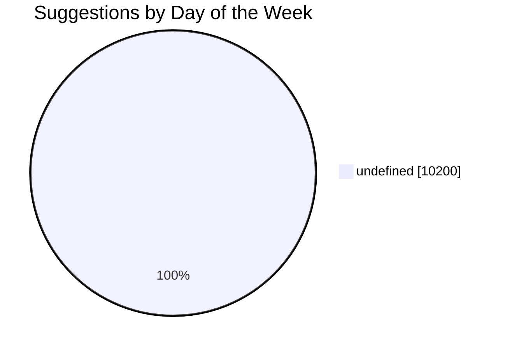
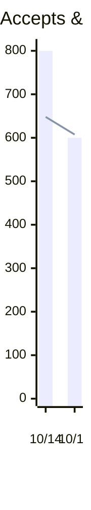
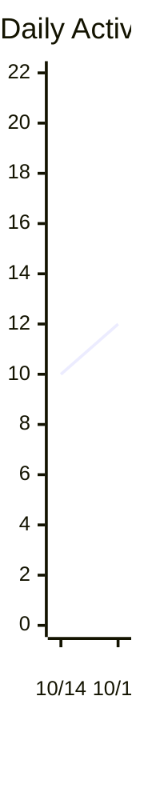
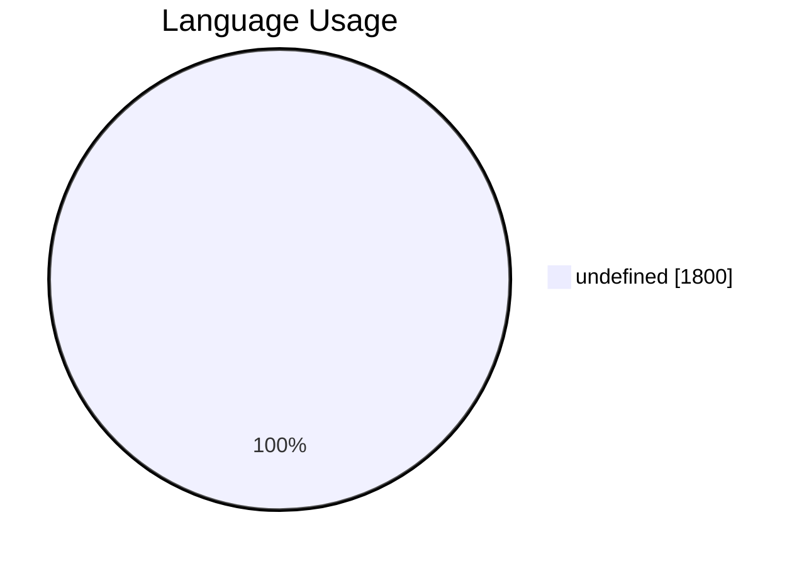
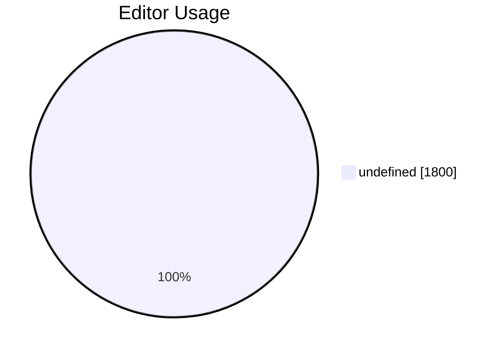
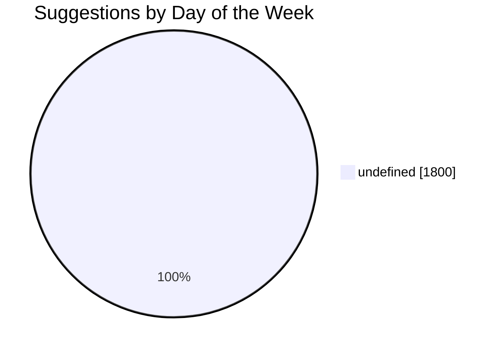

<h1>Copilot Usage 10/14/2023 - 10/15/2023</h1>
<h3>Suggestions: 10,200</h3>
<h3>Acceptances: 8,100</h3>
<h3>Acceptance Rate: 79.41%</h3>
<h3>Lines of Code Accepted: 8,500</h3>

<h1>Language Usage</h1>

<table><tr><th>Language</th><th>Suggestions</th><th>Acceptances</th><th>Acceptance Rate</th><th>Lines Suggested</th><th>Lines Accepted</th><th>Active Users</th></tr><tr><td>undefined</td><td>10,200</td><td>7,900</td><td>77.45%</td><td>12,500</td><td>8,700</td><td>30</td></tr></table>
<h1>Editor Usage</h1>

<table><tr><th>Editor</th><th>Suggestions</th><th>Acceptances</th><th>Acceptance Rate</th><th>Lines Suggested</th><th>Lines Accepted</th><th>Active Users</th></tr><tr><td>undefined</td><td>10,200</td><td>7,900</td><td>77.45%</td><td>12,500</td><td>8,700</td><td>30</td></tr></table>
<h1>Daily Usage</h1>
<h3>The most active day was 10/15/2023 with 15 active users.</h3>
<h3>The day with the highest acceptance rate was 10/15/2023 with an acceptance rate of 98.08%.</h3>

<table><tr><th>Day</th><th>Suggestions</th><th>Acceptances</th><th>Acceptance Rate</th><th>Lines Suggested</th><th>Lines Accepted</th><th>Active Users</th><th>Chat Acceptances</th><th>Chat Turns</th><th>Active Chat Users</th></tr><tr><td>10/14/2023</td><td>5,000</td><td>3,000</td><td>60.00%</td><td>7,000</td><td>3,500</td><td>15</td><td>45</td><td>350</td><td>8</td></tr><tr><td>10/15/2023</td><td>5,200</td><td>5,100</td><td>98.08%</td><td>5,300</td><td>5,000</td><td>15</td><td>57</td><td>455</td><td>12</td></tr></table>
<h1>Copilot Usage 10/14/2023 - 10/15/2023</h1>
<h3>Suggestions: 1,800</h3>
<h3>Acceptances: 1,400</h3>
<h3>Acceptance Rate: 77.78%</h3>
<h3>Lines of Code Accepted: 1,900</h3>

<h1>Language Usage</h1>

<table><tr><th>Language</th><th>Suggestions</th><th>Acceptances</th><th>Acceptance Rate</th><th>Lines Suggested</th><th>Lines Accepted</th><th>Active Users</th></tr><tr><td>undefined</td><td>1,800</td><td>1,300</td><td>72.22%</td><td>2,900</td><td>1,900</td><td>21</td></tr></table>
<h1>Editor Usage</h1>

<table><tr><th>Editor</th><th>Suggestions</th><th>Acceptances</th><th>Acceptance Rate</th><th>Lines Suggested</th><th>Lines Accepted</th><th>Active Users</th></tr><tr><td>undefined</td><td>1,800</td><td>1,300</td><td>72.22%</td><td>2,900</td><td>1,900</td><td>21</td></tr></table>
<h1>Daily Usage</h1>
<h3>The most active day was 10/15/2023 with 12 active users.</h3>
<h3>The day with the highest acceptance rate was 10/14/2023 with an acceptance rate of 80.00%.</h3>

<table><tr><th>Day</th><th>Suggestions</th><th>Acceptances</th><th>Acceptance Rate</th><th>Lines Suggested</th><th>Lines Accepted</th><th>Active Users</th><th>Chat Acceptances</th><th>Chat Turns</th><th>Active Chat Users</th></tr><tr><td>10/14/2023</td><td>1,000</td><td>800</td><td>80.00%</td><td>1,800</td><td>1,200</td><td>10</td><td>32</td><td>200</td><td>4</td></tr><tr><td>10/15/2023</td><td>800</td><td>600</td><td>75.00%</td><td>1,100</td><td>700</td><td>12</td><td>57</td><td>426</td><td>8</td></tr></table>
<h1>Copilot Usage 10/14/2023 - 10/15/2023</h1>
<h3>Suggestions: 1,800</h3>
<h3>Acceptances: 1,400</h3>
<h3>Acceptance Rate: 77.78%</h3>
<h3>Lines of Code Accepted: 1,900</h3>

<h1>Language Usage</h1>

<table><tr><th>Language</th><th>Suggestions</th><th>Acceptances</th><th>Acceptance Rate</th><th>Lines Suggested</th><th>Lines Accepted</th><th>Active Users</th></tr><tr><td>undefined</td><td>1,800</td><td>1,300</td><td>72.22%</td><td>2,900</td><td>1,900</td><td>21</td></tr></table>
<h1>Editor Usage</h1>

<table><tr><th>Editor</th><th>Suggestions</th><th>Acceptances</th><th>Acceptance Rate</th><th>Lines Suggested</th><th>Lines Accepted</th><th>Active Users</th></tr><tr><td>undefined</td><td>1,800</td><td>1,300</td><td>72.22%</td><td>2,900</td><td>1,900</td><td>21</td></tr></table>
<h1>Daily Usage</h1>
<h3>The most active day was 10/15/2023 with 12 active users.</h3>
<h3>The day with the highest acceptance rate was 10/14/2023 with an acceptance rate of 80.00%.</h3>

<table><tr><th>Day</th><th>Suggestions</th><th>Acceptances</th><th>Acceptance Rate</th><th>Lines Suggested</th><th>Lines Accepted</th><th>Active Users</th><th>Chat Acceptances</th><th>Chat Turns</th><th>Active Chat Users</th></tr><tr><td>10/14/2023</td><td>1,000</td><td>800</td><td>80.00%</td><td>1,800</td><td>1,200</td><td>10</td><td>32</td><td>200</td><td>4</td></tr><tr><td>10/15/2023</td><td>800</td><td>600</td><td>75.00%</td><td>1,100</td><td>700</td><td>12</td><td>57</td><td>426</td><td>8</td></tr></table>
<h1>Seat Info</h1>
<h3>Seat Management Setting: assign_selected</h3>
<h3>Public Code Suggestions Enabled: block</h3>
<h3>IDE Chat Enabled: undefined</h3>
<h3>Platform IDE Enabled: undefined</h3>
<h3>Platform Chat Enabled: undefined</h3>
<h3>CLI Enabled: undefined</h3>
<h3>Total Seats: 12</h3>
<h3>Added this cycle: 9</h3>
<h3>Pending invites: 0</h3>
<h3>Pending cancellations: 0</h3>
<h3>Active this cycle: 12</h3>
<h3>Inactive this cycle: 11</h3>
