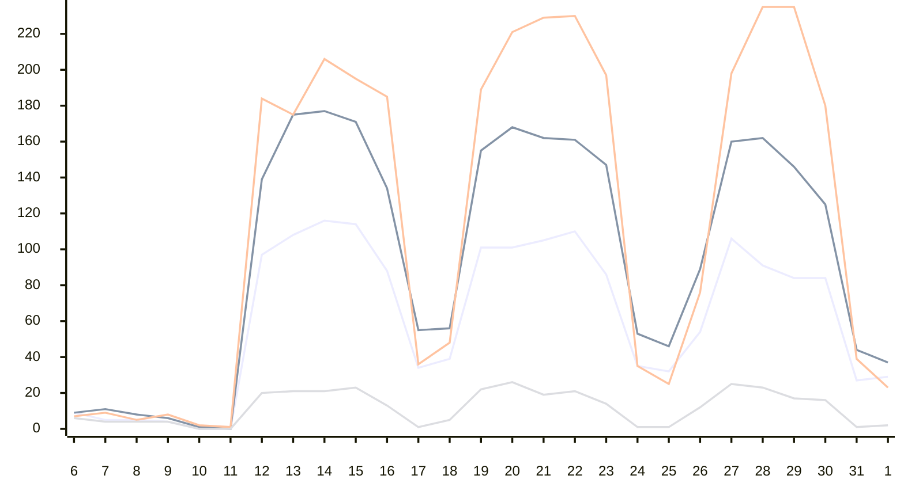
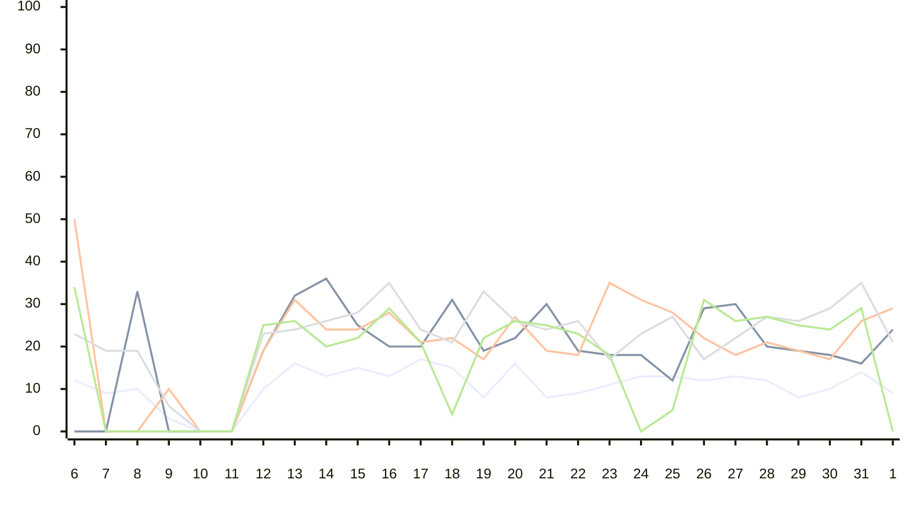
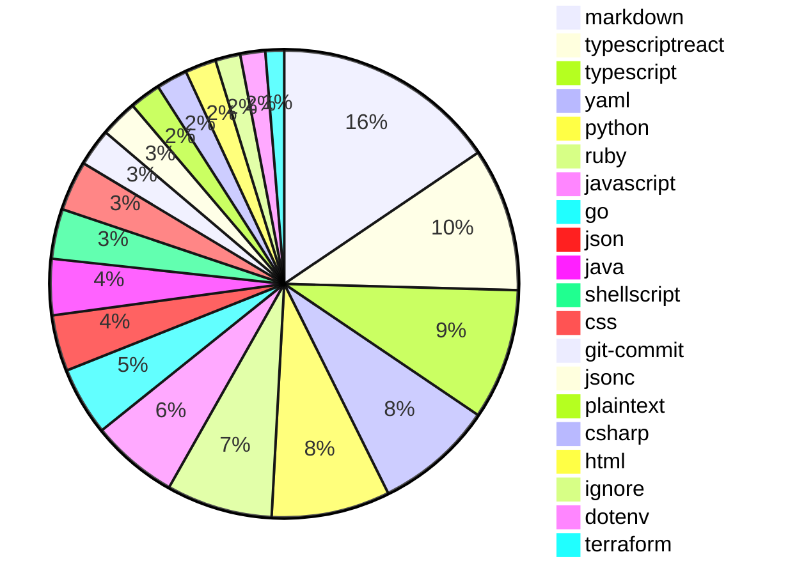
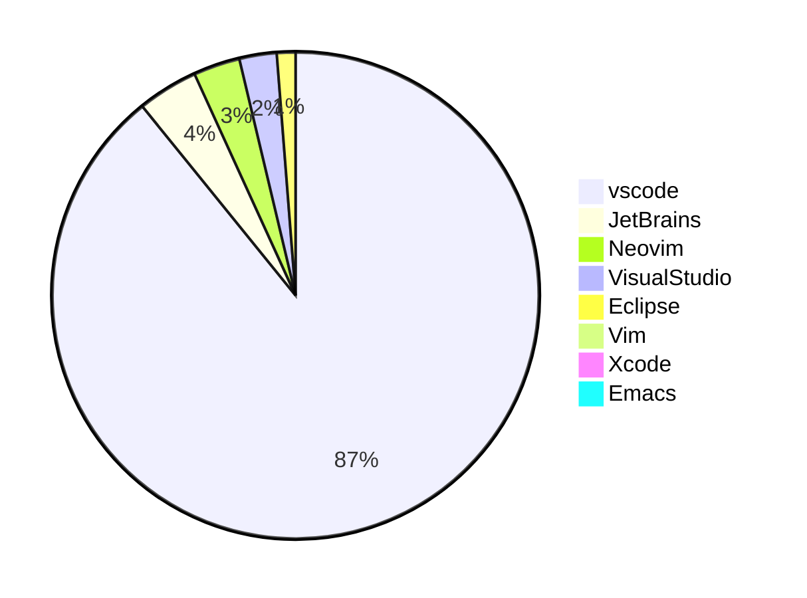
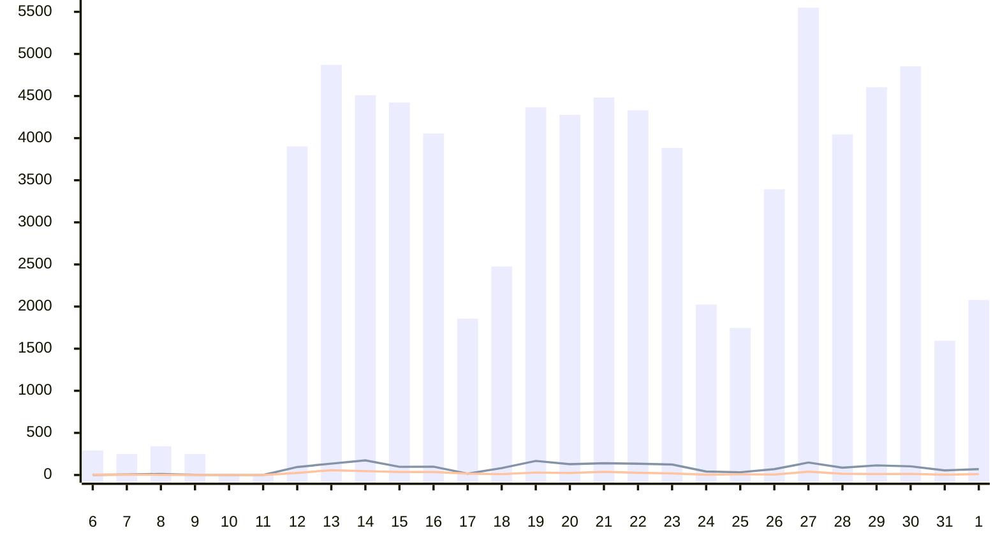
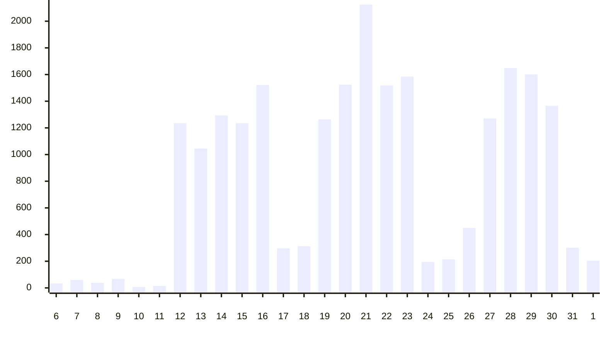
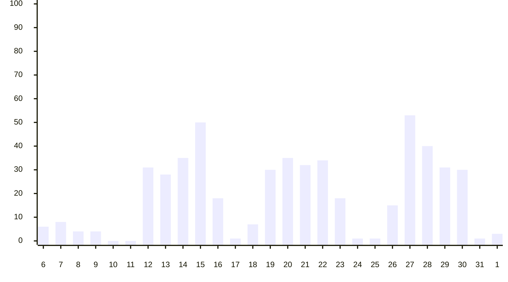

```mermaid
---
config:
    xyChart:
        width: 900
        height: 500
        xAxis:
            labelPadding: 20
        yAxis:
            labelPadding: 20
    themeVariables:
        xyChart:
            backgroundColor: "transparent"
---
xychart-beta

  x-axis  [6, 7, 8, 9, 10, 11, 12, 13, 14, 15, 16, 17, 18, 19, 20, 21, 22, 23, 24, 25, 26, 27, 28, 29, 30, 31, 1]
  y-axis  0 --> 384
bar  [16, 19, 11, 14, 3, 1, 330, 366, 378, 372, 333, 100, 111, 340, 370, 377, 372, 343, 88, 80, 160, 344, 384, 367, 306, 83, 76]
bar  [16, 16, 11, 12, 3, 1, 309, 336, 350, 339, 303, 89, 100, 307, 342, 347, 344, 311, 84, 72, 143, 318, 349, 334, 276, 77, 65]
```

```mermaid
---
config:
    xyChart:
        width: 900
        height: 500
        xAxis:
            labelPadding: 20
        yAxis:
            labelPadding: 20
    themeVariables:
        xyChart:
            backgroundColor: "transparent"
---
xychart-beta

  x-axis  [6, 7, 8, 9, 10, 11, 12, 13, 14, 15, 16, 17, 18, 19, 20, 21, 22, 23, 24, 25, 26, 27, 28, 29, 30, 31, 1]
  y-axis  0 --> 15379
bar  [1322, 772, 284, 904, 26, 0, 13352, 13728, 14011, 12325, 15011, 3742, 6278, 12151, 11105, 14531, 15379, 10264, 2335, 3424, 8553, 10685, 10706, 9161, 10736, 3680, 3604]
bar  [290, 138, 48, 49, 0, 0, 2129, 2866, 2854, 2359, 2997, 648, 1167, 1867, 1937, 2638, 2535, 1684, 400, 392, 1498, 2003, 1819, 1508, 1677, 636, 708]
```

<h1>Copilot Usage for enterprise<br>5/6 - 6/1</h1>
Metrics for the last 27 days<h2>Totals</h2>
<table><tr><td>Code Suggestions</td><td>208,069</td></tr><tr><td>Code Acceptances</td><td>36,847</td></tr><tr><td>Acceptance Rate</td><td>17.71%</td></tr><tr><td>Lines of Code Accepted</td><td>48,359</td></tr><tr><td>Chat Interactions</td><td>78,458</td></tr><tr><td>Chat Copy Events</td><td>2,131</td></tr><tr><td>Chat Insertion Events</td><td>480</td></tr></table>
<h3>Daily Engaged Users</h3>



 Active&nbsp;&nbsp; Engaged<h3>Daily Engaged Users by Product</h3>



 IDE Code Completions&nbsp;&nbsp; IDE Chat&nbsp;&nbsp; Dotcom Chat&nbsp;&nbsp; Dotcom Pull Requests<h2>IDE Completion</h2>
<h3>Suggestions vs. Acceptances</h3>



 Suggestions&nbsp;&nbsp; Acceptances<h3>Lines Suggested vs. Accepted</h3>



 Lines Suggested&nbsp;&nbsp; Lines Accepted<h3>Acceptance Rate</h3>

```mermaid
---
config:
    xyChart:
        width: 900
        height: 500
        xAxis:
            labelPadding: 20
        yAxis:
            labelPadding: 20
    themeVariables:
        xyChart:
            backgroundColor: "transparent"
---
xychart-beta

  x-axis  [6, 7, 8, 9, 10, 11, 12, 13, 14, 15, 16, 17, 18, 19, 20, 21, 22, 23, 24, 25, 26, 27, 28, 29, 30, 31, 1]
  y-axis  0 --> 23270
bar  [2182, 1417, 596, 1448, 39, 0, 22232, 20908, 21717, 18932, 23212, 5175, 11072, 17133, 16592, 21789, 23270, 15247, 3485, 5031, 12578, 16940, 16025, 14250, 15221, 6828, 5316]
bar  [428, 186, 56, 96, 0, 0, 3144, 3624, 4018, 2970, 3272, 785, 1540, 2401, 2594, 3850, 3258, 2266, 413, 404, 1822, 2888, 2534, 2059, 1976, 969, 806]
```

```mermaid
---
config:
    xyChart:
        width: 900
        height: 500
        xAxis:
            labelPadding: 20
        yAxis:
            labelPadding: 20
    themeVariables:
        xyChart:
            backgroundColor: "transparent"
---
xychart-beta

  x-axis  [6, 7, 8, 9, 10, 11, 12, 13, 14, 15, 16, 17, 18, 19, 20, 21, 22, 23, 24, 25, 26, 27, 28, 29, 30, 31, 1]
  y-axis  0 --> 100
line  [22, 18, 17, 5, 0, 0, 16, 21, 20, 19, 20, 17, 19, 15, 17, 18, 16, 16, 17, 11, 18, 19, 17, 16, 16, 17, 20]
```
<h3>Acceptance Rate by Language</h3>



 markdown&nbsp;&nbsp; python&nbsp;&nbsp; typescriptreact&nbsp;&nbsp; typescript&nbsp;&nbsp; go<h3>Language Usage by Engaged Users</h3>


<h3>Editor Usage by Engaged Users</h3>


<h2>IDE Copilot Chat</h2>



 Total Chats&nbsp;&nbsp; Copy Events&nbsp;&nbsp; Insert Events<h2>Copilot .COM Chat</h2>
<h3>Total Chats</h3>



 Total Chats<h2>Copilot .COM Pull Request</h2>
<h3>Summaries Created</h3>



 Total PR Summaries Created