<h1>Copilot Usage for enterprise 3/1 - 3/27</h1>
Metrics for the last 27 days<h2>Totals</h2>
<table><tr><td>Code Suggestions</td><td>243,150</td></tr><tr><td>Code Acceptances</td><td>57,011</td></tr><tr><td>Acceptance Rate</td><td>23.45%</td></tr><tr><td>Lines of Code Accepted</td><td>75,177</td></tr><tr><td>Chat Interactions</td><td>2,937</td></tr><tr><td>Chat Copy Events</td><td>2,989</td></tr><tr><td>Chat Insertion Events</td><td>2,989</td></tr></table>
<h3>Daily Engaged Users</h3>

```mermaid
---
config:
    xyChart:
        width: 900
        height: 400
        xAxis:
            labelPadding: 20
        yAxis:
            labelPadding: 20
    themeVariables:
        xyChart:
            backgroundColor: "transparent"
---
xychart-beta

  x-axis  [1, 2, 3, 4, 5, 6, 7, 8, 9, 10, 11, 12, 13, 14, 15, 16, 17, 18, 19, 20, 21, 22, 23, 24, 25, 26, 27]
  y-axis  0 --> 355
bar  [79, 84, 244, 282, 288, 295, 285, 85, 71, 267, 300, 319, 325, 287, 81, 77, 286, 323, 355, 321, 288, 76, 65, 274, 291, 310, 311]
bar  [73, 81, 233, 237, 261, 257, 245, 71, 65, 242, 260, 285, 286, 249, 76, 71, 248, 290, 320, 286, 251, 68, 57, 247, 253, 276, 269]
```

 Active&nbsp;&nbsp; Engaged<h3>Daily Engaged Users by Product</h3>

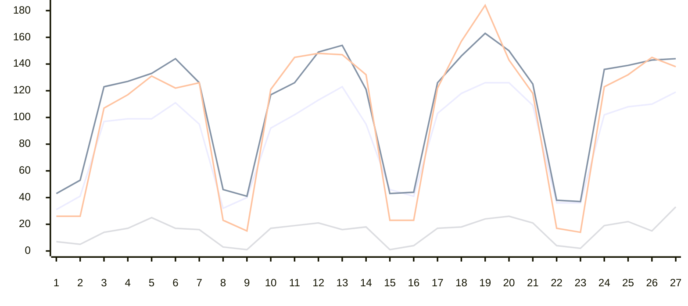

 IDE Code Completions&nbsp;&nbsp; IDE Chat&nbsp;&nbsp; Dotcom Chat&nbsp;&nbsp; Dotcom Pull Requests<h2>IDE Completion</h2>
<h3>Suggestions vs. Acceptances</h3>

```mermaid
---
config:
    xyChart:
        width: 900
        height: 400
        xAxis:
            labelPadding: 20
        yAxis:
            labelPadding: 20
    themeVariables:
        xyChart:
            backgroundColor: "transparent"
---
xychart-beta

  x-axis  [1, 2, 3, 4, 5, 6, 7, 8, 9, 10, 11, 12, 13, 14, 15, 16, 17, 18, 19, 20, 21, 22, 23, 24, 25, 26, 27]
  y-axis  0 --> 16053
bar  [2535, 4399, 7817, 7584, 8188, 10948, 7552, 2907, 3728, 7355, 7094, 9811, 12494, 10670, 7333, 3887, 10842, 13005, 14231, 16053, 13576, 4659, 4605, 12699, 12829, 10978, 15371]
bar  [626, 1404, 2111, 2170, 2232, 2874, 2058, 636, 753, 1741, 1856, 2335, 3246, 2447, 1474, 881, 2354, 2699, 3143, 3518, 2926, 1061, 815, 2778, 2933, 2412, 3528]
```

 Suggestions&nbsp;&nbsp; Acceptances<h3>Lines Suggested vs. Accepted</h3>

```mermaid
---
config:
    xyChart:
        width: 900
        height: 400
        xAxis:
            labelPadding: 20
        yAxis:
            labelPadding: 20
    themeVariables:
        xyChart:
            backgroundColor: "transparent"
---
xychart-beta

  x-axis  [1, 2, 3, 4, 5, 6, 7, 8, 9, 10, 11, 12, 13, 14, 15, 16, 17, 18, 19, 20, 21, 22, 23, 24, 25, 26, 27]
  y-axis  0 --> 30710
bar  [4766, 19818, 15333, 13876, 16878, 19956, 13436, 5310, 7071, 13729, 13889, 17290, 25392, 19886, 14161, 7258, 20346, 23822, 27586, 30710, 25483, 9369, 10016, 22751, 26462, 23221, 30479]
bar  [770, 2519, 2816, 2931, 3280, 3924, 2871, 833, 1057, 2075, 2564, 2988, 4247, 2957, 2194, 1152, 2788, 3935, 4975, 4506, 3118, 1259, 1168, 3296, 3338, 3066, 4550]
```

 Suggestions&nbsp;&nbsp; Acceptances<h3>Acceptance Rate</h3>

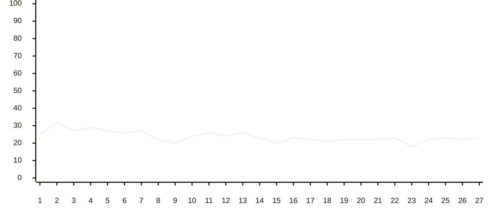
<h3>Acceptance Rate by Language</h3>

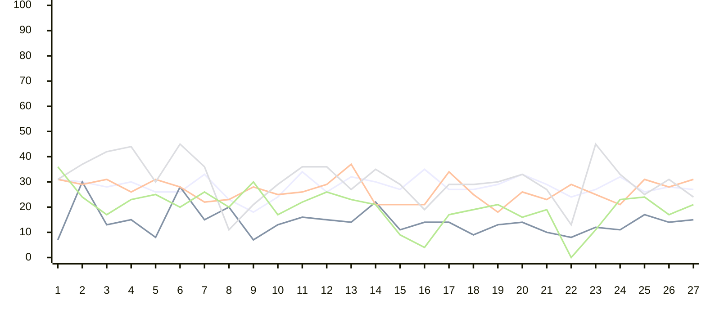

 typescript&nbsp;&nbsp; markdown&nbsp;&nbsp; typescriptreact&nbsp;&nbsp; python&nbsp;&nbsp; ruby<h3>Language Usage by Engaged Users</h3>

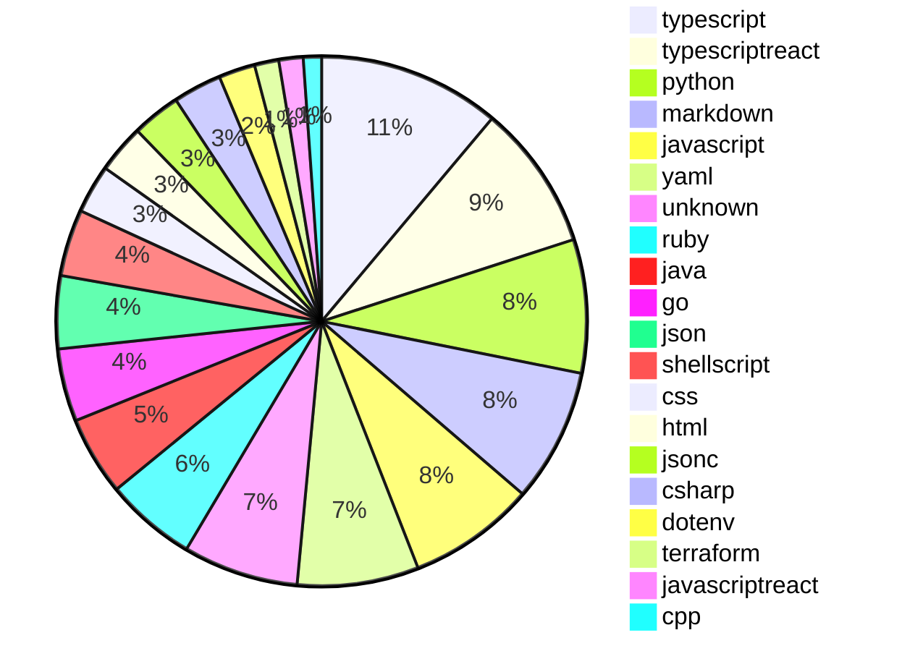
<h3>Editor Usage by Engaged Users</h3>

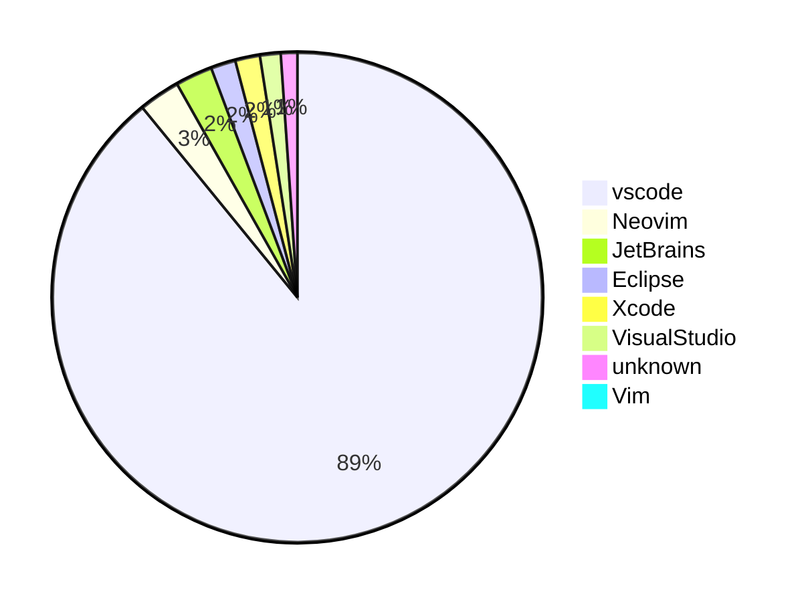
<h2>IDE Copilot Chat</h2>

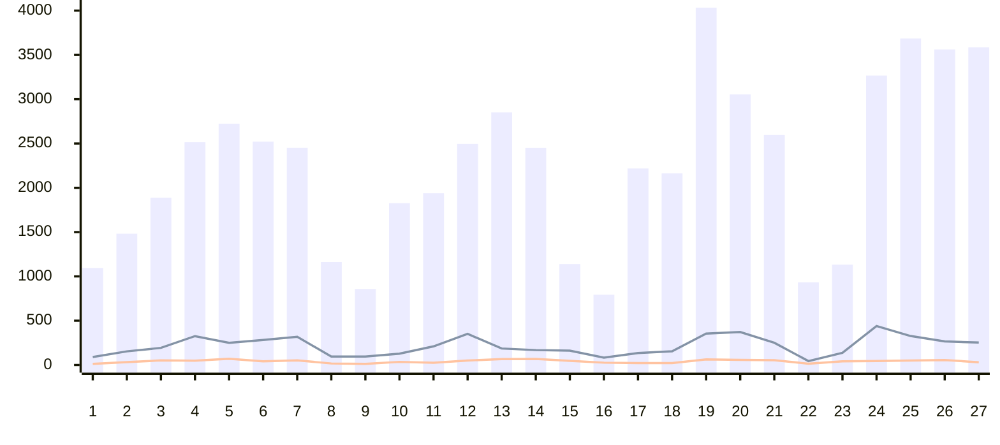

 Total Chats&nbsp;&nbsp; Copy Events&nbsp;&nbsp; Insert Events<h2>Copilot .COM Chat</h2>
<h3>Total Chats</h3>

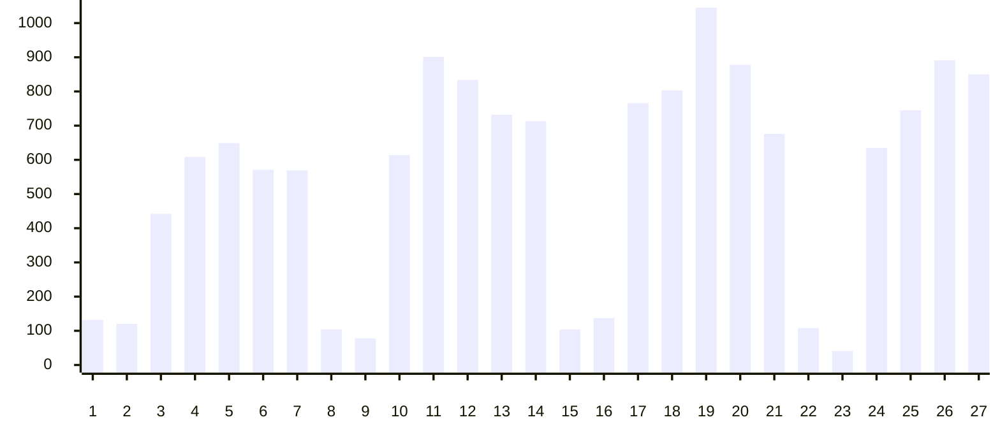

 Total Chats<h2>Copilot .COM Pull Request</h2>
<h3>Summaries Created</h3>

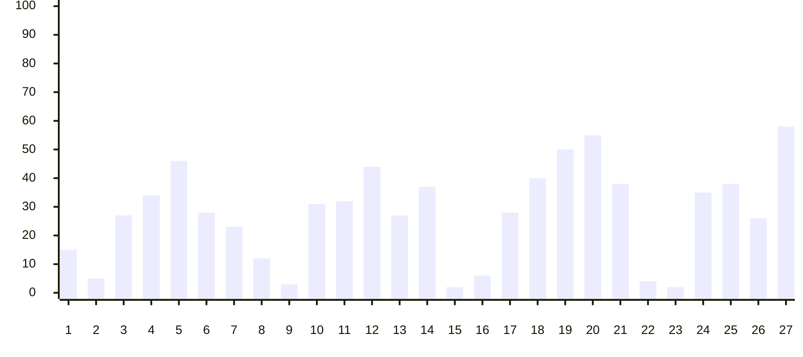

 Total PR Summaries Created