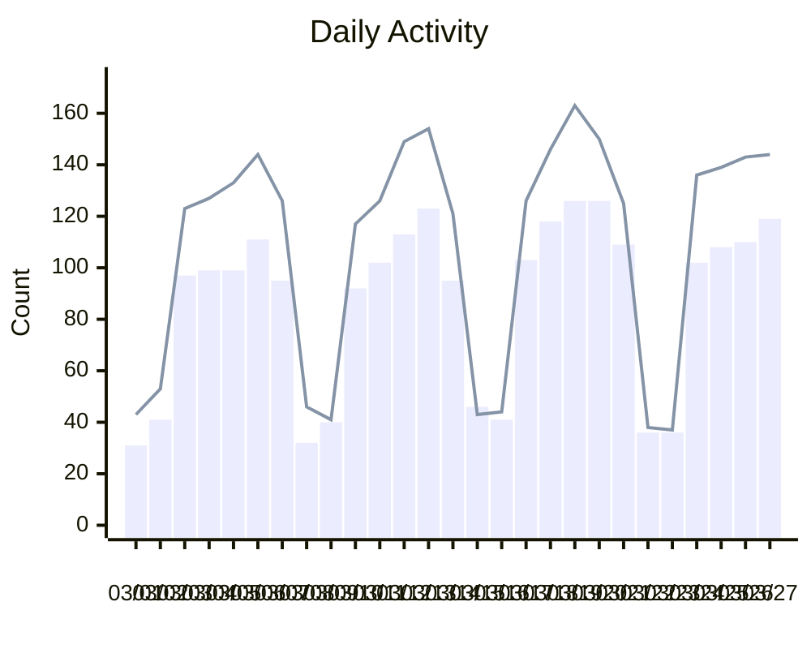
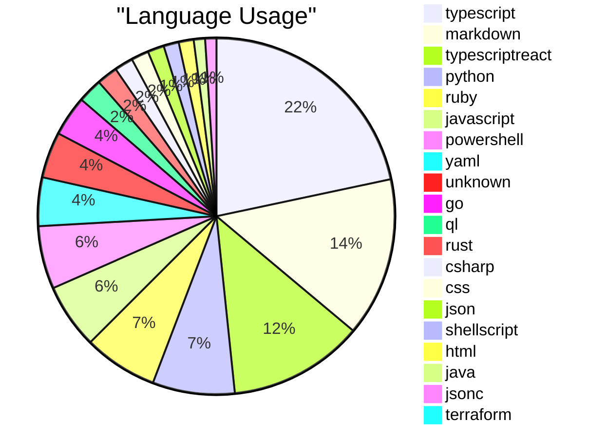
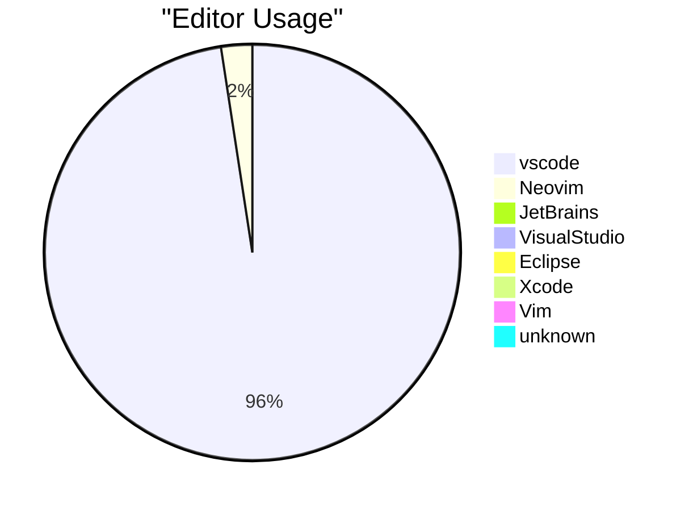
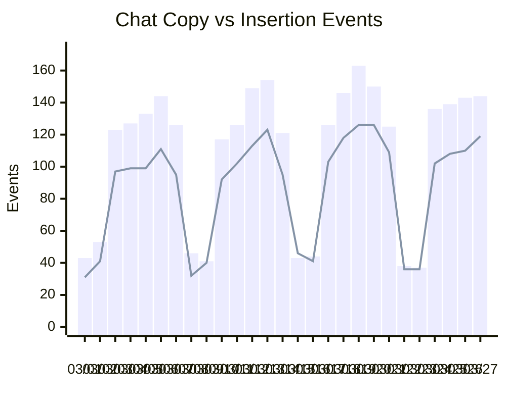

<h1>Copilot Usage for enterprise 3/1/2025 - 3/27/2025</h1>
<h1>Usage Summary</h1>
<ul><li>Total Code Suggestions: 243,150</li><li>Total Code Acceptances: 57,011</li><li>Acceptance Rate: 23.45%</li><li>Total Lines of Code Accepted: 75,177</li><li>Total Chat Interactions: 2,937</li><li>Total Chat Copy Events: 0</li><li>Total Chat Insertion Events: 0</li></ul>

<h1>Language Usage</h1>

<h1>Editor Usage</h1>

<h1>Chat Activity</h1>

