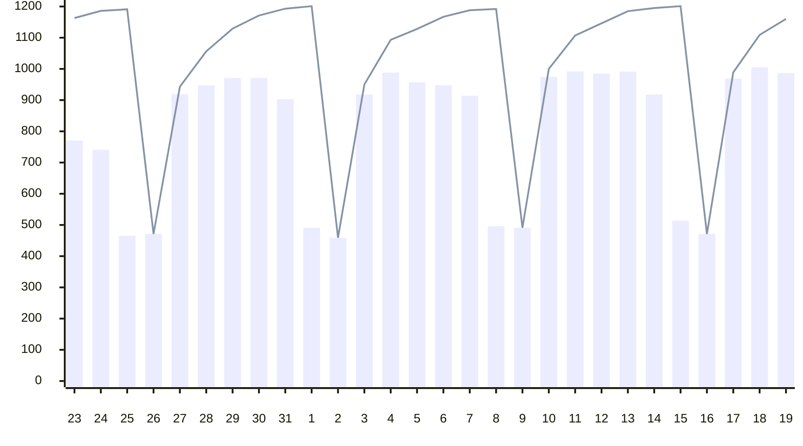
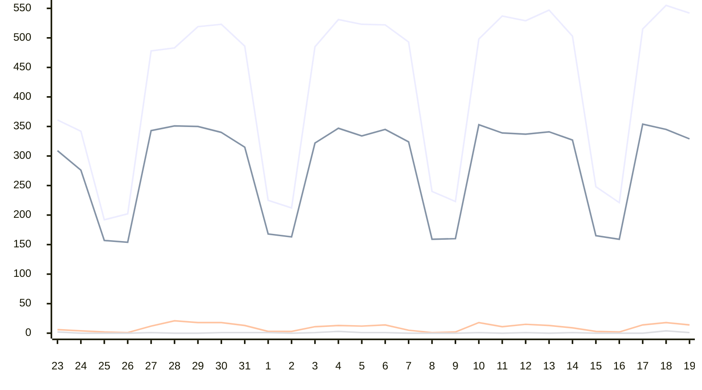
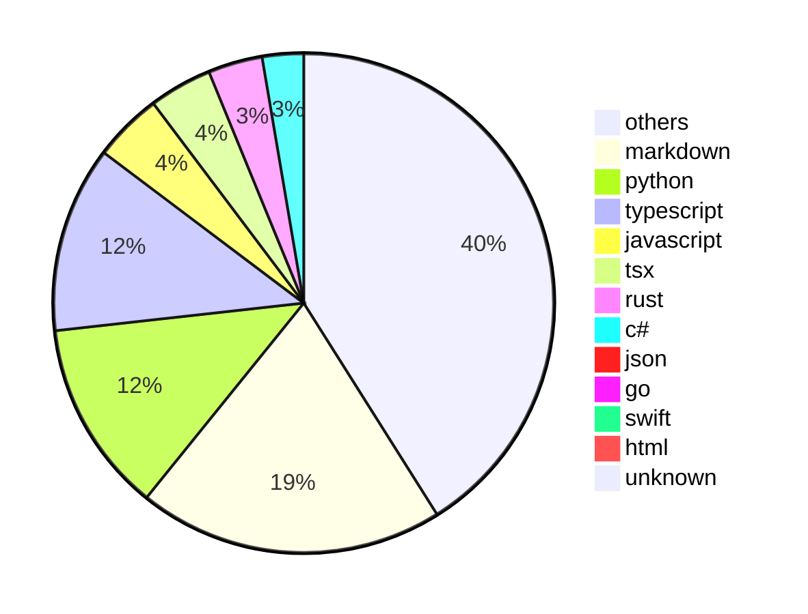
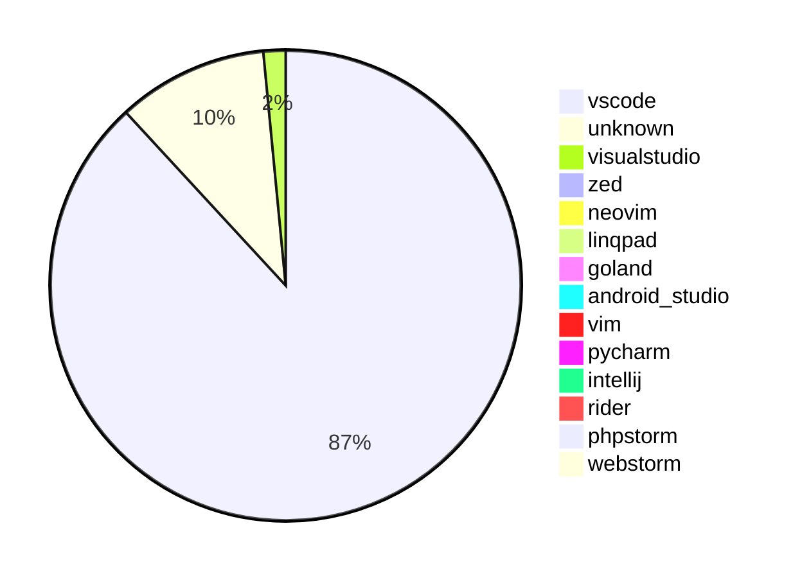
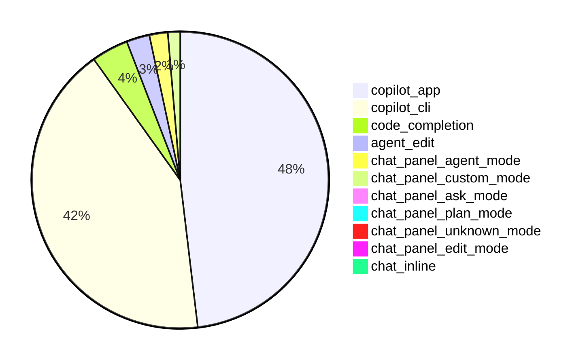
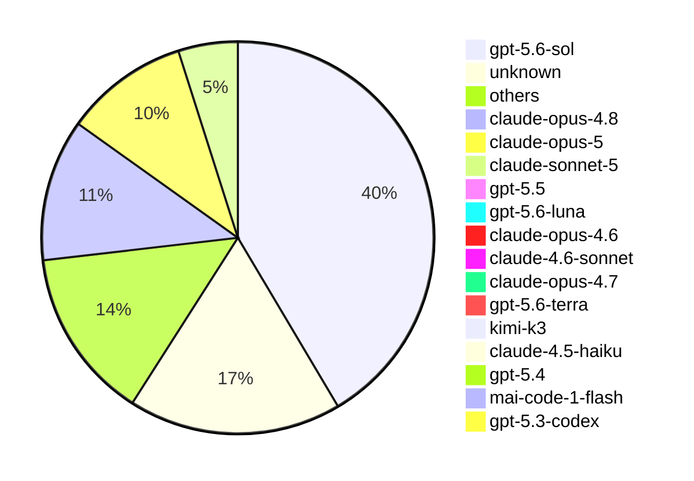

<h1>Copilot Usage for octodemo 7/23 - 8/19</h1>
Metrics for the last 28 days<h2>Totals</h2>
<table><tr><td>Active Users (latest day)</td><td>987</td></tr><tr><td>Active Users (28 day)</td><td>1,340</td></tr><tr><td>User Initiated Interactions</td><td>430,160</td></tr><tr><td>Code Generation Activities</td><td>1,232,731</td></tr><tr><td>Code Acceptance Activities</td><td>1,038,242</td></tr><tr><td>Acceptance Rate</td><td>84.22%</td></tr><tr><td>Lines of Code Added</td><td>45,441,351</td></tr><tr><td>Lines of Code Deleted</td><td>12,022,526</td></tr><tr><td>CLI Sessions</td><td>202,922</td></tr><tr><td>Copilot App Sessions</td><td>73,981</td></tr></table>
<h3>Daily Active Users</h3>

```mermaid
---
config:
    xyChart:
        width: 900
        height: 500
        xAxis:
            labelPadding: 20
        yAxis:
            labelPadding: 20
    themeVariables:
        xyChart:
            backgroundColor: "transparent"
---
xychart-beta

  x-axis  [23, 24, 25, 26, 27, 28, 29, 30, 31, 1, 2, 3, 4, 5, 6, 7, 8, 9, 10, 11, 12, 13, 14, 15, 16, 17, 18, 19]
  y-axis  0 --> 1201
bar  [771, 741, 465, 471, 919, 947, 971, 971, 903, 491, 459, 918, 988, 957, 948, 914, 496, 491, 974, 992, 985, 991, 918, 514, 471, 969, 1005, 987]
line  [1163, 1186, 1191, 471, 943, 1056, 1129, 1171, 1193, 1201, 459, 950, 1093, 1128, 1167, 1188, 1192, 491, 1000, 1107, 1146, 1185, 1195, 1201, 471, 989, 1109, 1160]
```

 Daily Active&nbsp;&nbsp; Weekly Active<h3>Daily Active Users by Surface</h3>

```mermaid
---
config:
    xyChart:
        width: 900
        height: 500
        xAxis:
            labelPadding: 20
        yAxis:
            labelPadding: 20
    themeVariables:
        xyChart:
            backgroundColor: "transparent"
---
xychart-beta

  x-axis  [23, 24, 25, 26, 27, 28, 29, 30, 31, 1, 2, 3, 4, 5, 6, 7, 8, 9, 10, 11, 12, 13, 14, 15, 16, 17, 18, 19]
  y-axis  0 --> 555
line  [361, 342, 192, 202, 478, 483, 519, 523, 486, 225, 212, 485, 531, 523, 522, 493, 240, 223, 498, 537, 529, 547, 503, 248, 221, 515, 555, 542]
line  [309, 276, 157, 154, 343, 351, 350, 340, 315, 168, 163, 322, 347, 334, 345, 324, 159, 160, 353, 339, 337, 341, 327, 165, 159, 354, 345, 329]
line  [6, 4, 2, 1, 12, 21, 18, 18, 13, 3, 3, 11, 13, 12, 14, 5, 1, 2, 18, 11, 15, 13, 9, 3, 2, 14, 18, 14]
line  [2, 0, 0, 0, 1, 0, 0, 1, 1, 1, 0, 1, 3, 1, 1, 0, 0, 0, 1, 0, 1, 0, 1, 0, 0, 0, 4, 1]
```

 Copilot App&nbsp;&nbsp; CLI&nbsp;&nbsp; Cloud Agent&nbsp;&nbsp; Code Review<h2>Code Activity</h2>
<h3>Generations vs. Acceptances</h3>

```mermaid
---
config:
    xyChart:
        width: 900
        height: 500
        xAxis:
            labelPadding: 20
        yAxis:
            labelPadding: 20
    themeVariables:
        xyChart:
            backgroundColor: "transparent"
---
xychart-beta

  x-axis  [23, 24, 25, 26, 27, 28, 29, 30, 31, 1, 2, 3, 4, 5, 6, 7, 8, 9, 10, 11, 12, 13, 14, 15, 16, 17, 18, 19]
  y-axis  0 --> 62376
bar  [23723, 33787, 23189, 24112, 46943, 49264, 51620, 52012, 49093, 31395, 27842, 40627, 58557, 53325, 49324, 51952, 28904, 27240, 49985, 59636, 56552, 62376, 60253, 36218, 30579, 47076, 54521, 52626]
bar  [18402, 27989, 20697, 21079, 39803, 42244, 44953, 43911, 41988, 27656, 24138, 34313, 49536, 45231, 41456, 43133, 24784, 23766, 41077, 47283, 46513, 52630, 50435, 32010, 27249, 39736, 43050, 43180]
```

 Generations&nbsp;&nbsp; Acceptances<h3>Lines of Code</h3>

```mermaid
---
config:
    xyChart:
        width: 900
        height: 500
        xAxis:
            labelPadding: 20
        yAxis:
            labelPadding: 20
    themeVariables:
        xyChart:
            backgroundColor: "transparent"
---
xychart-beta

  x-axis  [23, 24, 25, 26, 27, 28, 29, 30, 31, 1, 2, 3, 4, 5, 6, 7, 8, 9, 10, 11, 12, 13, 14, 15, 16, 17, 18, 19]
  y-axis  0 --> 2511076
bar  [772462, 938848, 804373, 859346, 1508706, 1546082, 1701325, 1692004, 1701620, 1222648, 1086446, 1372894, 2012325, 1873981, 1814307, 2107665, 1212732, 941914, 1772725, 2030785, 2301772, 2484846, 2274373, 1459283, 1219148, 2197280, 2511076, 2020385]
bar  [157387, 271422, 108657, 188385, 247569, 322135, 291159, 386714, 392564, 199074, 264506, 254440, 629773, 1125312, 453779, 817465, 262582, 187980, 543010, 657487, 665495, 721046, 676062, 291007, 296575, 469698, 558271, 582972]
```

 Lines Added&nbsp;&nbsp; Lines Deleted<h3>Acceptance Rate</h3>

```mermaid
---
config:
    xyChart:
        width: 900
        height: 500
        xAxis:
            labelPadding: 20
        yAxis:
            labelPadding: 20
    themeVariables:
        xyChart:
            backgroundColor: "transparent"
---
xychart-beta

  x-axis  [23, 24, 25, 26, 27, 28, 29, 30, 31, 1, 2, 3, 4, 5, 6, 7, 8, 9, 10, 11, 12, 13, 14, 15, 16, 17, 18, 19]
  y-axis  0 --> 100
line  [78, 83, 89, 87, 85, 86, 87, 84, 86, 88, 87, 84, 85, 85, 84, 83, 86, 87, 82, 79, 82, 84, 84, 88, 89, 84, 79, 82]
```
<h3>Language Usage</h3>

```mermaid
---
config:
    
---
pie

"others" : 498942
"markdown" : 239911
"python" : 151122
"typescript" : 146439
"javascript" : 54105
"tsx" : 49582
"rust" : 42677
"c#" : 32414
"json" : 6316
"go" : 5077
"swift" : 2572
"html" : 2121
"unknown" : 1453
```
<h3>IDE Usage</h3>

```mermaid
---
config:
    
---
pie

"vscode" : 107128
"unknown" : 12563
"visualstudio" : 1848
"zed" : 571
"neovim" : 264
"linqpad" : 156
"goland" : 105
"android_studio" : 100
"vim" : 79
"pycharm" : 52
"intellij" : 42
"rider" : 25
"phpstorm" : 6
"webstorm" : 4
```
<h3>Feature Usage</h3>

```mermaid
---
config:
    
---
pie

"copilot_app" : 592461
"copilot_cli" : 517327
"code_completion" : 49457
"agent_edit" : 30998
"chat_panel_agent_mode" : 24651
"chat_panel_custom_mode" : 16538
"chat_panel_ask_mode" : 572
"chat_panel_plan_mode" : 473
"chat_panel_unknown_mode" : 246
"chat_panel_edit_mode" : 5
"chat_inline" : 3
```
<h3>Model Usage</h3>

```mermaid
---
config:
    
---
pie

"gpt-5.6-sol" : 475795
"unknown" : 201515
"others" : 161991
"claude-opus-4.8" : 134304
"claude-opus-5" : 117289
"claude-sonnet-5" : 56289
"gpt-5.5" : 8349
"gpt-5.6-luna" : 6687
"claude-opus-4.6" : 6002
"claude-4.6-sonnet" : 5443
"claude-opus-4.7" : 2986
"gpt-5.6-terra" : 2100
"kimi-k3" : 2054
"claude-4.5-haiku" : 829
"gpt-5.4" : 730
"mai-code-1-flash" : 562
"gpt-5.3-codex" : 349
```
<h2>Pull Requests</h2>
<table><tr><td>Created</td><td>6,394</td></tr><tr><td>Created by Copilot</td><td>260</td></tr><tr><td>Reviewed</td><td>6,044</td></tr><tr><td>Reviewed by Copilot</td><td>5,996</td></tr><tr><td>Merged</td><td>226</td></tr><tr><td>Copilot Suggestions</td><td>839</td></tr><tr><td>Copilot Suggestions Applied</td><td>16</td></tr></table>
<h2>AI Adoption Phases</h2>
<table><tr><th>Phase</th><th>Engaged Users</th><th>Avg Interactions</th><th>Avg Generations</th><th>Avg Acceptances</th></tr><tr><td>No Cohort</td><td>69</td><td>9.84</td><td>15.07</td><td>10.2</td></tr><tr><td>Phase 1</td><td>38</td><td>16.79</td><td>25.87</td><td>2.21</td></tr><tr><td>Phase 2</td><td>212</td><td>26.66</td><td>56.59</td><td>44.23</td></tr><tr><td>Phase 3</td><td>668</td><td>18.25</td><td>57.79</td><td>49.42</td></tr></table>
