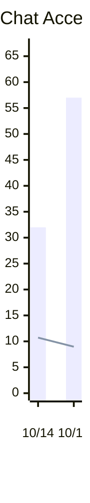
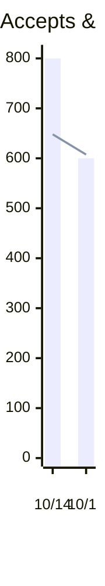
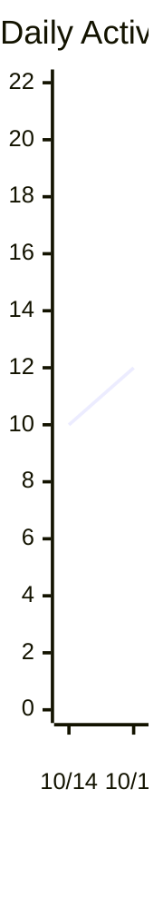
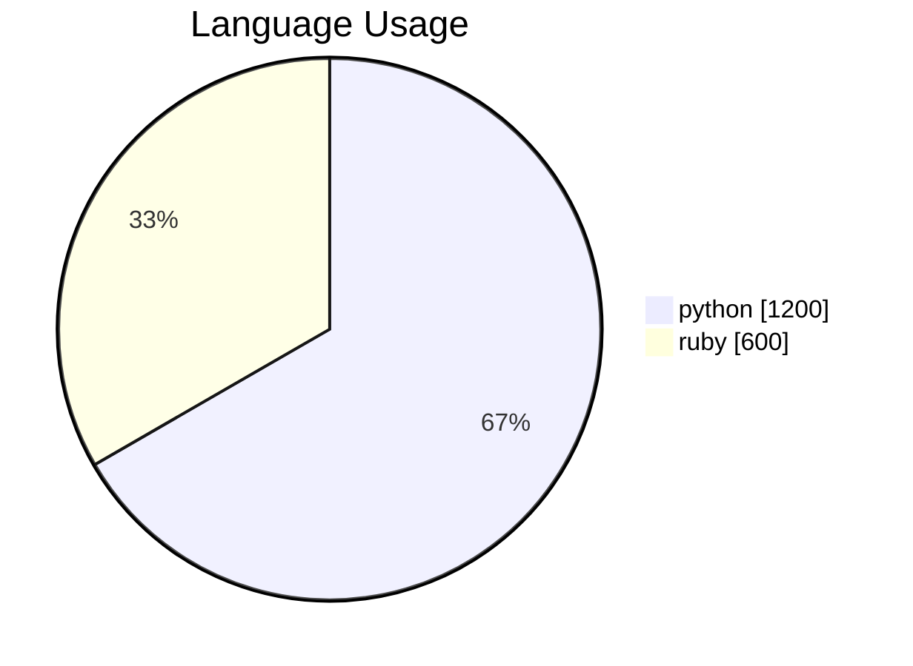
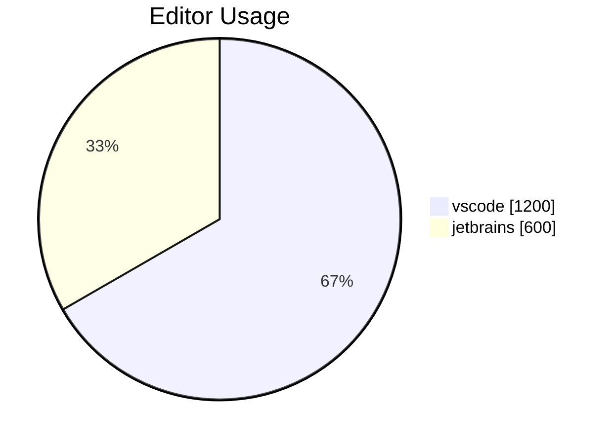

<h1>Copilot Usage 2 days (10/14/2023 - 10/15/2023)</h1>
<h2>Copilot Chat</h2>
<ul><li>Acceptances: 89</li><li>Turns: 626</li><li>Acceptance Rate: 14.22%</li><li>Average Daily Users: 6.00</li></ul>

<h2>Copilot Completions</h2>
<ul><li>Suggestions: 1,800</li><li>Acceptances: 1,400</li><li>Acceptance Rate: 77.78%</li><li>Lines of Code Accepted: 1,900</li></ul>

<h1>Language Usage</h1>

<table><tr><th>Language</th><th>Suggestions</th><th>Acceptances</th><th>Acceptance Rate</th><th>Lines Suggested</th><th>Lines Accepted</th><th>Active Users</th></tr><tr><td>python</td><td>1,200</td><td>800</td><td>66.67%</td><td>2,200</td><td>1,550</td><td>6</td></tr><tr><td>ruby</td><td>600</td><td>500</td><td>83.33%</td><td>700</td><td>350</td><td>3</td></tr></table>
<h1>Editor Usage</h1>

<table><tr><th>Editor</th><th>Suggestions</th><th>Acceptances</th><th>Acceptance Rate</th><th>Lines Suggested</th><th>Lines Accepted</th><th>Active Users</th></tr><tr><td>vscode</td><td>1,200</td><td>950</td><td>79.17%</td><td>2,200</td><td>1,350</td><td>5</td></tr><tr><td>jetbrains</td><td>600</td><td>350</td><td>58.33%</td><td>700</td><td>550</td><td>6</td></tr></table>
<h1>Daily Usage</h1>
<ul><li>Most Active Day: 10/15/2023 (12 active users)</li><li>Highest Acceptance Rate: 10/14/2023 (80.00%)</li></ul>
<table><tr><th>Day</th><th>Suggestions</th><th>Acceptances</th><th>Acceptance Rate</th><th>Lines Suggested</th><th>Lines Accepted</th><th>Active Users</th><th>Chat Acceptances</th><th>Chat Turns</th><th>Active Chat Users</th></tr><tr><td>10/14/2023</td><td>1,000</td><td>800</td><td>80.00%</td><td>1,800</td><td>1,200</td><td>10</td><td>32</td><td>200</td><td>4</td></tr><tr><td>10/15/2023</td><td>800</td><td>600</td><td>75.00%</td><td>1,100</td><td>700</td><td>12</td><td>57</td><td>426</td><td>8</td></tr></table>
